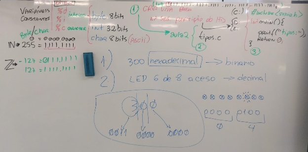
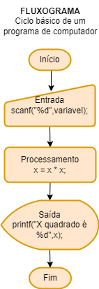

# Aula02 - Tipos de variáveis e constantes


## Conhecimentos
- 2.3. Algoritmo
- 2.3.1. Entrada, processamento e saída
- 2.3.2. Variáveis
- 2.3.3. Constantes
- 2.3.4. Operadores lógicos
- 2.3.5. Operadores aritméticos

### Tipos de dados
- **int** (Números inteiros)
- **char** (Letras e números) (ASCII - 0 à 255)
- **bool** (Booleano) true or false (0 ou 1)

## Operadores

| Aritiméticos    | Lógicos                      |
| --------------- | ---------------------------- |
| + adição        | == comparação de igualdade   |
| - subtração     | != comparação de diferença   |
| * multiplicação | < comparação Menor           |
| / divisão       | > comparação Maior           |
|                 | <= Comparação Menor ou Igual |
|                 | >= Comparação Maior ou Igual |

## Exemplos de manipulação de variáveis e tipos de dados:
- tipos1.c
```c
#include <stdio.h>
int main(){
	int x; //Declarando vari�vel
	x = 127; //Atribuindo valor
	printf("Variavel x = %d",x);
	return 0;
}

```
- tipos2.c
```c
#include <stdio.h>
int main(){
	int x; //Declarando vari�vel
	x = 'A'; //Atribuindo valor
	printf("Variavel x = %c",x);
	return 0;
}

```
- tipos3.c
```c
#include <stdio.h>
int main(){
	int x = -2147483647; //Declarar e atribuir
	printf("Variavel x = %i",x);
	return 0;
}

```
- tipos4.c
```c
#include <stdio.h>
int main(){
	char x = 'A'; //Declarar e atribuir
	char y = -127;
	printf("Variavel x = %i \n",x);
	printf("Variavel x = %c \n",x);
	printf("Variavel y = %i \n",y);
	printf("Variavel y = %c \n",y);
	return 0;
}

```

## Desafios 1

- 1. Faça um programa em C com duas variáveis atribuídas com valores inteiros quaisquer, **some** as variáveis e armazene o valor em uma terceira variável. Exiba na tela o resultado. (Nome do arquivo ex1.c)

- solução 1:
```c
#include <stdio.h>
int main(){
	int x = 10;
	int y = 5;
	int z = x + y;
	printf("X = %d \n",x);
	printf("Y = %d \n",y);
	printf("X + Y = %d",z);
	return 0;
}
```
- Solução 2: Exemplo de processamento na saída
```c
#include <stdio.h>
int main(){
	int x = 10;
	int y = 5;
	printf("X = %d \n",x);
	printf("Y = %d \n",y);
	printf("X + Y = %d",x + y);
	return 0;
}
```
- Solução 3: Exemplo de várias saídas na mesma linha
```c
#include <stdio.h>
int main(){
	int x = 10;
	int y = 5;
	int z = x + y;
	printf("x = %d \ny = %d \nx + y = %d", x, y, z);
	return 0;
}
```

## Exemplos de Comparação e Atribuição
```c
#include <stdio.h>
#include <stdbool.h>
/*
	Este é um exemplo da diferença
	entre atribuição e comparação
*/
int main(){
	int x  = 10; //Declaração e atribuição
	int y = x;
	bool z = true;
	printf("O valor de z = %d\n",z);
	z = false;
	printf("O valor de z = %d\n",z);
}
```
```c
#include <stdio.h>
/*
	Este é um exemplo da diferença
	entre atribuição e comparação
*/
int main(){
	int x  = 10; //Declaração e atribuição
	int y = 15;
	int z = x == y; //Comparação igualdade
	printf("O valor de z = %d\n",z);
	int z = x != y; //Comparação diferença
	printf("O valor de z = %d\n",z);
	int z = x > y; //Comparação Maior
	printf("O valor de z = %d\n",z);
	int z = x < y; //Comparação Maior
	printf("O valor de z = %d\n",z);
	int z = x <= y; //Comparação Menor ou igual
	printf("O valor de z = %d\n",z);
	int z = x >= y; //Comparação Maior ou igual
}
```

## Exemplos de Entradas de dados a partir do teclado (scanf)
```c
#include <stdio.h>
/* Entrada -> Processamento -> Saída*/
int main(){
	int x; //Declaração de uma variável
	//Entrada
	printf("Digite um número inteiro:");
	scanf("%d",&x);
	//Processamento
	x = x * x;
	//Saída
	printf("O valor digitado ao quadrado é %d",x);
}
```

```c
#include <stdio.h>
/* Entrada -> Processamento -> Saída*/
int main(){
	char x; //Declaração de variável
	int quadrado;
	//Entrada
	printf("Digite uma letra:");
	scanf("%c",&x);
	//Processamento
	quadrado = x * x;
	//Saída
	printf("O quadrado do código ASCII digitado é %d",quadrado);
}
```

## Lista 01 (Lista de exercícios EAD - Tempo: 5 horas)
- 1. Desenvolva um programa que leia três variáveis (a, b, c) e resolva a expressão: ( a + b ) / c.
- 2. Desenvolva um programa que leia a velocidade de um carro (km/h) e a distância a ser percorrida (km) por ele. Calcule e apresente na tela, quanto tempo (horas) será necessário para o carro percorrer a distância informada.
- 3. Desenvolva um programa que leia o nome e o salário de uma pessoa, depois leia o valor do índice percentual (%) de reajuste do salário. Calcule e apresente na tela, o valor do novo salário e o nome da pessoa.
- 4. Desenvolva um programa que leia o nome de um time de futebol, o número de vitórias e o número de empates. O programa deverá calcular e apresentar na tela, o nome do time e o total de pontos. Lembrando que a vitória vale 3 pontos e o empate vale 1 ponto.
- 5. Desenvolva um programa que leia um número ”n” inteiro, positivo e diferente de zero e apresente na tela: n – 1, e também n + 1.
- 6. Sabendo-se que a velocidade de cruzeiro de um avião 747-300 é de 900 km/h, faça um programa que leia uma distância (km), calcule e apresente na tela, quanto tempo (horas) será necessário para um 747-300 sobrevoar a distância informada.
- 7. Um caminhão consegue transportar 18 toneladas de laranjas em uma viagem que faz entre a fazenda e a fábrica de suco de laranja. Um alqueire de terra produz em média 250 toneladas de laranjas. Faça um programa que leia quantos caminhões e quantos alqueires uma fazenda produtora de laranjas possui, calcule e apresente na tela quantas viagens de caminhão serão necessárias para transportar toda a colheita de laranjas.
- 8. Desenvolva um programa que leia o raio (cm) e a altura (cm) de um cilindro. Calcule e mostre a área (cm2) e o volume (cm3) do cilindro.
- 9. Desenvolva um programa que leia o nome e o preço de uma mercadoria. O programa deverá calcular um aumento de 5% no preço da mercadoria e mostrar o nome da mercadoria e o seu novo preço.
- 10. Desenvolva um programa que leia o nome de uma cidade, o número total de eleitores e o número total de votos apurados na última eleição. O programa deverá calcular e exibir a porcentagem de participação dos eleitores desta cidade na última eleição.
- Obs: Todas as entradas serão consideradas como valores inteiros e positivos, portanto o programa não precisará testá-las.

## Entrega:
Criar um repositório público no seu GitHub e compartilhar o link em:
- https://forms.gle/c2B2z6ntAeJJymLp8
- Data de entrega: 11/08/2023