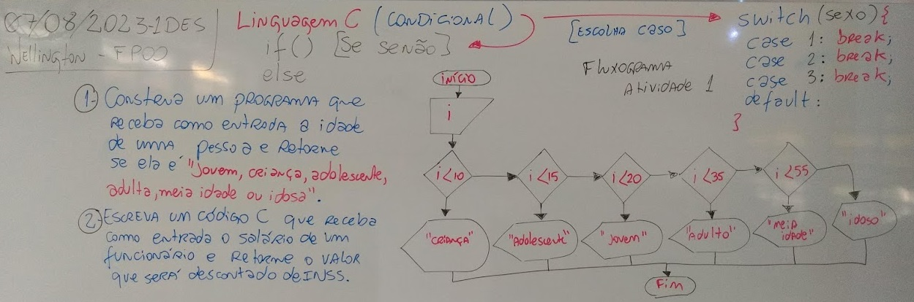
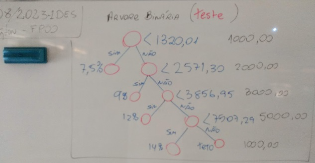
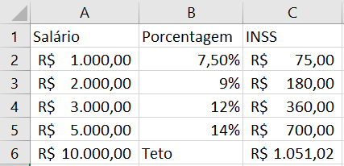
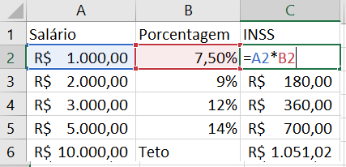

# Aula05 - Exempos Condicionais
## Linguagem C

## Exemplos
- exp1.c
```c
#include <stdio.h>
int main(){
	int i;
	printf("Informe sua idade: ");
	scanf("%d",&i);
	if(i<10) printf("Criança");
	else if(i<15) printf("Adolescente");
	else if(i<20) printf("Jovem");
	else if(i<35) printf("Adulto");
	else if(i<55) printf("Meia idade");
	else printf("Idoso");
	return 0;
}
```
- "Descontraindo, sabemos que as fases da vida passam diferente para homens e mulheres, segundo a teoria da relatividade moral de Alberto Ainstem."
- Desta forma faça com que o programa pergunte se o usuário é homem ou mulher e classifique de forma diferente
- exp2.c
```c
#include <stdio.h>
int main(){
	int i, sexo;
	printf("Informe sua idade: ");
	scanf("%d",&i);
	printf("Informe como você de identifica 1.mulher, 2.homem:");
	scanf("%d",&sexo);
	if(sexo == 1){
		if(i<10) printf("Criança");
		else if(i<15) printf("Adolescente");
		else if(i<20) printf("Jovem");
		else if(i<35) printf("Adulta");
		else if(i<55) printf("Meia idade");
		else printf("Idosa");
	} else {
		if(i<20) printf("Criança");
		else if(i<35) printf("Adolescente");
		else if(i<40) printf("Jovem");
		else if(i<50) printf("Adulto");
		else if(i<55) printf("Meia idade");
		else printf("Idoso");
	}
	return 0;
}
```
- Caso o usuário se identifique com um gênero diferente crie uma terceira classificação.
- exp3.c
```c
#include <stdio.h>
int main(){
	int i, sexo;
	printf("Informe sua idade: ");
	scanf("%d",&i);
	printf("Informe como você de identifica 1.mulher, 2.homem, 3.outro:");
	scanf("%d",&sexo);
	if(sexo == 1){
		if(i<10) printf("Criança");
		else if(i<15) printf("Adolescente");
		else if(i<20) printf("Jovem");
		else if(i<35) printf("Adulta");
		else if(i<55) printf("Meia idade");
		else printf("Idosa");
	} else if(sexo == 2){
		if(i<20) printf("Criança");
		else if(i<35) printf("Adolescente");
		else if(i<40) printf("Jovem");
		else if(i<50) printf("Adulto");
		else if(i<55) printf("Meia idade");
		else printf("Idoso");
	}else if(sexo == 3){
		if(i<=10) printf("Criança");
		else if(i<=15) printf("Adolescente");
		else if(i<=20) printf("Jovem");
		else if(i<=35) printf("Adulte");
		else if(i<=55) printf("Meia idade");
		else printf("Idose");		
	}else{
		printf("Opção inválida");
	}
	return 0;
}
```
- O mesmo programa anterior escrito com **switch case break**
exp4.c
```c
#include <stdio.h>
int main(){
	int i, sexo;
	printf("Informe sua idade: ");
	scanf("%d",&i);
	printf("Informe como você de identifica 1.mulher, 2.homem, 3.outro:");
	scanf("%d",&sexo);
	switch(sexo){
		case 1:
			if(i<10) printf("Criança");
			else if(i<15) printf("Adolescente");
			else if(i<20) printf("Jovem");
			else if(i<35) printf("Adulta");
			else if(i<55) printf("Meia idade");
			else printf("Idosa");
			break;
		case 2:
			if(i<20) printf("Criança");
			else if(i<35) printf("Adolescente");
			else if(i<40) printf("Jovem");
			else if(i<50) printf("Adulto");
			else if(i<55) printf("Meia idade");
			else printf("Idoso");
			break;
		case 3:
			if(i<=10) printf("Criança");
			else if(i<=15) printf("Adolescente");
			else if(i<=20) printf("Jovem");
			else if(i<=35) printf("Adulta(o)");
			else if(i<=55) printf("Meia idade");
			else printf("Idosa(o)");
			break;
		default:
			printf("Opção inválida");
	}
	return 0;
}
```
- Exemplo do cálculo de INSS
- exp5.c
```c
#include <stdio.h>
/*
Presquisa no Google "Tabela INSS 2023" - Resultado:
Como funciona o desconto do INSS em 2023? As alíquotas são:
de 7,5% para aqueles que ganham até R$ 1.320,00;
de 9% para quem ganha entre R$ 1.320,01 até R$ 2.571,29;
de 12% para os que ganham entre R$ 2.571,30 até R$ 3.856,94;
e de 14% para quem ganha de R$ 3.856,95 até R$ 7.507,29.
Quem ganha acima de 7.507,29 desconta o TETO 1.051,02
*/
int main(){
	float salario, inss; //Declaração de variáveis
	printf("Digite seu salário:");
	scanf("%f",&salario); //Entrada
	//Processamento
	if(salario < 1320.01) inss = salario * 0.075;
	else if(salario < 2571.30) inss = salario * 0.09;
	else if(salario < 3856.95) inss = salario * 0.12;
	else if(salario < 7507.29) inss = salario * 0.14;
	else inss = 1051.02;
	//Saída
	printf("O desconto de INSS = %.2f\n",inss);
	printf("O salário líquido será de = %.2f\n",salario - inss);
	return 0;
}
```
- Testando este programa com a **árvore binária**
- 
```cmd
Digite seu salário:1000
O desconto de INSS = 75.00
O salßrio líquido será de = 925.00

Digite seu salário:2000
O desconto de INSS = 180.00
O salßrio líquido será de = 1820.00

Digite seu salário:3000
O desconto de INSS = 360.00
O salßrio líquido será de = 2640.00

Digite seu salário:5000
O desconto de INSS = 700.00
O salßrio líquido será de = 4300.00

Digite seu salário:10000
O desconto de INSS = 1051.02
O salßrio líquido será de = 8948.98
```
-
-