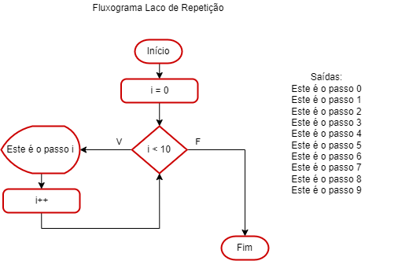
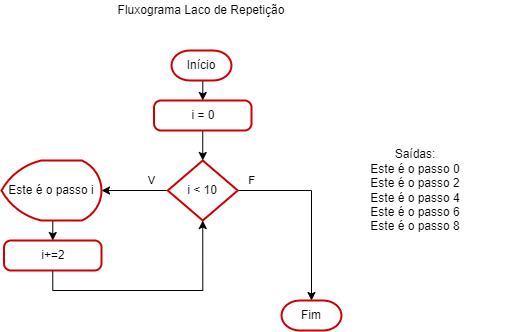

# Aula06 - Laços de Repetição

## Contador
- Contador é uma variável que é incrementada ou decrementada
- Exemplo de contador:
```c
#include <stdio.h>
int main(){
	int contador = 1;
	printf("O valor do contador é %d\n",contador);
	contador = contador + 1;
	printf("O valor do contador é %d\n",contador);
	contador++;
	printf("O valor do contador é %d\n",contador);
	contador++;
	printf("O valor do contador é %d\n",contador);
	contador = contador - 1;
	printf("O valor do contador é %d\n",contador);
	contador--;
	printf("O valor do contador é %d\n",contador);
	contador = contador + 3;
	printf("O valor do contador é %d\n",contador);
	contador += 3;
	printf("O valor do contador é %d\n",contador);
	contador = contador + 3;
	printf("O valor do contador é %d\n",contador);
	contador -= 3;
	printf("O valor do contador é %d\n",contador);
	return 0;
	
}
```

## for => para
- Ex1: (para i = 1 até 10 passo 1)
	- Saída: 1, 2, 3, 4, 5, 6, 7, 8, 9, 10
- Ex2: (para i = 1 até 10 passo 2)
	- Saída: 1, 3, 5, 7, 9
## while => enquanto
Pode ser executado 0 ou mais vezes
Ex1:
i = 3
enquanto i < 10
	i = i + 1;
Saída: 3, 4, 5, 6, 7, 8, 9
Ex2:
i = 5
enquanto i < 3
	i = i + 1
Saída: Nula (0 vezes)

## do while => faça enquanto
Pode ser executado 1 ou mais vezes
Ex1:
i = 3
faça
	i = i + 1
enquanto i < 10
Saída: 4, 5, 6, 7, 8, 9

## Exemplos
- exp1.c
```c
#include <stdio.h>
int main(){
	int contador = 1;
	while(contador <= 1000){
		printf("Bom dia, vamos aprender a programar.\n");
		contador++;
	}
	return 0;
}
```
- exp2.c
```c
#include <stdio.h>
int main(){
	int contador = 1;
	do{
		printf("Bom dia, vamos aprender a programar.\n");
		contador++;
	}while(contador <= 4);
	return 0;
}
```
- exp3.c
```c
#include <stdio.h>
int main(){
	int contador;
	for(contador = 1; contador <= 1000; contador++){
		printf("Bom dia, vamos aprender a programar.\n");
	}
	return 0;
}

```

## Fluxogramas

|Exemplo 1|Exemplo 2|
|-|-|
|||

## Atividades
- 1 - Faça um programa que escreva na tela os numerais de 1 a 20;
- 2 - Faça um programa que escreva na tela os numerais de 20 a 1;
- 3 - Faça um proframa que escreva na tela os numerais de 0 a 20 de 2 em 2;
- 4 - Faça um proframa que escreva na tela os numerais de 20 a 0 de 4 em 4;
- 5 - Faça um programa que peça para o usuário digitar um número qualquer porém só termine quando o usuário digitar o número 4;
- 6 - Faça um programa que funcione como o anterior porém mostre o quadrado do número digitado;
- atv1.c
```c
#include<stdio.h>
int main(){
	int i;
	for(i = 1; i <= 20; i++)
		printf("%d\n",i);
	return 0;
}
```
- atv2.c
```c
#include<stdio.h>
int main(){
	int i;
	for(i = 20; i >= 1; i--)
		printf("%d\n",i);
	return 0;
}
```
- atv3.c
```c
#include<stdio.h>
int main(){
	int i;
	for(i = 0; i <= 20; i+=2)
		printf("%d\n",i);
	return 0;
}
```
- atv4.c
```c
#include<stdio.h>
int main(){
	int i;
	for(i = 20; i >= 0; i-=2)
		printf("%d\n",i);
	return 0;
}
```
- atv5.c
```c
#include<stdio.h>
int main(){
	int i;
	do{
		printf("Digite um número inteiro: ");
		scanf("%d",&i);
	}while(i != 4);
	return 0;
}
```
- atv6.c
```c
#include<stdio.h>
int main(){
	int i = 0;
	while(i != 4){
		printf("Digite um número inteiro: ");
		scanf("%d",&i);
	}
	return 0;
}
```
## Algoritmo de TROCA
### Exp1
- variavel copo1 = uva; variavel copo2 = laranja; variavel auxiliar;
- auxiliar = copo1;
- copo1 = copo2;
- copo2 = auxiliar;
### Exp2
- Com variáveis simples
- int x = 10, y = 3, aux;
- aux = x;
- x = y;
- y = aux;

## Lista 03 (Lista de exercícios EAD - Tempo: 5 horas)
- 1 - Faça um programa que mostre na tela valores no intervalo entre 10 e 200;
- 2 - Faça um programa que mostre na tela valores no intervalo entre 200 e 10;
- 3 - Faça um  programa que solicite que o usuário digite um valor inteiro, positivo e imprima todos os valores entre 0 e o número digitado;
- 4 - Faça um programa que solicite que o usuário digite dois valores inteiros diferentes e imprima todos os valores entre o um número e o outro;
- 5 - Faça um programa que solicite que o usuário digite um valor inteiro, positivo e imprima todos os valores entre 0 e o número digitado de 2 em 2;
- 6 - Faça um programa que solicite que o usuário digite um valor inteiro, positivo e imprima todos os valores **ímpares** entre 0 e o número digitado;
- 7 - Faça um programa que imprima na tela a soma dos valores inteiros entre 0 e 100;
- 8 - Faça um programa que peça para o usuário digitar um número inteiro positivo e calcule o **fatorial** deste número;
- 9 - Escreva um programa que exiba na tela a tabuada de um número que deverá ser informado pelo usuário entre 0 e 10;
-	Exemplo: Digite um número: 4
	- 4 x 0 = 0
	- 4 x 1 = 4
	- 4 x 2 = 8
	- 4 x 3 = 12
	- 4 x 4 = 16
	- 4 x 5 = 20
	- 4 x 6 = 24
	- 4 x 7 = 28
	- 4 x 8 = 32
	- 4 x 9 = 36
	- 4 x 10 = 40
- 10 - Escreva um programa que leia 10 números inteiros e exiba na tela ao final, o maior número que foi digitado pelo usuário.
- 11 - Escreva um programa que leia 5 números inteiros em qualquer ordem e exiba na tela ao final, os cinco números em ordem crescente.

## Entrega:
Criar um repositório público no seu GitHub e compartilhar o link em:
- https://forms.gle/wXz51UhzAeu87reN9
- Data de entrega: 25/08/2023