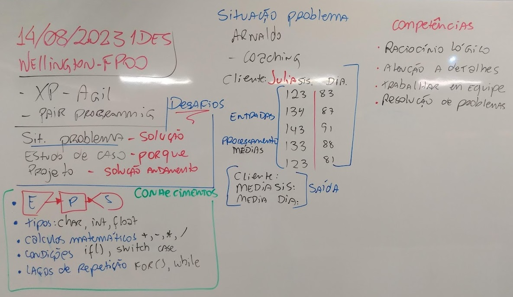
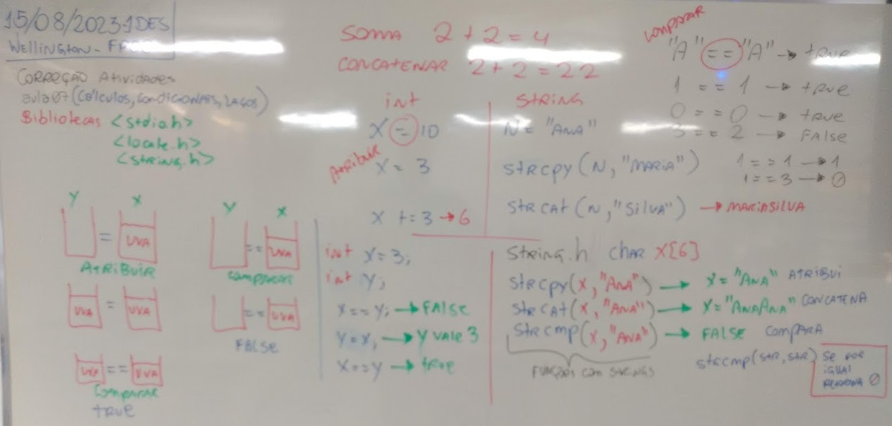

# Aula07 - Situações Problema

Dentro da proposta de **aprendizagem desafiadora** e a prática Ágil, XP, pair programming, nesta aula, formem duplas para desenvolver soluções para os seguintes desafios:

## Fundamentos Técnicos e Científicos
- Identificar as características e tipos de linguagem de programação
- Utilizar lógica de programação para a resolução de problemas
- Declarar as variáveis e as constantes considerando os tipos de dados na elaboração do programa
- Utilizar comandos de entrada e saída na elaboração de programas
- Utilizar operações aritméticas, relacionais e lógicas na elaboração de programas
- Utilizar estruturas de decisão na elaboração do programa
- Utilizar estruturas de repetição na elaboração do programa

## Capacidades Sociais, Organizativas e Metodológicas
- Demonstrar atenção a detalhes
- Demonstrar raciocínio lógico na organização das informações
- Seguir método de trabalho
## Conhecimentos
- 2.3. Algoritmo
- 2.3.1. Entrada, processamento e saída
- 2.3.2. Variáveis
- 2.3.3. Constantes
- 2.3.4. Operadores lógicos
- 2.3.5. Operadores aritméticos
- 2.3.6. Operadores relacionais
- 2.3.7. Estrutura de decisão
- 2.3.8. Estrutura de repetição
- Bibliotecas
    - locale.h
    - string.h
- 
## Situação 01 - Coaching de condicionamento físico
### Contextualização:
Arnaldo é Coaching de condicionamento físico e solicita toda documentação médica a seus clientes e após o atestado de saúde, inicia a avaliação física do atleta, uma de suas avaliações é a pressão arterial, ele pede para o cliente medir a pressão arterial por 5 dias em um mesmo horário, antes dos exercícios, para saber a evolução ele calcula a pressão média.

### Desafio A:
Crie um programa em C que leia o **nome** do cliente e os 5 resultados da medição da pressão **sis**:(sistólica) e **dia**:(diastólica) e retorne as **médias** destes resultados.

## Desafio B:
Para facilitar a digitação de Arnaldo, o programa deve pedir inicialmente o nome do atleta em seguida os valores sis. e dia. respectivamente: e ao final mostrar o nome e as médias.
### Desafio C:
Alguns atletas não são muito disciplinados e não fazem o que Arnaldo pede, anotam os resultados por menos ou mais de 5 dias, altere o programa para que peça quantos dias deseja registrar as medidas.

### Desafio D:
Arnaldo possui vários clientes/atletas, por isso o programa deve perguntar se deseja terminar (Digite 1) ou prosseguir (Digite 2), caso arnaldo deseje prosseguir deve voltar ao iício solicitando novamente o nome do cliente, quantos dias e as medidas.

### Dados para teste
|Sis.|Dia.|
|:-:|:-:|
|122|88|
|131|89|
|132|91|
|121|83|
|119|78|
|Média|Média|
|125|85,8|

## Obs:
Durante o desafio em dupla, o instrutor pedirá que as duplas alternem no teclado, altere os integrantes e alterem as estações de trabalho para que os alunos possam se testar em diversas competências como:
- Raciocínio lógico
- Trabalho em equipe
- Resolução de problemas
- Atenção a detalhes
- Entre outras

## Situação 02 - Calculadora de IMC para Consultório Médico

### Contextualização:
Um consultório médico necessita de um programa de computador para calcular o Índice de Massa Corporal (IMC) de seus pacientes de forma rápida e precisa. O IMC é uma medida utilizada para avaliar a relação entre o peso e a altura de uma pessoa, sendo um indicativo importante para avaliar a saúde e o estado nutricional.

### Desafio:
#### O programa deve receber as seguintes informações do paciente:
- Nome completo
- Peso (em quilogramas)
- Altura (em metros)

#### O programa deverá realizar os seguintes passos:
- Solicitar ao usuário que insira seu nome completo, peso e altura.
- Calcular o IMC utilizando a fórmula
- Classificar o resultado de acordo com a tabela de classificação do IMC:

#### Nova funcionalidade
- Como o consultório tem vários clientes o programa deve perguntar ao usuário se deseja sair ou continuar ao final da execução.

### Soluções comentadas em ./codigos