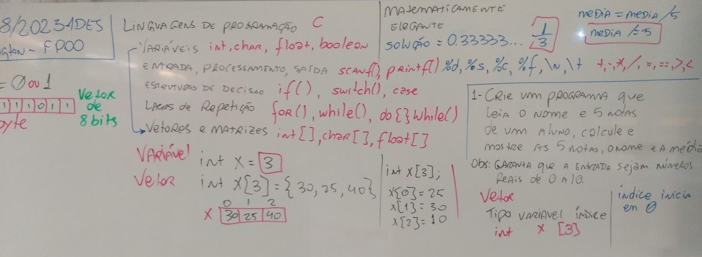
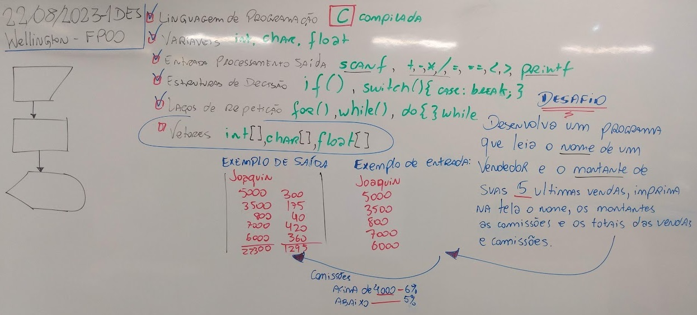
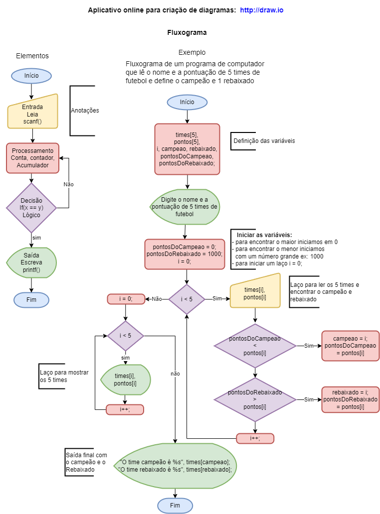

# Aula08 - Vetores e Matrizes
- Variáveis = endereços de memória ou espaços de memória
- Tipos primitivos de variáveis: char, int, float...
- Vetores são sequências de variáveis de mesmo tipo


## Exemplo 1:
Construa um programa que leia o nome e 5 notas de um aluno, calcule a média e mostre as 5 notas, o nome e a média deste aluno. Obs: garanta que as notas sejam números reais entre 0 e 10;

- solucao1.c Sem validação de dados na entrada
```c
#include <stdio.h> //Entrada e Saída padrão
#include <locale.h> //Configurações de Localização
#include <string.h> //Strings são vetores de caracteres

int main(){
	setlocale(LC_ALL,"");//Configurações
	float n1, n2, n3, n4, n5;//Declaração de variáveis
	float media;
	char nome[20];
	//Entrada
	printf("Digite o nome do aluno: ");
	scanf("%s",&nome);
	printf("Digite as 5 notas do aluno: ");
	scanf("%f %f %f %f %f", &n1, &n2, &n3, &n4, &n5);
	//Processamento
	media = (n1 + n2 + n3 + n4 + n5) / 5;
	//Saída
	printf("Notas: %.1f %.1f %.1f %.1f %.1f\n", n1, n2, n3, n4, n5);
	printf("%s sua média é %.1f", nome, media);
		
	return 0;
}
- solucao2.c com validação de dados na entrada
```c
#include <stdio.h> //Entrada e Saída padrão
#include <locale.h> //Configurações de Localização
#include <string.h> //Strings são vetores de caracteres

int main(){
	setlocale(LC_ALL,"");//Configurações
	float n1, n2, n3, n4, n5;//Declaração de variáveis
	float media;
	char nome[20];
	//Entrada
	printf("Digite o nome do aluno: ");
	scanf("%s",&nome);
	do{
		printf("Digite a 1ª nota entre 0 e 10: ");
		scanf("%f", &n1);
	}while(n1 < 0 || n1 > 10);
	do{
		printf("Digite a 2ª nota entre 0 e 10: ");
		scanf("%f", &n2);
	}while(n2 < 0 || n2 > 10);
	do{
		printf("Digite a 3ª nota entre 0 e 10: ");
		scanf("%f", &n3);
	}while(n3 < 0 || n3 > 10);
	do{
		printf("Digite a 4ª nota entre 0 e 10: ");
		scanf("%f", &n4);
	}while(n4 < 0 || n4 > 10);
	do{
		printf("Digite a 5ª nota entre 0 e 10: ");
		scanf("%f", &n5);
	}while(n5 < 0 || n5 > 10);
		
	//Processamento
	media = (n1 + n2 + n3 + n4 + n5) / 5;
	//Saída
	printf("Notas: %.1f %.1f %.1f %.1f %.1f\n", n1, n2, n3, n4, n5);
	printf("%s sua média é %.1f", nome, media);
		
	return 0;
}
```
- solucao3 com vetores
```c
#include <stdio.h> //Entrada e Saída padrão
#include <locale.h> //Configurações de Localização
#include <string.h> //Strings são vetores de caracteres

int main(){
	setlocale(LC_ALL,"");//Configurações
	float nota[5];//Declaração de um vetor
	float media;
	char nome[20];
	//Entrada
	printf("Digite o nome do aluno: ");
	scanf("%s",&nome);
	do{
		printf("Digite a 1ª nota entre 0 e 10: ");
		scanf("%f", &nota[0]);
	}while(nota[0] < 0 || nota[0] > 10);
	do{
		printf("Digite a 2ª nota entre 0 e 10: ");
		scanf("%f", &nota[1]);
	}while(nota[1] < 0 || nota[1] > 10);
	do{
		printf("Digite a 3ª nota entre 0 e 10: ");
		scanf("%f", &nota[2]);
	}while(nota[2] < 0 || nota[2] > 10);
	do{
		printf("Digite a 4ª nota entre 0 e 10: ");
		scanf("%f", &nota[3]);
	}while(nota[3] < 0 || nota[3] > 10);
	do{
		printf("Digite a 5ª nota entre 0 e 10: ");
		scanf("%f", &nota[4]);
	}while(nota[4] < 0 || nota[4] > 10);
		
	//Processamento
	media = (nota[0] + nota[1] + nota[2] + nota[3] + nota[4]) / 5;
	//Saída
	printf("Notas: %.1f %.1f %.1f %.1f %.1f\n", nota[0], nota[1], nota[2], nota[3], nota[4]);
	printf("%s sua média é %.1f", nome, media);
		
	return 0;
}
```
- solucao4 otimizada com vetores
```c
#include <stdio.h> //Entrada e Saída padrão
#include <locale.h> //Configurações de Localização
#include <string.h> //Strings são vetores de caracteres

int main(){
	setlocale(LC_ALL,"");//Configurações
	float nota[5];//Declaração de um vetor
	float media;
	char nome[20];
	int i; //Índice
	//Entrada
	printf("Digite o nome do aluno: ");
	scanf("%s",&nome);
	for(i = 0; i < 5; i++){
		do{
			printf("Digite a %dª nota entre 0 e 10: ", i + 1);
			scanf("%f", &nota[i]);
		}while(nota[i] < 0 || nota[i] > 10);
	}
	
	//Processamento
	media = (nota[0] + nota[1] + nota[2] + nota[3] + nota[4]) / 5;
	//Saída
	printf("Notas: %.1f %.1f %.1f %.1f %.1f\n", nota[0], nota[1], nota[2], nota[3], nota[4]);
	printf("%s sua média é %.1f", nome, media);
		
	return 0;
}
```
- solucao5.c mais otimizada ainda
```c
#include <stdio.h> //Entrada e Saída padrão
#include <locale.h> //Configurações de Localização
#include <string.h> //Strings são vetores de caracteres

int main(){
	setlocale(LC_ALL,"");//Configurações
	float nota[5];//Declaração de um vetor
	float media;
	char nome[20];
	int i; //Índice
	//Entrada
	printf("Digite o nome do aluno: ");
	scanf("%s",&nome);
	for(i = 0; i < 5; i++){
		do{
			printf("Digite a %dª nota entre 0 e 10: ", i + 1);
			scanf("%f", &nota[i]);
		}while(nota[i] < 0 || nota[i] > 10);
	}
	
	//Processamento + Saída
	for(i = 0; i < 5; i++){
		media += nota[i]; //Algoritmo de acumulação
		//Saída
		printf("Nota %d: %.1f\n", i + 1, nota[i]);
	}
	media /= 5;
	printf("%s sua média é %.1f", nome, media);

	return 0;
}
```
## Situação Problema 02
Programa que calcula comissões, 6% para vendas acima de 4000 e 5% para vendas abaixo, as ultimas 5 vendas de um funcionário (Vendedor):


- solucao1.c
```c
#include <stdio.h>
#include <locale.h>
#include <string.h>
int main(){
	setlocale(LC_ALL,"");
	char nome[20];//Vetor de caracteres 'Ab5&#;' 256 ASCII
	float montante1, montante2, montante3, montante4, montante5;
	float comissao1, comissao2, comissao3, comissao4, comissao5;
	float valorTotal, comissaoTotal;
	
	//Entradas
	printf("Nome do vendedor: ");
	gets(nome);
	printf("Digite os montantes das últimas 5 vendas:");
	scanf("%f %f %f %f %f", &montante1, &montante2, &montante3, &montante4, &montante5);
	
	//Processamento
	if(montante1 > 4000){
		comissao1 = montante1 * 0.06;
	} else {
		comissao1 = montante1 * 0.05;
	}
	
	if(montante2 > 4000){
		comissao2 = montante2 * 0.06;
	} else {
		comissao2 = montante2 * 0.05;
	}
	
	if(montante3 > 4000){
		comissao3 = montante3 * 0.06;
	} else {
		comissao3 = montante3 * 0.05;
	}
	
	if(montante4 > 4000){
		comissao4 = montante4 * 0.06;
	} else {
		comissao4 = montante4 * 0.05;
	}
	
	if(montante5 > 4000){
		comissao5 = montante5 * 0.06;
	} else {
		comissao5 = montante5 * 0.05;
	}
	
	valorTotal = montante1 +  montante2 +  montante3 +  montante4 +  montante5;
	comissaoTotal = comissao1 + comissao2 + comissao3 + comissao4 + comissao5;

	//Saída
	printf("Funcionário %s\n",nome);
	printf("Vendas\tComissões\n");
	printf("%.2f\t%.2f\n",montante1, comissao1);
	printf("%.2f\t%.2f\n",montante2, comissao2);
	printf("%.2f\t%.2f\n",montante3, comissao3);
	printf("%.2f\t%.2f\n",montante4, comissao4);
	printf("%.2f\t%.2f\n",montante5, comissao5);
	printf("%.2f\t%.2f\n",valorTotal, comissaoTotal);
	return 0;
}
```
- solucao2.c
```c
#include <stdio.h>
#include <locale.h>
#include <string.h>
int main(){
	setlocale(LC_ALL,"");
	char nome[20];//Vetor de caracteres 'Ab5&#;' 256 ASCII
	float montante[5], comissao[5], valorTotal = 0, comissaoTotal = 0;
	int i;//Contador para laços for()
	
	//Entradas
	printf("Nome do vendedor: ");
	gets(nome);
	printf("Digite os montantes das últimas 5 vendas:");
	scanf("%f %f %f %f %f", &montante[0], &montante[1], &montante[2], &montante[3], &montante[4]);
	
	//Processamento
	if(montante[0] > 4000){
		comissao[0] = montante[0] * 0.06;
	} else {
		comissao[0] = montante[0] * 0.05;
	}
	
	if(montante[1] > 4000){
		comissao[1] = montante[1] * 0.06;
	} else {
		comissao[1] = montante[1] * 0.05;
	}
	
	if(montante[2] > 4000){
		comissao[2] = montante[2] * 0.06;
	} else {
		comissao[2] = montante[2] * 0.05;
	}
	
	if(montante[3] > 4000){
		comissao[3] = montante[3] * 0.06;
	} else {
		comissao[3] = montante[3] * 0.05;
	}
	
	if(montante[4] > 4000){
		comissao[4] = montante[4] * 0.06;
	} else {
		comissao[4] = montante[4] * 0.05;
	}
	
	valorTotal = montante[0] +  montante[1] +  montante[2] +  montante[3] +  montante[4];
	comissaoTotal = comissao[0] + comissao[1] + comissao[2] + comissao[3] + comissao[4];

	//Saída
	printf("Funcionário %s\n",nome);
	printf("Vendas\tComissões\n");
	printf("%.2f\t%.2f\n",montante[0], comissao[0]);
	printf("%.2f\t%.2f\n",montante[1], comissao[1]);
	printf("%.2f\t%.2f\n",montante[2], comissao[2]);
	printf("%.2f\t%.2f\n",montante[3], comissao[3]);
	printf("%.2f\t%.2f\n",montante[4], comissao[4]);
	printf("%.2f\t%.2f\n",valorTotal, comissaoTotal);
	return 0;
}
```

- solucao3.c
```c
#include <stdio.h>
#include <locale.h>
#include <string.h>
int main(){
	setlocale(LC_ALL,"");
	char nome[20];//Vetor de caracteres 'Ab5&#;' 256 ASCII
	float montante[5], comissao[5], valorTotal = 0, comissaoTotal = 0;
	int i;//Contador para laços for()
	
	//Entradas
	printf("Nome do vendedor: ");
	gets(nome);
	printf("Digite os montantes das últimas 5 vendas:");
	scanf("%f %f %f %f %f", &montante[0], &montante[1], &montante[2], &montante[3], &montante[4]);
	
	//Processamento
	for(i = 0; i < 5; i++){
		if(montante[i] > 4000){
			comissao[i] = montante[i] * 0.06;
		} else {
			comissao[i] = montante[i] * 0.05;
		}
		valorTotal +=  montante[i]; //Algoritmo de acumulação
		comissaoTotal += comissao[i]; //Algoritmo de acumulação
	}

	//Saída
	printf("Funcionário %s\n",nome);
	printf("Vendas\tComissões\n");
	for(i = 0; i < 5; i++){
		printf("%.2f\t%.2f\n",montante[i], comissao[i]);
	}
	printf("%.2f\t%.2f\n",valorTotal, comissaoTotal);
	return 0;
}
```
## Situação problema 03
- Precisamos de um programa para validar resultados de jogos esportivos, escreva um código em linguagem C que leia o nome de 5 times de futebol e sua respectiva pontuação no campeonato, o programa deve informar como saída um campeão e um rebaixado.
- Dados para teste

|Times|Pontos|
|-|:-:|
|Corinthians|13|
|São Paulo|18|
|Palmeiras|15|
|Ponte Preta|8|
|Guarani|17|

- exemplo1.c (entrada de dados) com vetores de string
- Utilzamos o gets() para ler strings com espaços
- a função gets() dentro de laços possui algumas particularidades, por este motivo vamos ler os nomes dos times e depois os pontos
```c
#include <stdio.h> //Entrada e Saída padrão
#include <locale.h> //Configurações de Localização
#include <string.h> //Strings são vetores de caracteres

int main(){
	setlocale(LC_ALL,"");//Configurações
	char times[5][20];
	int pontos[5];
	int i;
	
	for(i = 0; i < 5; i++){
		printf("Digite o nome do %dª time: ", i + 1);
		gets(times[i]);
	}
	for(i = 0; i < 5; i++){
		printf("Digite pontos do %s: ",times[i]);
		scanf("%d",&pontos[i]);
	}
	printf("%s pontos: %d\n", times[0], pontos[0]);
	printf("%s pontos: %d\n", times[1], pontos[1]);
	printf("%s pontos: %d\n", times[2], pontos[2]);
	printf("%s pontos: %d\n", times[3], pontos[3]);
	printf("%s pontos: %d\n", times[4], pontos[4]);

	return 0;
}
```


- (Algoritmo) Código fonte em C do fluxograma e da solução do desafio03

```c
#include <stdio.h>
#include <locale.h>
#include <string.h>
int main(){
	setlocale(LC_ALL,"");//Configurações
	char times[5][20];
	int pontos[5];
	int i, rebaixado, pontosDoRebaixado, campeao, pontosDoCampeao;
	
	printf("Digite o nome a pontuação dos 5 times de futebol\n");
	pontosDoCampeao = 0;
	pontosDoRebaixado = 1000;
	for(i = 0; i < 5; i++){
		scanf("%s %i", &times[i], &pontos[i]);
		if(pontosDoCampeao < pontos[i]){
			pontosDoCampeao = pontos[i];
			campeao = i;
		}
		if(pontosDoRebaixado > pontos[i]){
			rebaixado = i;
			pontosDoRebaixado = pontos[i];
		} 
	}
	for(i = 0; i < 5; i++){
		printf("%s\t%d\n", times[i], pontos[i]);
	}
	printf("\nO time campeão é %s\n", times[campeao]);
	printf("O time rebaixado é %s\n", times[rebaixado]);
	return 0;
}

```

#### Continue concluíndo este desafio.

## Lista 04 (Lista de exercícios EAD - Tempo: 5 horas)

OBS: caso seja necessário, valide as entradas com laços de repetição para impedir valores absurdos.
- 1 - Desenvolva um programa que leia o nome e o salário de 5 pessoas, depois leia um valor de índice percentual (%) de reajuste do salário. Calcule e apresente na tela, o valor do novo salário e o nome das 5 pessoas.
- 2 - Desenvolva um programa que leia o nome de 5 times de futebol, o número de vitórias e o número de empates de cada time. O programa deverá calcular e apresentar na tela, o nome dos times e o total de pontos de cada um e a ordem de classificação decrescente. Lembrando que a vitória vale 3 pontos e o empate vale 1 ponto.
- 3 - Desenvolva um programa que leia o nome e o preço de 5 mercadorias. Se o preço for menor do que 1000 terá um aumento de 5% no preço da mercadoria, senão o aumento será de 7%. Mostrar o nome das mercadorias e o seu novo preço.
- 4 - Desenvolva um programa que leia o nome e o preço de 5 mercadorias, apresente na tela o mais caro e o mais barato.
- 5 - Desenvolva um programa que leia o nome de 5 cidades, seu respectivo número total de eleitores e o total de votos apurados na última eleição. O programa deverá calcular e exibir a porcentagem de participação dos eleitores na eleição para 5 cidades.
- 6 - Desenvolva um programa que leia o nome e o preço de 10 mercadorias, depois leia o valor do índice percentual (%) de desconto no preço das mercadorias. Calcule e apresente na tela, o nome, o preço original, o valor do desconto e preço final (com o desconto) de cada mercadoria. Obs: é apenas uma porcentagem para todas as 10 mercadorias.
- 7 - Escreva um programa que leia 5 números inteiros em qualquer ordem e exiba na tela ao final, os cinco números em ordem decrescente.
- 8 - Crie um programa com dois vetores numéricos de dimensão 5 com valores informados pelo usuário. Apresente a soma do primeiro vetor com o inverso do segundo.
- 9 - Crie um vetor de tamanho 10, permita que o usuário o preencha, como saída informe:
A soma e média dos pares;
A soma e média dos impares;
O total de números pares;
O total de números impares;
- 10 - Utilizando apenas um vetor de tamanho 6, troque os valores de maneira inversa, ex: 2 4 6 8 10 11 inverso 11 10 8 6 4 2;
- 11 - Crie um programa que gere um vetor com 10 números inteiros aleatórios entre 0 e 100, Localize um valor informado pelo usuário dentro do vetor. Ex: 25 41 8 7 13 18 4 1 7 3, valor informado 13, está na posição 4 do vetor.

## Entrega:
Criar um repositório público no seu GitHub e compartilhar o link em:
- https://forms.gle/CkXM2WVzQNf9yDNF9
- Data de entrega: 13/09/2023