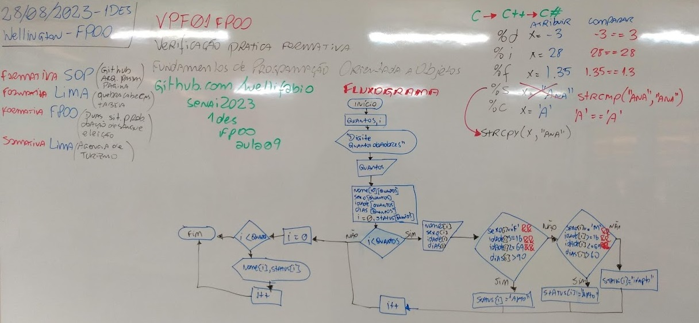
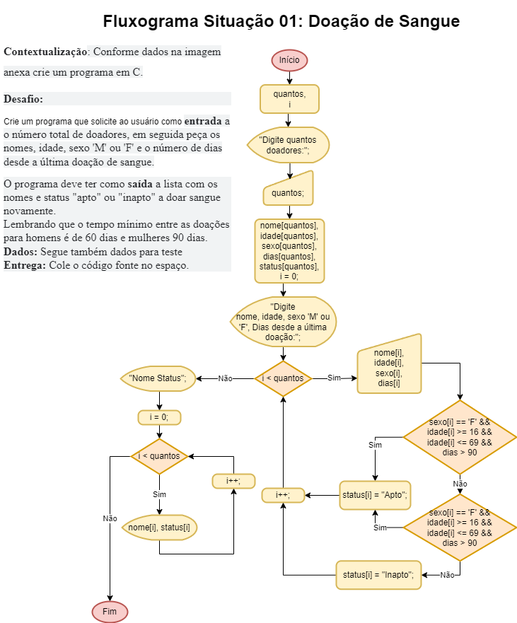
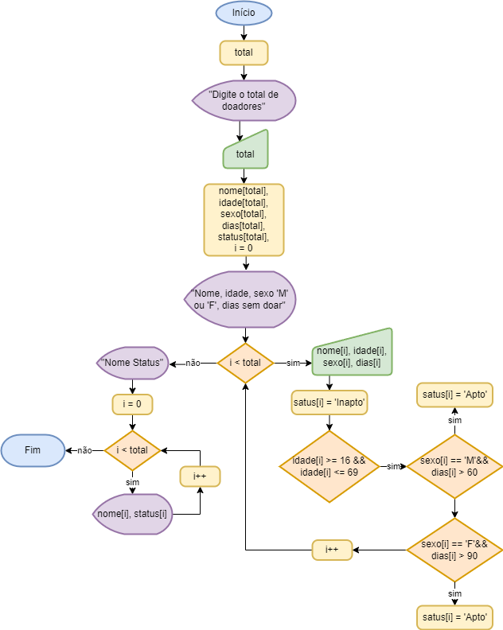

# Aula09 - FPF01
## Verificação Prática Formativa
- link https://forms.gle/TpULen4EE2yTdSQc9

## Critérios de avaliação
### Fundamentos Técnicos e Científicos
-  Identificar as características e tipos de linguagem de programação (**Codificou ao menos uma das soluções utilizando a linguagem de programação estudada C ou Java.**)

-  Utilizar lógica de programação para a resolução de problemas (**Desenvolveu o algoritmo de forma que resolva os problemas propostos.**)
-  Declarar as variáveis e as constantes considerando os tipos de dados na elaboração do programa.	(**Declarou variáveis de tipos compatíveis como inf, char, float.**)
-  Utilizar comandos de entrada e saída na elaboração de programas (**Utilizou adequadamente comandos como scanf() e printf()**)
-  Utilizar operações aritméticas, relacionais e lógicas na elaboração de programas (**Resolveu a parte do código que envolve cálculos.**)
-  Utilizar estruturas de decisão na elaboração do programa (**Resolveu parte do código que envolve decisão.**)
-  Utilizar estruturas de repetição na elaboração do programa (**Resolveu a parte do código que envolve laços como for(), while() ou do{}while().**)
-  Aplicar técnicas de código limpo (clean code) (**Nomeou variáveis conforme descrição do problema, convenções [camelCase], indentou o código, comentou onde necessário, removeu códigos desnecessários.**)
### Capacidades Sociais, Organizativas e Metodológicas
-  Demonstrar atenção a detalhes (**Resolveu todos os problemas apresentados seguindo exatamente as intruções, o programa executou sem erros de sintaxe.**)
-  Demonstrar capacidade de análise (**Compreendeu os problemas, dividiu em problemas menores, encontrou padrões e codificou algoritmo como solução.**)
-  Demonstrar raciocínio lógico na organização das informações (**Definiu de variáveis e constantes pertinentes aos problemas propostos, resolveu mesmo que parcialmente o com falhas ao menos uma das situações.**)


## Conhecimentos
--------------
- 1. Linguagem de programação
- 1.1. Princípios
- 1.2. Caraterísticas
- 1.3. Tipos
- 1.3.1. Compilada
- 1.3.2. Interpretada
- 2. Lógica de programação orientada a objeto
- 2.1. Definição
- 2.2. Aplicação
- 2.3. Algoritmo
- 2.3.1. Entrada, processamento e saída
- 2.3.2. Variáveis
- 2.3.3. Constantes
- 2.3.4. Operadores lógicos
- 2.3.5. Operadores aritméticos
- 2.3.6. Operadores relacionais
- 2.3.7. Estrutura de decisão
- 2.3.8. Estrutura de repetição
- 2.3.9. Vetores

## Fluxograma da Situação problema 01 - Doação de Sangue:

```c
#include <stdio.h>
#include <locale.h>
#include <string.h>
int main(){
	int total;
	printf("Digite o total de doadores:");
	scanf("%d",&total);
	char nome[total][15];
	int idade[total];
	char sexo[total];
	int dias[total];
	char status[total][7];
	int i = 0;
	printf("Nome, idade, sexo 'M' ou 'F', dias sem doar:\n");
	for(i = 0;i < total; i++){
		scanf("%s %d %c %d", &nome[i], &idade[i], &sexo[i], &dias[i]);
		if(idade[i] >= 16 && idade[i] <= 69 && sexo[i] == 'M' && dias[i] > 60)
			strcpy(status[i],"Apto");
		else if(idade[i] >= 16 && idade[i] <= 69 && sexo[i] == 'F' && dias[i] > 90)
			strcpy(status[i],"Apto");
		else
			strcpy(status[i],"Inapto");
	}
	printf("\nNome\tStatus\n");
	for(i = 0;i < total;i++){
		printf("%s\t%s\n", nome[i], status[i]);	
	}
	return 0;
}
```

```c
#include <stdio.h>
#include <locale.h>
#include <string.h>
int main(){
	int total;
	printf("Digite o total de doadores:");
	scanf("%d",&total);
	char nome[total][15];
	int idade[total];
	char sexo[total];
	int dias[total];
	char status[total][7];
	int i = 0;
	printf("Nome, idade, sexo 'M' ou 'F', dias sem doar:\n");
	while(i < total){
		scanf("%s %d %c %d", &nome[i], &idade[i], &sexo[i], &dias[i]);
		strcpy(status[i],"Inapto");
		if(idade[i] >= 16 && idade[i] <= 69){
			if(sexo[i] == 'M' && dias[i] > 60)
				strcpy(status[i],"Apto");
			if(sexo[i] == 'F' && dias[i] > 90)
				strcpy(status[i],"Apto");
		}
		i++;
	}
	printf("Nome\tStatus\n");
	for(i = 0;i < total;i++){
		printf("%s\t%s\n", nome[i], status[i]);	
	}
	return 0;
}
```

## Solução da Situação problema 02 - Eleições municipais

Desafio: Criar um programa para apuração de votos, que solicite o nome da Cidade, o total de candidatos e em seguida os nomes e total de votos de cada candidato. O programa deverá informar a porcentagem de votos de cada candidato, o total de votos brancos e nulos, se a eleição é válida ou inválida (possui mais votos válidos do que nulos, em tempo: votos brancos são válidos), se for válida, qual o candidato vencedor ou se haverá segundo turno e informar os dois mais votados. Lembrando que só há segundo turno caso o primeiro colocado não obtenha 50% + 1 dos votos válidos em cidades com mais de 200 mil eleitores.

```c
#include <stdio.h>
#include <locale.h>
#include <string.h>
int main(){
	setlocale(LC_ALL,"");
	char cidade[50];
	int total;
	
	printf("Digite o nome da cidade: ");
	gets(cidade);
	printf("Digite o total de candidatos: ");
	scanf("%d",&total);
	
	char candidatos[total][20];
	int votos[total];
	float porcentagens[total];
	int i, brancos, nulos, auxiliar;
	float totalValidos = 0;
	float totalBrancos = 0;
	int primeiro, totalPrimeiro = 0;
	int segundo, totalSegundo = 0;
	
	printf("Candidato Votos:\n");
	for(i = 0; i < total; i++){
		scanf("%s %d", &candidatos[i], &votos[i]);
		totalValidos += votos[i];
		if(totalPrimeiro < votos[i]){
			primeiro = i;
			totalPrimeiro = votos[i];
		}
	}
	
	printf("Total de votos Brancos: ");
	scanf("%d", &brancos);
	totalValidos += brancos;
	printf("Total de votos Nulos: ");
	scanf("%d", &nulos);
	
	if(totalValidos > nulos){
		printf("\nEleição Válida\n");
		printf("Votos válidos: %.0f\n",totalValidos);
		printf("Votos inválidos: %d\n",nulos);
		
		printf("Candidato\tPorcentagem:\n");
		for(i = 0; i < total; i++){
			porcentagens[i] = votos[i] / totalValidos * 100.0;
			printf("%s\t%.1f%%\n", candidatos[i], porcentagens[i]);
		}
		totalBrancos = brancos / totalValidos * 100.0;
		printf("Brancos\t%.1f%%\n", totalBrancos);
		printf("Candidato mais votado %s com %d votos\n", candidatos[primeiro],votos[primeiro]);
		auxiliar = votos[primeiro];
		votos[primeiro] = 0;
		for(i = 0; i < total; i++){
			if(totalSegundo < votos[i]){
				segundo = i;
				totalSegundo = votos[i];
			}
		}
		votos[primeiro] = auxiliar;
		printf("Segundo mais votado %s com %d votos\n", candidatos[segundo],votos[segundo]);
		if(totalValidos + nulos < 200000){
			printf("%s eleito em primeiro turno com %d votos\n", candidatos[primeiro],votos[primeiro]);	
		}else{
			if(votos[primeiro] >= (totalValidos/2+1))
				printf("%s eleito em primeiro turno com %d votos\n", candidatos[primeiro],votos[primeiro]);
			else
				printf("Haverá segundo turno entre %s e %s\n", candidatos[primeiro],candidatos[segundo]);
		}
	}else{
		printf("Eleição Inválida");
	}
	return 0;
}
```