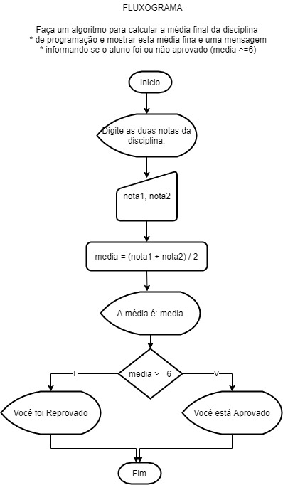
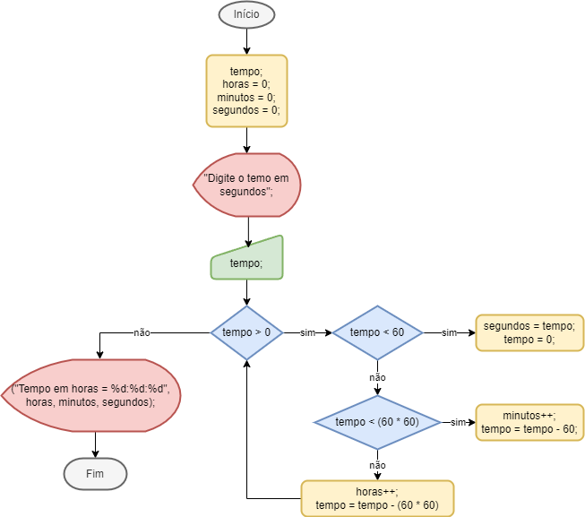
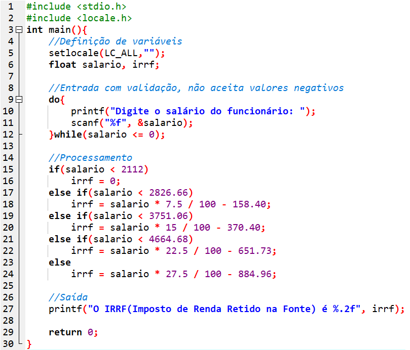
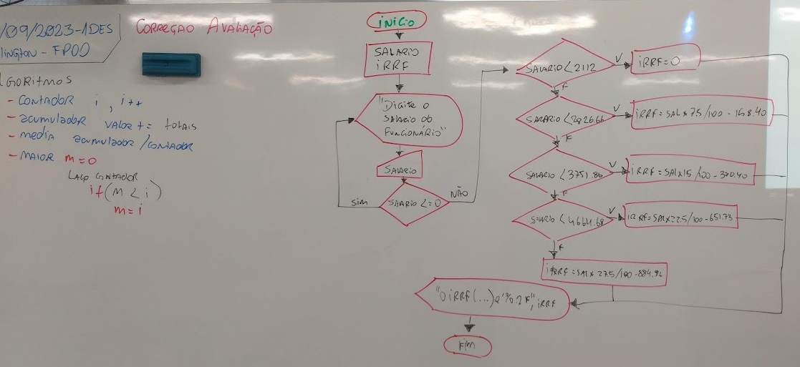
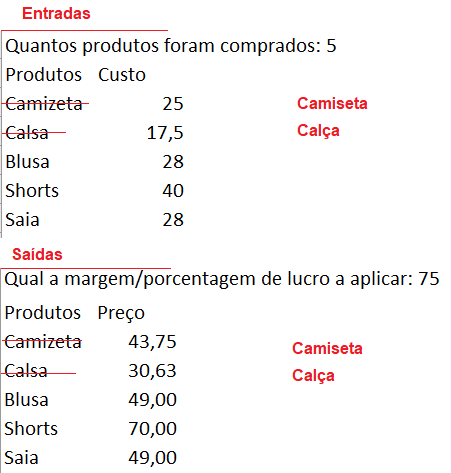

# Aula10 - VPS01
## Verificação Prática Somativa (Lógica de Programação)
- Acessar **classroom.google.com** e na turma 1DES entrar na atividade VPS01FPOO

## Critérios de avaliação
### Fundamentos Técnicos e Científicos
-  Identificar as características e tipos de linguagem de programação (**Codificou ao menos uma das soluções utilizando a linguagem de programação estudada C ou Java.**)

-  Utilizar lógica de programação para a resolução de problemas (**Desenvolveu o algoritmo de forma que resolva os problemas propostos.**)
-  Declarar as variáveis e as constantes considerando os tipos de dados na elaboração do programa.	(**Declarou variáveis de tipos compatíveis como inf, char, float.**)
-  Utilizar comandos de entrada e saída na elaboração de programas (**Utilizou adequadamente comandos como scanf() e printf()**)
-  Utilizar operações aritméticas, relacionais e lógicas na elaboração de programas (**Resolveu a parte do código que envolve cálculos.**)
-  Utilizar estruturas de decisão na elaboração do programa (**Resolveu parte do código que envolve decisão.**)
-  Utilizar estruturas de repetição na elaboração do programa (**Resolveu a parte do código que envolve laços como for(), while() ou do{}while().**)
-  Aplicar técnicas de código limpo (clean code) (**Nomeou variáveis conforme descrição do problema, convenções [camelCase], indentou o código, comentou onde necessário, removeu códigos desnecessários.**)
### Capacidades Sociais, Organizativas e Metodológicas
-  Demonstrar atenção a detalhes (**Resolveu todos os problemas apresentados seguindo exatamente as intruções, o programa executou sem erros de sintaxe.**)
-  Demonstrar capacidade de análise (**Compreendeu os problemas, dividiu em problemas menores, encontrou padrões e codificou algoritmo como solução.**)
-  Demonstrar raciocínio lógico na organização das informações (**Definiu de variáveis e constantes pertinentes aos problemas propostos, resolveu mesmo que parcialmente o com falhas ao menos uma das situações.**)

## Situação 01 - Média aritmética
- **Contextualização**:  No dia a dia de um programador, cálculos estatísticos são constantes.
- **Desafio**: Conforme fluxograma anexo, codifique o programa que calcula a média de duas notas.

```c
#include <stdio.h>
#include <locale.h>
int main() {
    setlocale(LC_ALL,"");
    float nota1, nota2, media;
    
    printf("Digite as duas notas da disciplina:");
    scanf("%f %f", &nota1, &nota2);
    
    media = (nota1 + nota2) / 2;

    printf("A media é: %.f\n", media);

    if (media >= 6.0) {
        printf("Aluno está Aprovado!\n");
    } else {
        printf("Aluno foi Reprovado!\n");
    }

    return 0;
}
```
## Situação 02: Segundos em Horas
- **Contextualização**: Uma pequena fábrica de plástico instalou em suas injetoras um sensor iOT que capta o tempo de utilização e envia a um banco de dados, porém o sensor capta o tempo em segundos inteiros ex: 556 segundos, 15 segundos, 140153 segundos.
- **Desafio**: Crie um programa que solicite ao usuário como entrada o tempo em segundos, converta para o formato de horas e exiba como saída no formato horas : minutos : segundos, conforme fluxograma anexo.

- solucacoLogica.c
```c
#include <stdio.h>
int main(){
	int tempo;
	int horas = 0;
	int minutos = 0;
	int segundos = 0;
	printf("Digite o tempo em segundos: ");
	scanf("%d", &tempo);
	
	while(tempo > 0){
		if(tempo < 60){
			segundos = tempo;
			tempo = 0;
		}else if(tempo < (60 * 60)){
			minutos++;
			tempo -=60;
		}else{
			horas++;
			tempo -= (60*60);
		}
	}
	printf("Tempo em horas = %d:%d:%d", horas, minutos, segundos);
	
	return 0;
}
```
- solucacoAritmetica.c
```c
#include <stdio.h>

int main (){
	int segundos;
	int minutos;
	int horas;
	int tempo;
	
	printf("Digite o tempo em segundos: ");
	scanf("%d", &segundos);
	
	horas = segundos / 3600;
	tempo = segundos % 3600;
	minutos = tempo / 60;
	segundos = tempo % 60;
	
	printf("horas: %d:%d:%d \n", horas,minutos,segundos);
}
```

### Situação 03 - IRRF 2023
- **Contextualização**: O algoritmo codificado em linguagem C apresentado na imagem, recebe como entrada o salário de um funcionário e  calcula o imposto de renda retido na fonte com base na tabela do ano de 2023.
- **Desafio**: Desenvolva o fluxograma deste programa para auxiliar o Analista de Sistemas a explicar este processo aos clientes do escritório de contabilidades.



## Situação 04 - Jorge Empreendedor
- **Contextualização**:  Jorge Garcia, possui uma loja de roupas, costuma ir até a cidade de São Paulo para fazer suas compras e abastecer sua loja. Está precisando de um programa para calcular seus investimentos e ganhos.
- **Desafio**: Desenvolva um programa que leia quantos itens Jorge comprou e em seguida os nomes dos itens e seus respectivos custos. Solicite a margem % de lucro esperada por Jorge, aplique esta porcentagem aos custos dos produtos. Finalmente mostre a lista de produtos e seus preços de venda. Conforme exemplo na imagem anexa.


```c
#include <stdio.h>
#include <locale.h>
#include <string.h>
int main(){
	setlocale(LC_ALL,"");
	printf("Cálculo de preços\n\n");
	int quantos, i;
	float porcentagem;
	printf("Quantos produtos foram comprados:");
	scanf("%d", &quantos);
	
	char produtos[quantos][20];
	float custos[quantos];
	
	printf("Digite os nomes e custos dos produtos separados por espaços:\n");
	printf("Produtos Custos\n");
	for(i = 0; i < quantos; i++){
		scanf("%s %f", &produtos[i], &custos[i]);
	}
	
	printf("Qual a margem/porcentagem de lucro %% a aplicar:");
	scanf("%f",&porcentagem);
	
	printf("Produtos\tPreço\n");
	for(i = 0; i < quantos; i++){
		printf("%d\t%.2f\n",produtos[i], custos[i] * porcentagem / 100.00 + custos[i]);
	}
	
	return 0;
}
```
## IA (Inteligência Artificial) que desenha fluxograma
- https://app.code2flow.com/