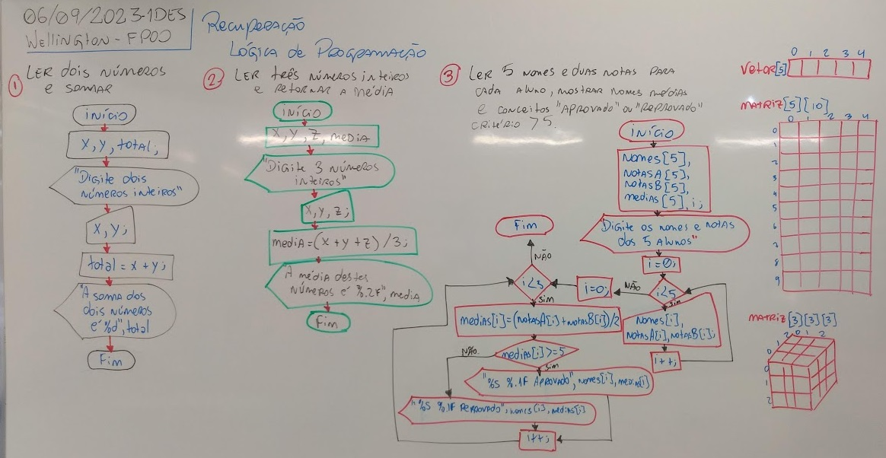
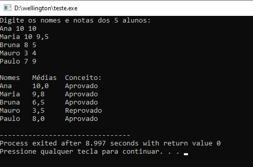

# Aula11 - Correção - Recuperação

## Atividade 03
```c
#include <stdio.h>
#include <locale.h>

int main(){
	setlocale(LC_ALL,"");
	char nomes[5][20];
	float notasA[5], notasB[5], medias[5];
	int i;
	
	printf("Digite os nomes e notas dos 5 alunos:\n");
	for(i = 0;i < 5;i++)
		scanf("%s %f %f", &nomes[i], &notasA[i], &notasB[i]);
	printf("\nNomes\tMédias\tConceito:\n");
	for(i = 0;i < 5;i++){
		medias[i] = (notasA[i] + notasB[i]) / 2;
		if(medias[i] >= 5)
			printf("%s\t%.1f\tAprovado\n", nomes[i], medias[i]);
		else
			printf("%s\t%.1f\tReprovado\n", nomes[i], medias[i]);
	}
	return 0;
}
```
