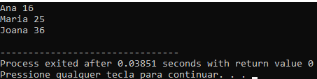

# Aula13
## Persistencia de dados
Manipulação de arquivos de texto. temos dois tipos de arquivos em um computador, arquivos **binários** e de **texto**, arquivos binários normalmente são, imagens, vídeos, sons, programas de computador compilados e arquivos de texto são todos os que são decodificados por uma tabela ascii.

### Prática
- Crie uma pasta e um arquivo de texto chamado arquivo.txt nesta pasta contendo o texto a seguir:
```
Mariana 5 7 10
Roberta 10 10 10
Genoveva 5 5 5
Jussara 3 4 5
```
#### Objetivo:
Criar um programa que leia um arquivo "arquivo.txt" contendo notas de alunos e mostre na tela o nome e a média de cada aluno, e salve um novo arquivo chamado "resultados.txt" os nomes dos alunos e se foram aprovados ou reprovados, critério média >= 5 aprovado, caso contrário reprovado.
#### Solução
- Primeiro vamos ler o arquivo caracter por caracter
- lecaracter.c
```c
#include <stdio.h>
#include <locale.h>
int main(){
    setlocale(LC_ALL,"");
    FILE *arquivo;
    char c;
    
    arquivo = fopen("arquivo.txt", "r");
    if(arquivo == NULL)
        printf("Erro, não foi possivel abrir o arquivo\n");
    else{
        while((c=fgetc(arquivo)) != EOF)
            putchar(c);
    }
    fclose(arquivo);
    return 0;
}
```
- Agora vamos ler o arquivo linha por linha
- lelinha.c
```c
#include <stdio.h>
#include <locale.h>

int main(){
	setlocale(LC_ALL,"");
	FILE *arquivo;
	char str[80];
	
	arquivo = fopen ("arquivo.txt", "r");
	if(arquivo == NULL)
		printf("Erro, não foi possivel abrir o arquivo\n");
	else{
		while((fgets(str, 80, arquivo)) != NULL)
  			printf("%s", str);
	}
	fclose(arquivo);
	return 0;
}
```
- Agora vamos ler o arquivo linha por linha, separar os dados e converter os tipos
- lecalcula.c
```c
int main(){
	setlocale(LC_ALL,"");
	FILE *arquivo;
	char str[80];
	char *nome;
	int n1, n2, n3;
	float media;
	
	arquivo = fopen ("arquivo.txt", "r");
	if(arquivo == NULL)
		printf("Erro, não foi possivel abrir o arquivo\n");
	else{
		while((fgets(str, 80, arquivo)) != NULL){
			nome = strtok(str," ");
			n1 = atoi(strtok(NULL," "));
			n2 = atoi(strtok(NULL," "));
			n3 = atoi(strtok(NULL," "));
			media = (n1 + n2 + n3)/3.0;
			printf("%s %d %d %d %.1f\n", nome, n1, n2, n3, media);
		}
	}
	fclose(arquivo);
	return 0;
}
```
- Enfim vamos além de mostrar as médias na tela, criar um arquivo de resultados com os conceitos "Aprovado" e "Reprovado"
```c
#include <stdio.h>
#include <locale.h>

int main(){
	setlocale(LC_ALL,"");
	FILE *entrada, *saida;
	char str[80];
	char *nome;
	int n1, n2, n3;
	float media;
	
	entrada = fopen ("arquivo.txt", "r");
	if(entrada == NULL)
		printf("Erro, não foi possivel abrir o arquivo\n");
	else{
		saida = fopen("resultado.txt","w");
		while((fgets(str, 80, entrada)) != NULL){
			nome = strtok(str," ");
			n1 = atoi(strtok(NULL," "));
			n2 = atoi(strtok(NULL," "));
			n3 = atoi(strtok(NULL," "));
			media = (n1 + n2 + n3)/3.0;
			printf("%s %d %d %d %.1f\n", nome, n1, n2, n3, media);
			if(media >= 5)
				fprintf(saida,"%s %s\n", nome, "Aprovado");
			else
				fprintf(saida,"%s %s\n", nome, "Reprovado");
		}
		fclose(saida);
	}
	fclose(entrada);
	return 0;
}
```
## Ler um arquivo com fscanf
dados.txt
```txt
Ana 16
Maria 25
Joana 36
```
lefscaf.c
```c
#include <stdio.h>

int main(){
	FILE *arq;
	char nome[50];
	int idade;
	
	arq = fopen("dados.txt","r");
	if(arq == NULL){
		printf("Erro ao ler arquivo.");
	}else{
		while(fscanf(arq,"%s %d",nome, &idade) != EOF){
			printf("%s %d\n", nome, idade);
		}
	}
	fclose(arq);
}
```
Saída:<br>

## Link com mais informações
https://www.cprogressivo.net/2013/11/Como-ler-arquivos-em-C-As-funcoes-fgetc-fscanf-fgets.html

### Exercício 1
- Crie um programa que leia um arquivo de texto chamado "dados.txt" contendo o texto a seguir:
```txt
1 2 3 4 5 6 7 8 9 10
```
- O programa deve ler o arquivo e mostrar na tela o conteúdo do arquivo e a soma dos números contidos no arquivo.
- solucao.c
```c
#include <stdio.h>
int main(){
	FILE *arquivo;
	char linha[80];
	arquivo = fopen("dados.txt","r");
	if(arquivo == NULL){
		printf("Erro ao ler arquivo");
	}else{
		//Contar quantos elementos tem no arquivo
		fgets(linha,80,arquivo);
		int cont = 1;
		strtok(linha," ");
		while(strtok(NULL," ")!=NULL) cont++;
		fclose(arquivo);
		printf("Total de elementos: %d\n", cont);
		
		//Agora acumular os valores do arquivo
		arquivo = fopen("dados.txt","r");
		fgets(linha,80,arquivo);
		int i, soma = 0;
		soma += atoi(strtok(linha," "));
		for(i = 1; i < cont; i++)
			soma += atoi(strtok(NULL," "));
		printf("Soma de elementos: %d", soma);
	}
	fclose(arquivo);
}
```

### Exercício 2
- Crie outro um programa deve ler o arquivo anterior e mostrar na tela o conteúdo do arquivo e gravar em um arquivo chamado "resultado.txt" média dos números contidos no arquivo.

```c
#include <stdio.h>
#include <locale.h>

//Constantes
#define LARGURA 80

//Variáveis GLOBAIS
FILE *arquivo;
char linha[LARGURA];
char nomeArquivo[] = "dados.txt";
char nomeResult[] = "resultado.txt";

//Funções
int contElementos(){
	int cont = 0;
	arquivo = fopen(nomeArquivo,"r");
	if(arquivo == NULL){
		printf("Erro ao ler arquivo\n");
	}else{
		fgets(linha,LARGURA,arquivo);
		cont = 1;
		strtok(linha," ");
		while(strtok(NULL," ")!=NULL) cont++;
		fclose(arquivo);
	}
	return cont;
}

float calcMedia(int cont){
	int i;
	float soma = 0;
	arquivo = fopen(nomeArquivo,"r");
	if(arquivo == NULL){
		printf("Erro ao ler arquivo\n");
	}else{
		fgets(linha,LARGURA,arquivo);
		soma += atoi(strtok(linha," "));
		for(i = 1; i < cont; i++)
			soma += atoi(strtok(NULL," "));
		fclose(arquivo);
	}
	return soma / cont;
}

void criarArquivo(float resultado){
	arquivo = fopen(nomeResult,"w");
	fprintf(arquivo, "%.1f", resultado);
	fclose(arquivo);	
}

//Programa Principal
int main(){
	setlocale(LC_ALL,"");
	int cont = contElementos();
	float media = calcMedia(cont);
	printf("O arquivo possui %d elementos\n",cont);
	printf("A média dos elementos é %.1f\n", media);
	criarArquivo(media);
}
```

## Situações Problema:
|Problema das portas (01)|
|-|
|Madame Beauvoir possui uma mansão onde ela recebe todos os seus descendentes (netos e bisnetos) durante as férias. Sua mansão possui exatamente N quartos (cada quarto é numerado de1 a N), onde N é também a quantidade de netos e bisnetos (cada descendente é também numerado de 1 a N).<br><br>Como toda criança, os descendentes de Mme. Beauvoir são bastante travessos. Todo dia é a mesma confusão: eles acordam de manhã cedo antes dela e se encontram no grande jardim. Cada descendente, um de cada vez, entra na mansão e troca o estado das portas dos quartos cujos números são múltiplos do seu identificador. Trocar o estado de uma porta significa fechar uma porta que estava aberta ou abrir uma porta que estava fechada. Por exemplo, o descendente cujo identificador é igual a 15 vai trocar o estado das portas 15, 30, 45, etc.<br><br>Considerando que todas as portas estão inicialmente fechadas (todos os descendentes fecham as portas antes de descer para o jardim) e que cada descendente entra exatamente uma vez na mansão (a confusão é tão grande que não sabemos em que ordem), quais portas estarão abertas após a entrada de todos os descendentes na mansão?|
|**Entrada:**|
|A entrada contém vários casos de teste. Cada caso de teste consiste em uma linha que contém um inteiro N (0 <= N <= 25.000.000), indicando o número de portas e descendentes. O final da entrada é indicado por N = 0.<br><br>A entrada deverá ser lida de um arquivo texto chamado **portas.in**|
|**Saída:**|
|Para cada caso de teste da entrada seu programa deve produzir uma linha na saída, contendo a sequência crescente de números correspondente aos identificadores dos quartos cujas portas estarão abertas. Ao imprimir a sequência, deixe um espaço em branco entre dois elementos consecutivos.<br><br>A saída deverá ser escrita em um arquivo texto chamado **portas.out**|

|Exemplo de entrada|Saída para o exemplo de entrada|
|-|-|
|1<br>2<br>3<br>4<br>0|1<br>1<br>1<br>1 4<br>|

-solucaoSemArquivo.c
```c
#include <stdio.h>
int total, i, j;

void mostrarPortas(int *portas){
	for(i = 0; i < total; i++){
		if(portas[i])
			printf("porta %d aberta\n", i + 1);
		else
			printf("porta %d fechada\n", i + 1);
	}
}

void formatarSaida(int *portas){
	for(i = 0; i < total; i++){
		if(portas[i])
			printf("%d ", i + 1);
	}
	printf("\n");
}

void solucao(int total){
	int portas[total];
	//Iniciei as portas
	for(i = 0; i < total; i++)
		portas[i] = 1;	
	//Alterar os status das portas
	for(i = 2; i <= total; i++)
		for(j = i; j <= total; j+=i)
			if(portas[j-1]) portas[j-1] = 0;
			else portas[j-1] = 1;
	//Mostrar na tela
	mostrarPortas(portas);
	formatarSaida(portas);
}

int main(){
	while(1){
		printf("Digite quantas portas e descendentes: ");
		scanf("%d", &total);
		solucao(total);
	}
	return 0;
}
```
- solucao.c
```c
#include <stdio.h>

//Variáveis Globais
FILE *entrada, *saida;
char in[] = "portas.in";
char out[] = "portas.out";
int i, j;

void solucao(int total){
	int portas[total];
	//Iniciei as portas
	for(i = 0; i < total; i++)
		portas[i] = 1;	
	//Alterar os status das portas
	for(i = 2; i <= total; i++)
		for(j = i; j <= total; j+=i)
			if(portas[j-1]) portas[j-1] = 0;
			else portas[j-1] = 1;
	//Gravar a saída no arquivo
	for(i = 0; i < total; i++){
		if(portas[i])
			fprintf(saida,"%d ",i + 1);
	}
	fprintf(saida,"\n");
	printf("%d\n",total);
}

int main(){
	entrada = fopen(in, "r");
	if(entrada == NULL){
		printf("Erro ao ler arquivo");
	}else{
		int total;
		saida = fopen(out,"w");
		do{
			fscanf(entrada, "%d",&total);
			solucao(total);
		}while(total != 0);
		fclose(saida);
	}
	fclose(entrada);
	return 0;
}
```


| Esquerda, Volver! (02)|
|-|
|Este ano o sargento está tendo mais trabalho do que de costume para treinar os recrutas. Um deles é muito atrapalhado, e de vez em quando faz tudo errado – por exemplo, ao invés de virar à a direita quando comandado, vira à esquerda, causando grande confusão no batalhão.<br><br> O sargento tem fama de durão e não vai deixar o recruta em paz enquanto este não aprender a executar corretamente os comandos. No sábado a tarde, enquanto todos os outros recrutas estão de folga, ele obrigou o recruta a fazer um treinamento extra. Com o recruta marchando parado no mesmo lugar, o sargento emitiu uma série de comandos “esquerda volver!” e “direita volver!”. A cada comando, o recruta deve girar sobre o mesmo ponto e dar um quarto de volta na direção correspondente ao comando. Por exemplo, se o recruta está inicialmente como rosto voltado para a direção norte, após um comando de “esquerda volver!” ele deve ficar com o rosto voltado para a direção oeste. Se o recruta está inicialmente com o rosto voltado para o leste, após um comando “direita, volver!” ele deve ter o rosto voltado para o sul.<br><br>No entanto, durante o treinamento, em que o recruta tinha inicialmente o rosto voltado para o norte, o sargento emitiu uma série tão extensa de comandos, e tão rapidamente, que até ele ficou confuso, e não sabe mais para qual direção o recruta deve ter seu rosto voltado após executar todos os comandos. Você pode ajudar o sargento?|
|**Entrada:**|
|A entrada contém vários casos de teste. A primeira linha de um caso de teste contém um inteiro N que indica o número de comandos emitidos pelo sargento (1 <= N <= 1.000). A segunda linha contém N caracteres, descrevendo a série de comandos emitidos pelo sargento. Cada comando é representado por uma letra: “E” (para “esquerda, volver!”) e “D” (para “direita, volver!”). O final da entrada é indicado por N = 0.<br><br> A entrada deverá ser lida de um arquivo texto chamado **esquerda.in**.|
|**Saída:**|
|Para cada caso de teste da entrada seu programa deve produzir uma única linha da saida, indicando a direção para a qual o recruta deve ter sua face voltada após executar a série de comandos, considerando que no início o recruta tem a face voltada para o norte. A linha deve conter uma letra entre ‘N’, ‘L’, ‘S’ e ‘O’, representando respectivamente as direções norte, leste, sul e oeste.<br><br>A saída deverá ser escrita em um arquivo texto chamado esquerda.out.|

|Exemplo de entrada|Saída para o exemplo de entrada|
|-|-|
|3<br>EDD<br>2<br>EE<br>0|L<br>S|

|Suco de Acerola (03)|
|-|
|Natural das Antilhas, a acerola (Malpighia glabra Linn, também conhecida como  cereja das Antilhas) já era apreciada pelos nativos das Américas há muitos séculos. Mas o grande interesse por essa fruta surgiu na década de 1940, quando cientistas porto-riquenhos descobriram que a acerola contém grande quantidade de Ácido ascórbico (vitamina C). A acerola apresenta, em uma mesma quantidade de polpa, até 100 vezes mais vitamina C do que a laranja e o limão, 20 vezes mais do que a goiaba e 10 vezes mais do que o caju e a amora.<br><br> Um grupo de amigos está visitando o Sítio do Picapau Amarelo, renomado produtor de acerola. Com a permissão de Dona Benta, dona do sítio, colheram uma boa quantidade de frutas, e pretendem agora fazer suco de acerola, que será dividido igualmente entre os amigos durante o lanche da tarde.<br><br> Conhecendo o número de amigos, a quantidade de frutas colhidas, e sabendo que cada unidade da fruta é suficiente para produzir 50 ml de suco, escreva um programa para determinar qual o volume, em litros, que cada amigo poderá tomar.|
|**Entrada:**|
|A entrada contém vários casos de teste. Cada caso de teste é composto por uma única linha, contendo dois números inteiros N e F, indicando respectivamente o número de amigos (1 <= N <= $10^3$) e a quantidade de de frutas colhidas (1 <= F <= $10^3$).<br><br>O final da entrada é indicado por uma linha que contém apenas dois zeros, separados por um espaço em branco.<br><br>A entrada deverá ser lida de um arquivo texto chamado **suco.in**.|
|**Saída:**|
|Para cada caso de teste da entrada seu programa deve imprimir uma única linha, contendo um número real, escrito com precisão de duas casas decimais, representando o volume de suco, em litros, a que cada amigo tem direito.<br><br>A saída deverá ser escrita em um arquivo de texto chamado **suco.out**.|

|Exemplo de entrada|Saída para o exemplo de entrada|
|-|-|
|1 1<br>5 431<br>101 330<br>0 0|0.05<br>4.31<br>0.16|