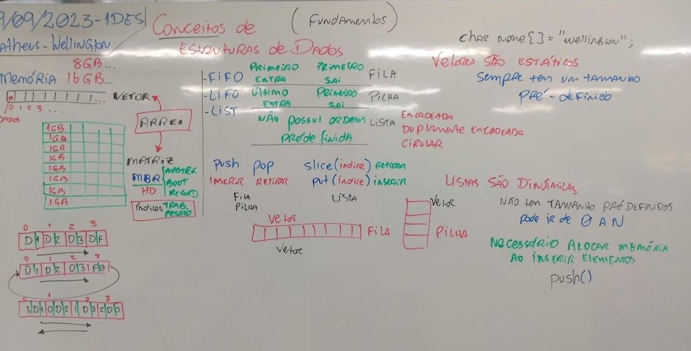

# Aula14 - Funcamentos de Estrutura de Dados
- PILHA
- FILA
- LISTA

## Pilha
- LIFO - Last In First Out
## Fila
- FIFO - First In First Out
## Lista
- Lista Ligada
- Lista Duplamente Ligada
- Lista Circular

## Exemplos:
pilha.c
```c
#include <stdio.h>
#define SIZE 10
int pilha[SIZE];
int ponteiro = 0;
int i;
void mostraPilha(){
	printf("Pilha:\n");
	for(i = 0; i < ponteiro; i++)
		printf("%d\n", pilha[i]);
}
int push(int dado){
	if(ponteiro < SIZE){
		pilha[ponteiro] = dado;
		ponteiro++;
		return 1;
	} 
	else return 0;
}
int pop(){
	if(ponteiro >= 0){
		ponteiro--;
		return 1;
	}else
		return 0;
}
int main(){
	push(25);
	mostraPilha();
	push(18);
	mostraPilha();
	push(10);
	mostraPilha();
	pop();
	mostraPilha();
	pop();
	mostraPilha();
}
```
Resultado:
```bash
Pilha:
25
Pilha:
25
18
Pilha:
25
18
10
Pilha:
25
18
Pilha:
25
```
fila.c
```c
#include <stdio.h>
#define SIZE 10
int fila[SIZE];
int ponteiro = 0;
int i;
void mostraFila(){
	printf("Fila:\n");
	for(i = 0; i < ponteiro; i++)
		printf("%d ", fila[i]);
	printf("\n");
}
int push(int dado){
	if(ponteiro < SIZE){
		fila[ponteiro] = dado;
		ponteiro++;
		return 1;
	} 
	else return 0;
}
int pop(){
	if(ponteiro >= 0){
		ponteiro--;
		for(i = 0; i < ponteiro; i++){
			fila[i] = fila[i+1];
		}
		return 1;
	}else
		return 0;
}
int main(){
	push(25);
	mostraFila();
	push(18);
	mostraFila();
	push(10);
	mostraFila();
	pop();
	mostraFila();
	pop();
	mostraFila();
}
```
Resultado:
```bash
Fila:
25
Fila:
25 18
Fila:
25 18 10
Fila:
18 10
Fila:
10
```
fila1.c
```c
#include <stdio.h>
#define SIZE 10
int fila[SIZE];
int inicio = 0;
int fim = 0;
int i;
void mostraFila(){
    printf("Fila:\n");
    for(i = inicio; i < fim; i++)
        printf("%d\n", fila[i]);
}
int push(int dado){
    if(fim < SIZE){
        fila[fim] = dado;
        fim++;
        return 1;
    } 
    else return 0;
}
int pop(){
    if(inicio < fim){
        inicio++;
        return 1;
    }else
        return 0;
}
int main(){
    push(25);
    mostraFila();
    push(18);
    mostraFila();
    push(10);
    mostraFila();
    pop();
    mostraFila();
    pop();
    mostraFila();
}
```
- Apresenta o mesmo resultado anterior

lista.c
```c
#include <stdio.h>
#include <stdlib.h>
struct Lista{
    int dado;
    struct Lista *prox;
};
struct Lista *inicio = NULL;
struct Lista *fim = NULL;
struct Lista *aux = NULL;
void mostraLista(){
    aux = inicio;
    printf("Lista:\n");
    while(aux != NULL){
        printf("%d\n", aux->dado);
        aux = aux->prox;
    }
}
int push(int dado){
    aux = (struct Lista*) malloc(sizeof(struct Lista));
    if(aux == NULL) return 0;
    aux->dado = dado;
    aux->prox = NULL;
    if(inicio == NULL){
        inicio = aux;
        fim = aux;
    }else{
        fim->prox = aux;
        fim = aux;
    }
    return 1;
}

int pop(){
    if(inicio != NULL){
        aux = inicio;
        inicio = inicio->prox;
        free(aux);
        return 1;
    }else
        return 0;
}

int slice(int index){
    int i;
    aux = inicio;
    if(index == 0){
        inicio = inicio->prox;
        free(aux);
        return 1;
    }else{
        for(i = 0; i < index-1; i++){
            aux = aux->prox;
        }
        struct Lista *aux2 = aux->prox;
        aux->prox = aux2->prox;
        free(aux2);
        return 1;
    }
    return 0;
}

int main(){
    push(25);
    mostraLista();
    push(18);
    mostraLista();
    push(10);
    mostraLista();
    pop();
    mostraLista();
    pop();
    mostraLista();
    push(45);
    push(18);
    push(25);
    mostraLista();
    slice(2);
    mostraLista();
}
```
Resultado:
```bash
Lista:
25
Lista:
25
18
Lista:
25
18
10
Lista:
18
10
Lista:
10
Lista:
10
45
18
25
Lista:
10
45
25
```
## Atividades
- 1. PILHA, utilize o algoritmo de plilha apresentado e implemente um menu na função main para que o usuário possa escolher entre as opções de inserir e  remover elementos na pilha, a acada alteração do usuário mostre a pilha.
- 2. FILA, faça o mesmo que foi pedido na atividade 1, mas agora para uma fila.
- 3. LISTA, faça o mesmo que foi pedido na atividade 1, mas agora para uma lista.
- 4. Crie um programa com as mesmas funcionalidades do anterior porém peça para o usuário escolher entre as opções de pilha, fila e lista.

### Prazo para mostrar ao professor:
- Próxima sexta feira: 06/10/2023