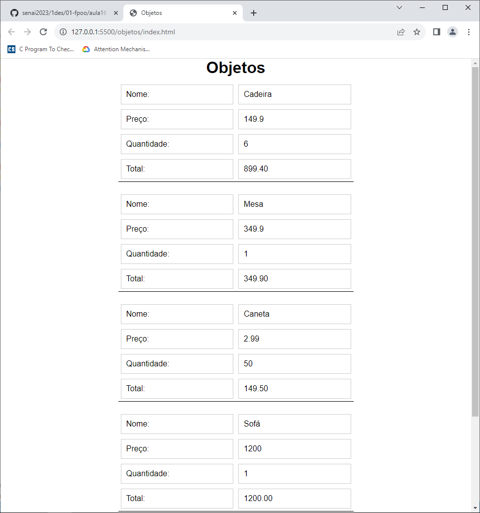
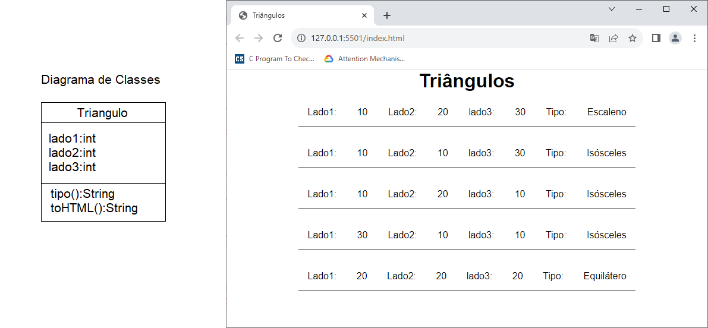
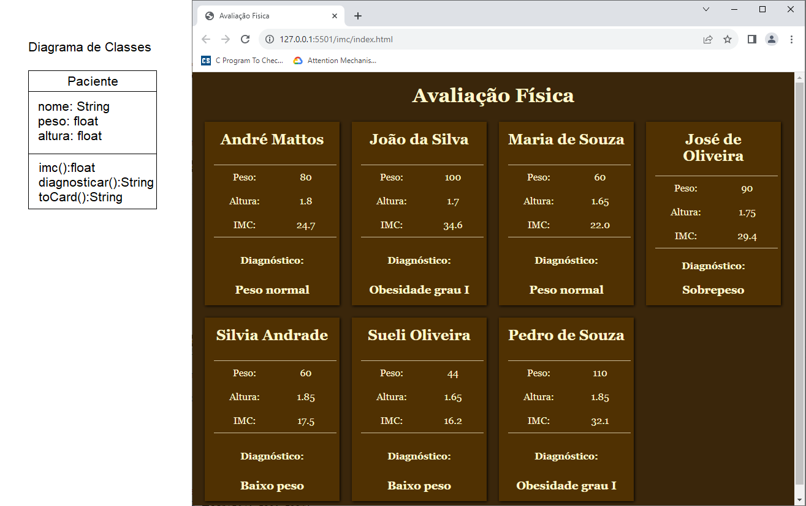
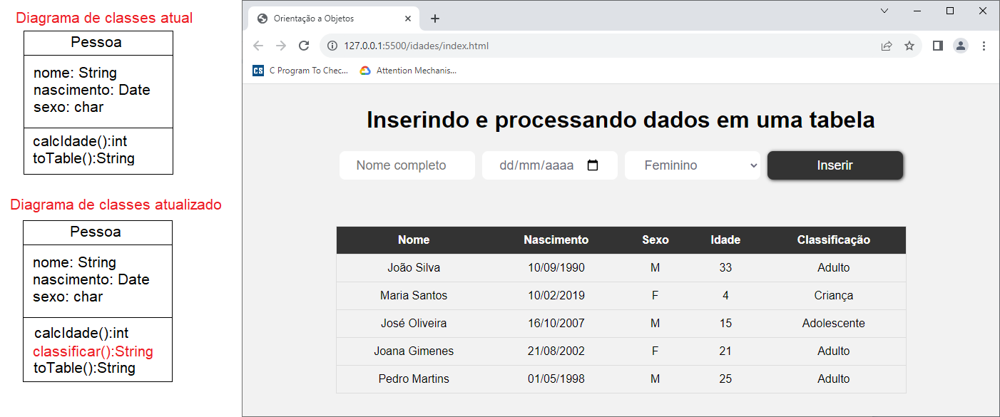

# Aula16 - Fundamentos de Programação Orientada a Objeto
<table>
<tr>
<td colspan="2" align="center">

## Classes e Objetos

<table>
    <tr><th>Classe</th><th>Instância</th><th>bjeto</th></tr>
    <tr><th></th><th><b>new</b></th><th>{}</th></tr>
    <tr><th>Atributos</th><th colspan="2">Características do objeto</th></tr>
    <tr><th>Métodos</th><th colspan="2">Ações, funções</th></tr>
</table>

</td>
</tr>
<tr>
<td>

## Conceitos

|Nome|Conceito|
|-|-|
|Classe|Abstração inicial de um objeto ou "esqueleto" de um objeto|
|Instância|Cada implementação / utilização da classe|
|Objeto|Os dados e ações de cada instância|
|Atributos|Características, campos de um objeto|
|Métodos|Ações, funções de um objeto|

- Reaproveitamento de Código 
</td>
<td>

## Diagrama de Classes

|NomeClasse|
|-|
|primeiroAtributo: tipo<br>segundoAtributo: tipo<br>...|
|primeiroMetodo():tipo<br>segundoMetodo(tipo):tipo<br>...|

- Utilizamos o estilo CamelCase com JavaScript
</td>
</tr>
</table>

## Classes, Instâncias e Objetos com JavaScriptv
### Prática
- Criar uma pasta com qualquer nome
- Criar dois arquivos dentro da pasta
    - index.html
    - objetos.js
- index.html
```html
<!DOCTYPE html>
<html lang="en">
<head>
    <meta charset="UTF-8">
    <meta name="viewport" content="width=device-width, initial-scale=1.0">
    <title>Objetos</title>
</head>
<body>
    <header>
        <h1>Objetos</h1>
    </header>
    <main id="objetos">       
    </main>
</body>
<script src="objetos.js"></script>
</html>
```
- objetos.js
```js
//Objeto declarado diretamente
const obj = {};
//Atributos dinamicamente
obj.nome = 'Bola';
obj.preço = 39.90;
obj.qtd = 10;
//Método com function
obj.total = function (){
    return obj.preço * obj.qtd;
}
//Método com arrow function
obj.showHTML = () => {
    let str = `<label>Nome:</label><label>${obj.nome}</label>`;
    str += `<label>Preço:</label><label>${obj.preço}</label>`;
    str += `<label>Quantidade:</label><label>${obj.qtd}</label>`;
    str += `<label>Total:</label><label>${obj.total().toFixed(2)}</label>`;
    return str;
}

//Saídas no console
console.log(obj);
console.log('Valor total = R$ '+obj.total().toFixed(2));

//Saída no HTML
const main = document.getElementById('objetos');
const div = document.createElement('div');
div.innerHTML = obj.showHTML();
main.appendChild(div);
```
### Exercício
- Crie mais dois objetos no arquivo objetos.js e mostre na tela HTML
#### Solução:
-objetos.js
```js
//Objeto vazio, declarado diretamente
const obj = {};
//Acrescentando atributos dinamicamente
obj.nome = 'Bola';
obj.preço = 39.90;
obj.qtd = 10;
//Acrescentando métodos com function, dinânicamente
obj.total = function (){
    return obj.preço * obj.qtd;
}
//Acrescentando outro método com arrow function, dinamicamente
obj.showHTML = () => {
    let str = `<label>Nome:</label><label>${obj.nome}</label>`;
    str += `<label>Preço:</label><label>${obj.preço}</label>`;
    str += `<label>Quantidade:</label><label>${obj.qtd}</label>`;
    str += `<label>Total:</label><label>${obj.total().toFixed(2)}</label>`;
    return str;
}

//Objeto cheio, com atributos e métodos
const obj2 = {
    //Atributos locais do objeto
    nome:"Mesa de escritório",
    preco: 349.90,
    qtd: 2,
    //Métodos locais do objeto
    total(){
        return this.preco * this.qtd;
    },
    showHTML(){
        let str = `<label>Nome:</label><label>${this.nome}</label>`;
        str += `<label>Preço:</label><label>${this.preco}</label>`;
        str += `<label>Quantidade:</label><label>${this.qtd}</label>`;
        str += `<label>Total:</label><label>${this.total().toFixed(2)}</label>`;
        return str;
    }
}

//Terceiro objeto, com atributos e métodos
const obj3 = {
    //Atributos locais do objeto
    nome:"Caneta azul",
    preco: 2.99,
    qtd: 10,
    //Métodos locais do objeto
    total(){
        return this.preco * this.qtd;
    },
    showHTML(){
        let str = `<label>Nome:</label><label>${this.nome}</label>`;
        str += `<label>Preço:</label><label>${this.preco}</label>`;
        str += `<label>Quantidade:</label><label>${this.qtd}</label>`;
        str += `<label>Total:</label><label>${this.total().toFixed(2)}</label>`;
        return str;
    }
}

//Saídas no console
console.log(obj);
console.log('Valor total = R$ '+obj.total().toFixed(2));
console.log(obj2);
console.log('Valor total = R$ '+obj2.total().toFixed(2));
console.log(obj3);
console.log('Valor total = R$ '+obj3.total().toFixed(2));

//Saída no HTML
const main = document.getElementById('objetos');

const div = document.createElement('div');
div.innerHTML = obj.showHTML();
main.appendChild(div);

const div2 = document.createElement('div');
div2.innerHTML = obj2.showHTML();
main.appendChild(div2);

const div3 = document.createElement('div');
div3.innerHTML = obj3.showHTML();
main.appendChild(div3);
```

### exercício 2
- Crie uma página de estilo css e divida a saída em um **grid**.
#### Solução:
- style.css
```css
*{
    margin: 0;
    padding: 0;
    box-sizing: border-box;
    font-family: 'Poppins', sans-serif;
}
body{
    display: flex;
    flex-direction: column;
    align-items: center;
}

main{
    width: 100%;
    display: flex;
    flex-direction: column;
    align-items: center;
}

main div{
    width: 50%;
    display: grid;
    margin: 10px;
    grid-template-columns: 50% 50%;
    border-bottom: 1px solid #000;
}

main div label{
    border: 1px solid #ccc;
    padding: 10px;
    margin: 5px;
}
```
## Classes (Reaproveitamento de código)
### Prática
- No arquivo index.html comentamos a classe script e criamos outra
- index.html
```html
<!DOCTYPE html>
<html lang="en">
<head>
    <meta charset="UTF-8">
    <meta name="viewport" content="width=device-width, initial-scale=1.0">
    <link rel="stylesheet" href="style.css">
    <title>Objetos</title>
</head>
<body>
    <header>
        <h1>Objetos</h1>
    </header>
    <main id="objetos">       
    </main>
</body>
<!-- <script src="objetos.js"></script> -->
<script src="classes.js"></script>
</html>
```
- Criamos um outro arquivo chamado classes.js
- classes.js
```js
//Criar objetos a partir de uma classe
class Coisa{
    constructor(nome, preco, qtd){
        this.nome = nome;
        this.preco = preco;
        this.qtd = qtd;
    }
    total(){
        return this.preco * this.qtd
    }
    showHTML(){
        let str = `<label>Nome:</label><label>${this.nome}</label>`;
        str += `<label>Preço:</label><label>${this.preco}</label>`;
        str += `<label>Quantidade:</label><label>${this.qtd}</label>`;
        str += `<label>Total:</label><label>${this.total().toFixed(2)}</label>`;
        return str;
    }
}
//Criar instâncias desta classe
const obj1 = new Coisa('Cadeira', 149.90, 6);
const obj2 = new Coisa('Mesa', 349.90, 1);
const obj3 = new Coisa('Caneta', 2.99, 50);
const obj4 = new Coisa('Sofá', 1200.00, 1);
const obj5 = new Coisa('Poltrona do papai', 5500.00, 1);

//Saídas no HTML
const main = document.getElementById('objetos');
const div1 = document.createElement('div');
const div2 = document.createElement('div');
const div3 = document.createElement('div');
const div4 = document.createElement('div');
const div5 = document.createElement('div');

div1.innerHTML = obj1.showHTML();
div2.innerHTML = obj2.showHTML();
div3.innerHTML = obj3.showHTML();
div4.innerHTML = obj4.showHTML();
div5.innerHTML = obj5.showHTML();

main.appendChild(div1);
main.appendChild(div2);
main.appendChild(div3);
main.appendChild(div4);
main.appendChild(div5);

```
### Utilizando Lista
- Como temos muitos objetos da mesma classe podemos utilizar uma lista para otimizar
- classes.js
```js
//Criar objetos a partir de uma classe
class Coisa{
    constructor(nome, preco, qtd){
        this.nome = nome;
        this.preco = preco;
        this.qtd = qtd;
    }
    total(){
        return this.preco * this.qtd
    }
    showHTML(){
        let str = `<label>Nome:</label><label>${this.nome}</label>`;
        str += `<label>Preço:</label><label>${this.preco}</label>`;
        str += `<label>Quantidade:</label><label>${this.qtd}</label>`;
        str += `<label>Total:</label><label>${this.total().toFixed(2)}</label>`;
        return str;
    }
}
//Criar instâncias desta classe em uma lista
const lista = [];
lista.push(new Coisa('Cadeira', 149.90, 6));
lista.push(new Coisa('Mesa', 349.90, 1));
lista.push(new Coisa('Caneta', 2.99, 50));
lista.push(new Coisa('Sofá', 1200.00, 1));
lista.push(new Coisa('Poltrona do papai', 5500.00, 1));

//Mostrar no console
console.table(lista);

//Mostrar no HTML
const main = document.getElementById('objetos');
lista.forEach(obj => {
    const div = document.createElement('div');
    div.innerHTML = obj.showHTML();
    main.appendChild(div);
});
```
### Resultado final


# Atividades
- 1 Da mesma forma que fizemos em aula:
    - A) crie uma pasta chamada "triangulos" e crie os arquivos index.html, style.css e triangulos.js
    - B) No arquivo index.html crie um cabeçalho com o título "Triângulos" e um main com id="triangulos"
    - C) No arquivo style.css crie um estilo para o body, main e div
    - D) No arquivo triangulos.js crie uma classe chamada Triangulo com os atributos lado1, lado2 e lado3 e um método chamado tipo() que retorna o tipo do triângulo (equilátero, isósceles ou escaleno)
    - E) Crie uma lista de triângulos e mostre no HTML, conforme o exemplo abaixo:
- 2 Conforme modelo de projeto que estamos seguindo, crie uma outra pasta chamada imc:
    - A) crie os arquivos index.html, style.css e imc.js
    - B) No arquivo index.html crie um cabeçalho com o título "Avaliação Física" e um main com id="pacientes"
    - C) No arquivo style.css crie um estilo para o body, main e div para ficar semelhante a imagem abaixo:
    - D) No arquivo imc.js crie uma classe chamada Paciente com os atributos nome, peso e altura, um método chamado imc() que retorna o IMC do paciente e outro chamado diagnosticar() que classifique de acordo com os seguintes critérios: abaixo de 18.5 - abaixo do peso; entre 18.5 e 24.9 - peso normal; entre 25 e 29.9 - sobrepeso; entre 30 e 34.9 - obesidade grau 1; entre 35 e 39.9 - obesidade grau 2; acima de 40 - obesidade grau 3.
    - E) Crie uma lista de pacientes e mostre no HTML, conforme o exemplo abaixo:
- 3 Neste repositório há um projeto iniciado chamado **idades**. Este projeto é um exemplo de como podemos utilizar classes e objetos para criar um sistema de cadastro de pessoas. O projeto está incompleto e você deve completá-lo. Para isso, siga os passos abaixo:
    - A) Crie uma pasta chamada "idades" e copie os arquivos index.html, style.css e pessoas.js
    - B) No arquivo index.html você perceberá que existe:
        - a) Um formulário para cadastrar pessoas
        - b) Uma tabela com os campos **nome, nascimento, sexo e idade**.
    - C) ainda no arquivo index.html, acrescente mais uma coluna chamada **Classificação** no cabeçalho da tabela.
    - D) No arquivo pessoas.js há uma classe chamada **Pessoa** com um método construtor, o método que calcula a idade a partir da data de nascimento e outro que mostra os dados como linha de uma tabela.
    - E) Acrescente um método chamado classificar() que classifique as pessoas como: Criança, Jovem, Adulto, Meia idade e idoso.
    - F) Acrescente um atributo calculado chamado classificacao que retorne a classificação da pessoa.
    - G) Altere o método toTable() para mostrar a classificação da pessoa.
- A imagem a seguir mostra o diagrama de classes e o wireframe de como a alteração deve ficar:
    
    
## Entregas
- Junte esta e as outras atividades em um único repositório público no GitHub e envie o link do repositório no forms a seguir:
- https://forms.gle/XcobyyCjJuxuqxZ76
- Instuções
- 