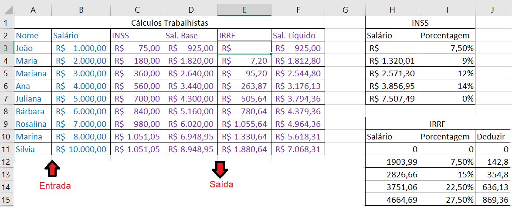

# Aula17 - Projeto: Cálculos Trabalhistas
- Utilizando como base a planilha da aula06 de SOP
- 
- Vamos criar um sistema web para realizar os cálculos trabalhistas
- O sistema possuirá as seguintes "features" (Funcionalidades) **CRUD**
	- **Create** - Cadastro
	- **Read** - Consulta
	- **Update** - Alteração
	- **Delete** - Exclusão

## Etapa 01
- Criar uma pasta para o projeto e um arquivo js com as funções com os calculos iniciais:
script.js
```js
function inss(salario) {
    if (salario < 1320.01)
        return salario * 7.5 / 100;
    else if (salario < 2571.30)
        return salario * 9 / 100;
    else if (salario < 3856.95)
        return salario * 12 / 100;
    else if (salario < 7507.49)
        return salario * 14 / 100;
    else
        return 1051.05;
}

function irrf(salario) {
    if (salario < 1903.99)
        return 0;
    else if (salario < 2826.66)
        return salario * 7.5 / 100 - 142.8;
    else if (salario < 3751.06)
        return salario * 15 / 100 - 354.8;
    else if (salario < 4664.69)
        return salario * 22.5 / 100 - 636.13;
    else
        return salario * 27.5 / 100 - 869.36;
}

//Testando as funções:
let salario = 1000;
let inss = inss(salario);
let salarioBase = salario - inss;
let irrf = irrf(salarioBase);
let salarioLiquido = salarioBase - irrf;

console.log("Salário: " + salario);
console.log("INSS: " + inss);
console.log("Salário Base: " + salarioBase);
console.log("IRRF: " + irrf);
console.log("Salário Líquido: " + salarioLiquido);
```
## Etapa 02 (Model)
- Transformar as funções em uma classe
- Pagamento.js
```js
class Pagamento {
    //Método construtor com os atributos da classe
    constructor(id, funcionario, salario) {
        this.id = id;
        this.funcionario = funcionario;
        this.data = new Date();
        this.salario = salario;
        this.salarioBase = (this.salario - this.inss()).toFixed(2);
        this.salarioLiquido = (this.salarioBase - this.irrf()).toFixed(2);
    }

    //Métodos de cálculo
    inss() {
        if (this.salario < 1320.01)
            return this.salario * 7.5 / 100;
        else if (this.salario < 2571.30)
            return this.salario * 9 / 100;
        else if (this.salario < 3856.95)
            return this.salario * 12 / 100;
        else if (this.salario < 7507.49)
            return this.salario * 14 / 100;
        else
            return 1051.05;
    }

    irrf() {
        if (this.salario < 1903.99)
            return 0;
        else if (this.salario < 2826.66)
            return this.salario * 7.5 / 100 - 142.8;
        else if (this.salario < 3751.06)
            return this.salario * 15 / 100 - 354.8;
        else if (this.salario < 4664.69)
            return this.salario * 22.5 / 100 - 636.13;
        else
            return this.salario * 27.5 / 100 - 869.36;
    }
}
```
## Etapa 03 (View)
- Criar uma interface para o usuário HTML
- index.html
```html
<!DOCTYPE html>
<html lang="en">

<head>
    <meta charset="UTF-8">
    <meta name="viewport" content="width=device-width, initial-scale=1.0">
    <link rel="stylesheet" href="style.css">
    <title>Folha de Pagamentos</title>
</head>

<body>
    <header>
        <h1>Folha de pagamentos</h1>
    </header>
    <main>
        <section>
            <form id="create">
                <label for="funcionario">Nome do funcionário:</label>
                <input type="text" name="funcionario" id="funcionario" placeholder="Nome do funcionário" required>
                <label for="salario">Salário:</label>
                <input type="number" name="salario" id="salario" placeholder="Salário" required>
                <input type="reset" value="Limpar">
                <input type="submit" value="Cadastrar">
            </form>
        </section>
        <section id="cards">

        </section>
    </main>
</body>
<script src="Pagamento.js"></script>
<script src="controller.js"></script>

</html>
```
# Etapa 04 (Controller)
- Criar os controles para adicionar, remover (CRUD)
- controller.js
```js
const formCadastro = document.querySelector('#create');
const folhaPagamentos = []

formCadastro.addEventListener('submit', (e) => {
    e.preventDefault();
    let id = Math.floor(Math.random() * 100000) + 1000; //Gerar id aleatorio entre 1000 e 100000
    folhaPagamentos.push(new Pagamento(id, formCadastro.funcionario.value, formCadastro.salario.value));
    preecherCards();
    sorteiaFuncionario();
});

function preecherCards() {
    const cards = document.querySelector('#cards');
    cards.innerHTML = '';
    folhaPagamentos.forEach(pagamento => {
        cards.innerHTML += `
        <div class="card">
            <div class="card-header">
                <h1>Pagamento Id: ${pagamento.id}</h1>
                <button type="button" class="btn btn-danger" onclick="excluir(${pagamento.id})">-</button>
            </div>
            <div class="card-body">
                <p class="card-title">Funcionário: ${pagamento.funcionario}</p>
                <p class="card-subtitle mb-2 text-muted">Data: ${pagamento.data.toLocaleDateString()}</p>
                <p class="card-text">Salário: R$ ${pagamento.salario}</p>
                <p class="card-text">INSS: R$ ${pagamento.inss().toFixed(2)}</p>
                <p class="card-text">Salário Base: R$ ${pagamento.salarioBase}</p>
                <p class="card-text">IRRF: R$ ${pagamento.irrf().toFixed(2)}</p>
                <p class="card-text">Salário Líquido: R$ ${pagamento.salarioLiquido}</p>
            </div>
        </div>`
    });
    console.table(folhaPagamentos);
}

function excluir(id) {
    const index = folhaPagamentos.findIndex(pagamento => pagamento.id == id);
    folhaPagamentos.splice(index, 1);
    preecherCards();
}
```

## Etapa 05 (View)
- Ainda em UI (User Interface) podemos estilizar com CSS
- style.css
```css
* {
    margin: 5px;
    padding: 5px;
    box-sizing: border-box;
    font-family: 'Poppins', sans-serif;
}

body {
    background: #f2f2f2;
    display: flex;
    flex-direction: column;
    align-items: center;
    height: 100vh;
    overflow: hidden;
}

header {
    display: flex;
    flex-direction: column;
    align-items: center;
    text-align: center;
    width: 100%;
    height: 10vh;
}

main {
    width: 100%;
    display: flex;
    flex-direction: column;
    align-items: center;
    height: 90vh;
}

main section #create {
    display: grid;
    grid-template-columns: 50% 50%;
}

#cards {
    width: 100%;
    height: 70vh;
    display: flex;
    flex-direction: row;
    flex-wrap: wrap;
    overflow-y: auto;
}

.card {
    max-height: 350px;
    background: #fff;
    border-radius: 10px;
    margin: 10px;
    display: flex;
    flex-direction: column;
    align-items: center;
    justify-content: center;
    box-shadow: 0px 0px 10px 0px rgba(0, 0, 0, 0.2);
}

.card .card-header {
    width: 100%;
    display: flex;
    justify-content: space-between;
    align-items: center;
    padding: 10px;
    font-size: small;
}

.card-header button {
    cursor: pointer;
    padding-left: 10px;
    padding-right: 10px;
}
```