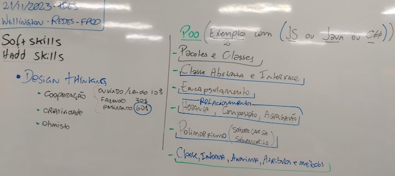

# Aula 18 - Programação Orientada a Objetos

## Conhecimentos
- 3.2. Pacotes
- 3.3. Classes
  - 3.3.1. Abstrata
  - 3.3.2. Interna
  - 3.3.3. Anônima
  - 3.3.4. Atributos
  - 3.3.5. Métodos
  - 3.3.6. Modificadores de acesso (encapsulamento)
- 3.4. Objetos
- 3.5. Interface
- 3.6. Polimorfismo
- 3.7. Enumerações
- 3.8. Relacionamentos de objetos
  - 3.8.1. Herança
  - 3.8.2. Agregação
  - 3.8.3. Composição 

  |Atividades|
  |-|
  |Em grupos de 3 a 4 integrantes, pesquise no google e/ou chatgpt sobre os assuntos/temas destacados na lousa e atribuídos pelo professor a cada grupo, escolha a linguagem de programação para apresentar a sala pelo menos dois exemplos de cada assunto| 

## Apresentações
- [Carlos, Ana, Otavio, Fernanda - Agregação, Composição e Herança](./relacoes)
- [Guilherme, Bruno, Alefe - Classes, Instâncias e Pacotes](https://github.com/Bruno-Otavio/senai/blob/main/presentation/presentation.pptx)
- [Carla, Letícia, Gabriela](./encapsulamento/apresentacao.pptx)