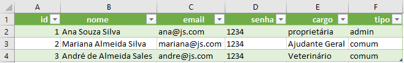
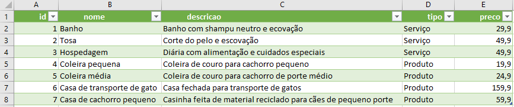
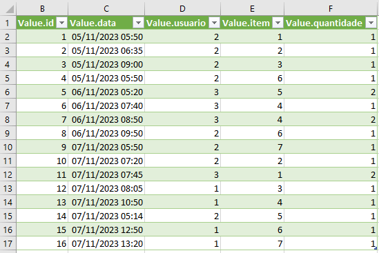

# Aula 19 (POO - JSON)

## Sistema de exemplo com persistência de dados em arquivo JSON

## Funções
- Abrir e Salvar(Download) de arquivos de dados
- Login e nível de acesso
- CRUD com dados das listas

## Tema do exemplo:
- PetShop da Ana

## Situação Problema
|Contextualização|
|-|
|A Sra. Ana Souza Silva, dona de um PetShop precisa de um sistema para gerenciar seu negócio, ela trabalha no seu petshop e possui dois colaboradores, um Veterinário e uma ajudante geral, quando ela não está os clientes são atendidos por seus funcionários, ela precisa que o sitema permita que somente ela possa cadastrar **ítens** de sua loja (Produtos e Serviços) e os seus funcionários possam ver os produtos e cadastrar **vendas**, atualmete ela utiliza uma planilha do Excel para fazer este controle|

|Planilhas|
|:-:|
|Planilha de usuários|
||
|Planilha de ítens|
||
|Planilha de vendas|
||

|Desafio|
|-|
|Crie um sistema Web que diferencie o acesso dos **usuários**: Sra. Ana e seus funcionários e permita que ela possa cadastrar **ítens**, e seus funcionários possam registrar as **vendas** de produtos e serviços, ao concluir a utilização do sistema os dados devem ser salvos (feito download para um arquivo de dados) e ao iniciar o sistema os dados devem ser carregados|

|Solução|
|-|
|Esta situação problema será resolvida em 3 etapas, sendo que cada etapa será um projeto, o primeiro projeto será o sistema de carregar e salvar dados em arquivo JSON, o segundo projeto será o sistema de login e logout e o final um sistema completo que atende a situação problema|

# Projetos finais
Baseado nesta situação problema, os projetos finais serão executados em grupos de até três devs. Cada grupo deverá escolher um tema para o sistema, por exemplo: PetShop, Loja de Roupas, Loja de Materiais de Construção, Loja de Materiais Esportivos, Biblioteca, etc.

|Grupo|Integrantes|Tema|
|-|-|-|
|1|Cícero, Colosso, Richard|Loja de Acessorios para Veículos (Estética automotiva)|
|2|Guilerme, Bruno, Alefe|Livraria|
|3|Carla, Gabriela, Letícia|Loja de Joias|
|4|Carlos, Igor, Vinícius|Loja e Games|
|5|Ana, Fernanda, Otávio|Loja de Bijouterias|
|6|Camila, Cecília, Erick|Loja de Roupas e Acessórios|
|7|Carlos|Prestação de serviços de Marido/Esposa de aluguel|
|8|Jaqueline, João, Rafael|Açougue|
|9|Beckham, Mirela, Pedro|Loja de Materiais de Construção|

## Requisitos mínimos
- Salvar e carregar dados em arquivo JSON
- Login e logout
- CRUD com dados das listas
- Estilização com CSS e/ou BootsTrap

|Entregas|
|-|
|O projeto deverá ser implementado no github.io ou em um servidor de hospedagem gratuito de sua preferência, o link do projeto deverá ser enviado para este FORMS 15/12/2020, também deverá ser colocado no seu portifólio|
