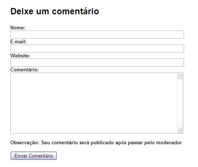
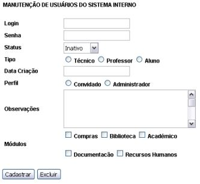
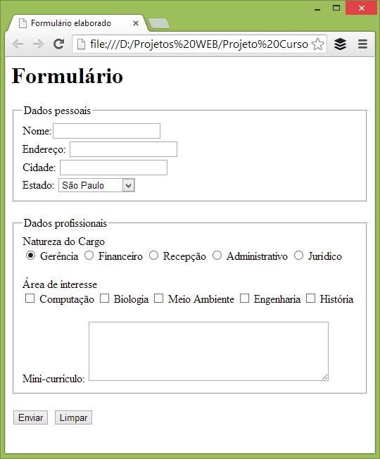

# Aula 03

## Formulários

```html

<!DOCTYPE HTML>
<html>
	<head>
		<meta charset="UTF-8"/>
		<title>Aula 03</title>
	</head>
	<body>
		<!-- TAG para formulário 
		       action => para onde os dados do formulario irão
		       method => maneira que será enviado
		-->
		<form action="" method="">
			<!-- TAG Label etiqueta para o input 
			       for => identifica o input que pertencer a label
			-->
			<label for="nome" >Nome Completo</label>

			<!-- TAG Input - Entrada de dados
			       type => Define o tipo do dado
			       id => Identificador do input
			       placeholder => Texto de identificação do input
			-->
			<input type="text" id="nome" placeholder="Insira seu nome" required/>
			<br>
			<label for="datanasc">Data de Nascimento</label>
			<input id="datanasc" type="date" />
			<br>
			<label for="indica">Você nos indicaria ?</label>
			<input id="indica" type="number" min="1" max="5" />
			<br>
			<label for="email">E-mail</label>
			<input id="email" type="email" placeholder="Informe seu E-mail" />
			<br>
			<label for="cor">Cor favorita</label>
			<input id="cor" type="color" />
			<br>
			<label for="volume">Em qual volume você ouve música (0 a 100)</label>
			<input id="volume" type="range" min="0" max="100"/>
			<br>
			<!-- TAG Fieldset conjunto de campos-->
			<fieldset>
				<!-- TAG legend titulo do fieldset -->
				<legend>Gênero</legend>
				<input type="radio" id="masc" name="genero" />
				<label for="masc">Masculino</label>
				<input type="radio" id="fem" name="genero"/>
				<label for="fem">Feminino</label>
				<input type="radio" id="outros" name="genero"/>
				<label for="outros">Outros</label>
			</fieldset>
			<br>
			<fieldset>
				<legend>Monte seu lanche</legend>
				<input type="checkbox" id="salada"/>
				<label for="salada">Salada</label>
				<input type="checkbox" id="hamb"/>
				<label for="hamb">Hamburguer</label>
				<input type="checkbox" id="bac"/>
				<label for="bac">Bacon</label>
				<input type="checkbox" id="mc"/>
				<label for="mc">Maionese Caseira da Casa</label>
			</fieldset>
			<br>
			<label for="info">Informações Adicionais</label><br>
			<textarea id="info"></textarea>
			<br>	
			<label for="senha">Senha</label>
			<input id="senha" type="password"/>
			<br>
			<label for="cidade">Informe a cidade</label>
			<select id="cidade">
				<option>Jaguariúna</option>
				<option>Pedreira</option>
				<option>Amparo</option>
				<option>Holambra</option>
			</select>
			<br>
			<input type="reset" value="Limpar Form"/>
			<input type="submit" />
		</form>
	</body>
</html>

```

## Exercícios de sala

### Exercício 01

!

### Exercício 02

!

### Exercício 01

!