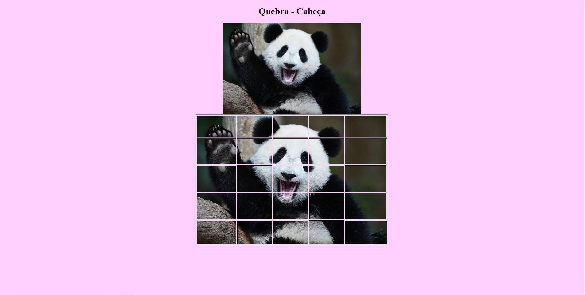

# Aula 05

## Atividade Formativa HTML + CSS
### Exercicio 01

- Reproduza a imagem de referencia organizando o quebra-cabeça.

### Exercicio 02

- Reproduza a imagem de referencia montando a tabela fielmente com as cores e alinhamentos.

## Critérios de avaliação
### Fundamentos Técnicos e Científicos
-  Identificar as características e tipos de linguagem de marcação. (**Diferenciou HTML de CSS.**)
-  Utilizar linguagem de marcação para desenvolvimento de páginas web. (**Desenvolveu uma página HTML e uma folha de estilos CSS.**)
-  Desenhar leiautes de tela para ambientes web. (**Replicou com alguma semelhança o leiaute apresentado.**)
-  Codificar leiautes de página web	(**Replicou com extrema semelhança o leiaute apresentado.**)
-  Utilizar semântica de linguagem de marcação conforme normas (**Classificou com a página com cabeçalho, assunto principal, rodapé e menus**)
-  Aplicar técnicas de estilização de páginas wed. (**Relaciou os elementos HTML com seu devido estilo CSS.**)
-  Otimizar imagens para aplicação em ambientes web e mobile (**Utilizou recuros básicos de responsividade como porcentagens e posição vertical e horizontal**)
### Capacidades Sociais, Organizativas e Metodológicas
-  Demonstrar atenção a detalhes (**Replicou com extrema semelhança o leiaute apresentado.**)
-  Demonstrar capacidade de análise (**Pesquisou na internet recursos que melhoraram a apresentação do site**)
-  Demonstrar raciocínio lógico na organização das informações (**Estilizou almenos um dos elementos do cabeçalho, ou imagem, ou fontes, outros.**)

## Conhecimentos
- 1. Linguagem de Marcação
    - 1.1. Definição
    - 1.2. Tipos
- 2. World wide web (www)
    - 2.1. Definição
    - 2.2. Mudanças na world wide web
    - 2.5. Mercado de trabalho
- 3. Leiautes de tela
    - 3.1. Definição
    - 3.2. Planejamento
    - 3.3. Wireframe
- 4. HTML
    - 4.1. Definição (Hyper text market language)
    - 4.2. Validação de código pelo W3C
    - 4.3. Elementos da linguagem
        - 4.3.1. Html
        - 4.3.2. Head
        - 4.3.3. Title
        - 4.3.4. Body e seus atributos
        - 4.3.5. Metas tag
        - 4.3.6. Comentários
    - 4.4. Semântica dos elementos
    - 4.5. Elementos para manipulação de textos
        - 4.5.1. Fonte
        - 4.5.2. Estilos de formatação (b, strong, I, em, sub, sup)
        - 4.5.3. Parágrafo
        - 4.5.4. Elementos de cabeçalho (h1 até h6)
        - 4.5.5. Quebra de linha
        - 4.5.6. Alinhamentos
    - 4.6. Elementos de cores e imagens
        - 4.6.1. Formato de cores (hexadecimal, RGB)
        - 4.6.2. Psicologia das cores 4.6.3. Cores em elementos de texto 4.6.4. Cores em elementos de fundo (background)
        - 4.6.5. Tipos de extensões para manipulação de imagens
        - 4.6.6. Imagens como elemento da página e seus atributos
        - 4.6.7. Imagens em elementos de fundo (background)
        - 4.6.8. Vídeos
    - 4.7. Elementos de ancoras (links)
        - 4.7.1. Dentro de arquivos
        - 4.7.2. Entre arquivos
        - 4.7.3. Para páginas externas
        - 4.7.4. Para download de arquivos
        - 4.7.5. Formatação de links
    - 4.8. Elementos de listas
        - 4.8.1. Não numeradas
        - 4.8.2. Numeradas
        - 4.8.3. De definição
        - 4.8.4. Encadeadas
    - 4.9. Elementos de tabulação
        - 4.9.1. Para criação de tabelas
        - 4.9.2. Atributos da tabela ( tamanhos, alinhamentos, espaçamentos, mesclagem)
        - 4.9.3. Formatação de tabelas (cores e imagens)
        - 4.9.4. Tabelas encadeadas
    - 4.10. Elementos de entrada de dados ( Formulários)
        - 4.10.1. Atributos do formulário (métodos, ações)
        - 4.10.2. Elementos de entrada de dados ( text, textarea, select, radio, checkbox, button, file)
        - 4.10.3. Elementos para formulários
        - 4.10.4. Atributos para elementos de formulário
        - 4.10.5. Validação de campos em formulário
        - 4.10.6. Expressões regulares
- 5. Estilização de páginas
    - 5.1. Definição
    - 5.2. Semântica de programação W3C
    - 5.3. Validação de código pelo W3C
    - 5.4. Tipos de seletores
        - 5.4.1. Classe
        - 5.4.2. Identificação
        - 5.4.3. Tag 5.4.4. Universal
        - 5.4.5. Seletores compartilhados
    - 5.5. Formatação de elementos 
        - 5.5.1. Textos 5.5.2. Imagens
        - 5.5.3. Listas 5.5.4. Tabelas
        - 5.5.5. Ancoras (links)
    - 5.6. Aplicação de estilos de menus e submenus
    - 5.7. Box model
        - 5.7.1. Margin
        - 5.7.2. Border
        - 5.7.3. Padding
        - 5.7.4. Content
    - 5.8. Diagramação de elemento (Div)
        - 5.8.1. Atributos de formatação e alinhamento
        - 5.8.2. Posicionamento (static, relative, fixed e absolute, float, z-index, display)