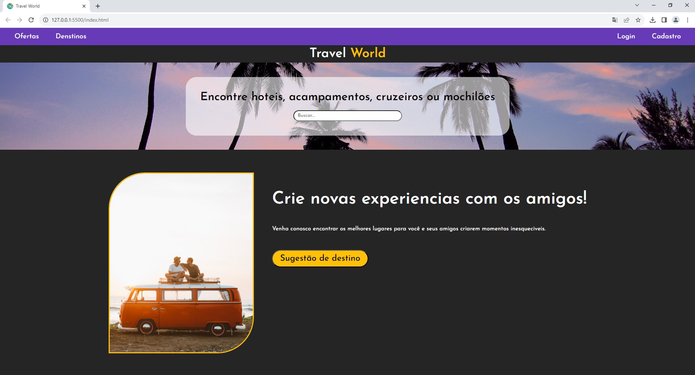

# Aula 07

## Atividade Somativa HTML + CSS

## Contextualização:
A "Travel World" é uma agência de viagens renomada, especializada em proporcionar experiências únicas e inesquecíveis para os amantes de aventuras e culturas ao redor do mundo. A empresa está buscando expandir sua presença online, atraindo um público global através de um site atraente.

## Desafio
Você como desenvolvedor front-end foi designado a criar o site baseado no layout a seguir.



## Entregas
Todas as instruções estão em nossa turma no https://classroom.google.com

## REQUISITOS:
- Organização de pastas.
- Seguir o design.
- Uso correto das tags e identação.
- Criar um repositório para esta atividade e enviar o link no forms.

### Assets:
- @import url('https://fonts.googleapis.com/css2?family=Josefin+Sans:ital,wght@0,300;0,500;0,600;1,700&display=swap');
- font-family: 'Josefin Sans', sans-serif;
#### Paleta de cores
- Roxo: #673AB7
- Branco: #FFFFFF
- Cinza: #252525
- Amarelo: #FFC107

## Correção
[Correção por Matheus](./correcaoByMatheus)
```html
<!DOCTYPE html>
<html lang="en">
<head>
    <meta charset="UTF-8">
    <meta name="viewport" content="width=device-width, initial-scale=1.0">
    <title>Travel World</title>
    <link rel="stylesheet" href="style/style.css">
    <link rel="shortcut icon" href="../assets/icon.png">
</head>
<body>

    <div class="navbar">
        <div>
            <span>Ofertas</span>
            <span>Destinos</span>
        </div>
        <div>
            <span>Login</span>
            <span>Cadastro</span>
        </div>
    </div>

    <headder>
        <h1>Travel <span>World</span></h1>
    </headder>

    <div class="search">
        <div>
            <h3>Encontre hoteis, acampamentos, cruzeiros ou mochilões</h3>
            <input type="search" placeholder="Buscar...">
        </div>
    </div>

    <main>
        <div>
            
        </div>
        <div class="text">
            <h1>Crie novas experiências com os amigos!</h1>
            <p>Venha conosco encontrar os melhores lugares para você e seus amigos criarem momentos inesqueciveis.</p>
            <input type="submit" value="Sugestão de destino">
        </div>
    </main>
    
</body>
</html>
```
```css
@import url('https://fonts.googleapis.com/css2?family=Josefin+Sans:ital,wght@0,300;0,500;0,600;1,700&display=swap');

*{
    margin: 0;
    padding: 0;
}

body{
    font-family: 'Josefin Sans', sans-serif;
}

:root{
    --Roxo: #673AB7;
    --Branco: #FFFFFF;
    --Cinza: #252525;
    --Amarelo: #FFC107;
}

.navbar{
    background-color: var(--Roxo);
    display: flex;
    justify-content: space-between;
    align-items: center;
    color: var(--Branco);
    height: 5vh;
}

.navbar div span{
    font-size: 1.3rem;
    padding: 30px;
}

headder{
    display: flex;
    justify-content: center;
    align-items: center;
    height: 7vh;
    background-color: var(--Cinza);
    color: var(--Branco);
    font-size: 1.4rem;
}

headder h1 span{
    color: var(--Amarelo);
}

.search{
    background-image: url(../../assets/banner.jpg);
    background-size: cover;
    background-position: center;
    height: 25vh;
    display: flex;
    justify-content: center;
    align-items: center;
}

.search div{
    background-color: rgba(255, 255, 255, .7);
    padding: 40px;
    border-radius: 20px;
    display: flex;
    flex-direction: column;
    justify-content: center;
    align-items: center;
}

.search h3{
    font-size: 1.7rem;
}

.search div input{
    width: 250px;
    padding: 5px;
    border-radius: 100px;
    margin-top: 15px;
}

main{
    height: 63vh;
    background-color: var(--Cinza);
    display: flex;
    justify-content: center;
    align-items: center;
}

main div img{
    height: 450px;
    border: 2px solid var(--Amarelo);
    border-radius: 100px 0 100px 0;
    margin-right: 50px;
}
.text{
    color: var(--Branco);
    height: 400px;
}

.text h1{
    font-size: 2.5rem;
    margin-bottom: 50px;
}

.text input{
    width: 300px;
    padding: 10px;
    font-size: 1.5rem;
    font-weight: bold;
    border-radius: 100px;
    background-color: var(--Amarelo);
    margin-top: 50px;
}
```
[Correção por Wellington](./correcaoByWellington)
```html
<!DOCTYPE html>
<html lang="en">

<head>
    <meta charset="UTF-8">
    <meta name="viewport" content="width=device-width, initial-scale=1.0">
    <title>Travel World</title>
    <link rel="shortcut icon" href="../assets/icon.png">
    <link rel="stylesheet" href="style.css">
</head>

<body>
    <header>
        <nav>
            <div>
                <button>Ofertas</button>
                <button>Destinos</button>
            </div>
            <div>
                <button>Login</button>
                <button>Cadastro</button>
            </div>
        </nav>
        <h1>
            <div>Travel</div>
            <div style="color:#FFC107;margin-left:10px;">World</div>
        </h1>
    </header>
    <main>
        <section class="faixa">
            <div>
                <h2>Encontre hotéis, acampamentos, cruzeiros ou mochilões</h2>
                <input type="text" placeholder="Buscar.">
            </div>
        </section>
        <section class="conteudo">
            <div>
                
                <div class="direita">
                    <h3>Crie novas experiências com os amigos!</h3>
                    <p>Venha conosco encontrar os melhores lugares para você e seus amigos criarem momentos
                        inesquecíveis.</p>
                    <button>Sugestão de destino</button>
                </div>
            </div>
        </section>
    </main>
</body>

</html>
```
```css
@import url('https://fonts.googleapis.com/css2?family=Josefin+Sans:ital,wght@0,300;0,500;0,600;1,700&display=swap');

/*
Roxo: #673AB7
Branco: #FFFFFF
Cinza: #252525
Amarelo: #FFC107
*/

*{
    margin: 0;
    padding: 0;
    font-family: 'Josefin Sans', sans-serif;
}

body{
    background-color: #252525;
    display: flex;
    flex-direction: column;
    align-items: center;
}

header{
    display: flex;
    flex-direction: column;
    align-items: center;
    width: 100%;
    height: 100px;
}

nav{
    width: 100%;
    display: flex;
    flex-direction: row;
    justify-content: space-between;
    align-items: center;
    background-color: #673AB7;
}

nav div button{
    background: none;
    color: #fff;
    border: none;
    margin: 10px;
    margin-left: 25px;
    margin-right: 25px;
    font-size: 16px;
}

h1{
    color: #fff;
    font-size: 30px;
    margin: 10px;
    display: flex;
    flex-direction: row;
}

main{
    display: flex;
    flex-direction: column;
    align-items: center;
    width: 100%;
}

img{
    max-width: 350px;
    border-top-left-radius: 25%;
    border-bottom-right-radius: 25%;
    border: #FFC107 solid 2px;
    margin: 40px;
}

.faixa{
    display: flex;
    flex-direction: column;
    align-items: center;
    width: 100%;
    height: 200px;
    background-image: url("../assets/banner.jpg");
    background-position: center;
    background-size: cover;
}

.faixa div{
    background-color: rgba(255,255,255,0.5);
    width: 50%;
    height: 150px;
    border-radius: 20px;
    display: flex;
    flex-direction: column;
    align-items: center;
    margin-top: 25px;
}

h2{
    font-size: 25px;
    margin: 25px;
}

.faixa div input{
    width: 300px;
    border-radius: 20px;
    padding: 5px;
    margin: 10px;
}

.conteudo{
    display: flex;
    flex-direction: column;
    align-items: center;
    max-width: 70%;
}

.conteudo div{
    display: flex;
    flex-direction: row;
}

.conteudo div .direita{
    display: flex;
    flex-direction: column;
    align-items: left;
}

h3{
    color: #fff;
    margin-top: 90px;
    font-size: 40px;
}

p{
    color: #fff;
    font-size: 14px;
    margin-top: 40px;
}

.conteudo div .direita button{
    background-color: #FFC107;
    border-radius: 20px;
    padding: 10px;
    margin-top: 40px;
    font-size: 20px;
    width: fit-content;
}
```
## Desafio:
- Dicas pesquise sobre display grid em CSS:
- [desafio](./Atividade.pdf)