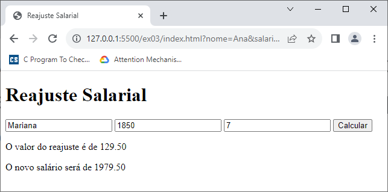
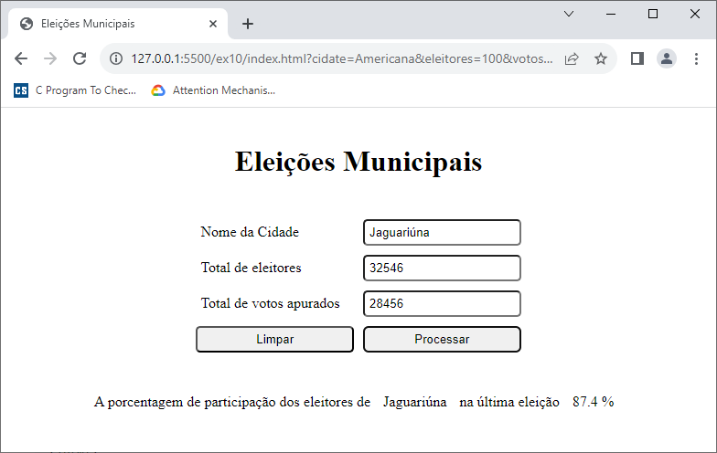
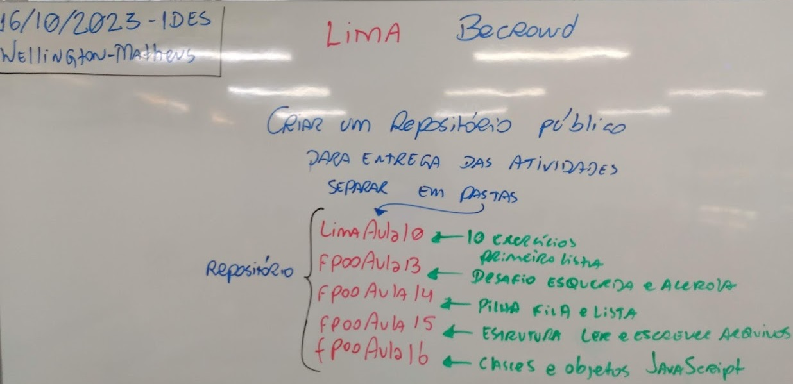

# Aula10 - JavaScript

Páginas HTML dinâmicas com JavaScript

## Objetivos
- Entender o que é JavaScript
- Entender como usar JavaScript em uma página HTML

## Prática

- index.html
```html
<!DOCTYPE html>
<html lang="en">
<head>
    <meta charset="UTF-8">
    <meta name="viewport" content="width=device-width, initial-scale=1.0">
    <title>Document</title>
</head>
<body>

    <input type="number" id="a" placeholder="Digite o valor a: ">
    <input type="number" id="b" placeholder="Digite o valor b: ">
    <input type="number" id="c" placeholder="Digite o valor c: ">
    <input type="submit" onclick="calculo()">

    <h1 id="result"></h1>
    
</body>
<script src="script.js"></script>
</html>
```
- script.js
```javascript
// var nome = document.getElementById('nome')
// var resultado = document.getElementById('resultado')

// function buscarElemento(){
//     // let nome = document.getElementById('nome')

//     resultado.innerHTML = nome.value 
// }

function calculo(){
    let a = Number(document.getElementById('a').value);
    let b = Number(document.getElementById('b').value);
    let c = Number(document.getElementById('c').value);

    document.querySelector('#result').innerHTML = `A soma de 'a' + 'b' divido por 'c' é igual a: ${(a+b)/c}`
}
```
## Atividades (Lista 01 - A mesma executada com linguagem C agora com entrada e saída em HTML e processamento em JavaScript)
- 1. Desenvolva um programa que leia três variáveis (a, b, c) e resolva a expressão: ( a + b ) / c.
- 2. Desenvolva um programa que leia a velocidade de um carro (km/h) e a distância a ser percorrida (km) por ele. Calcule e apresente na tela, quanto tempo (horas) será necessário para o carro percorrer a distância informada.
- 3. Desenvolva um programa que leia o nome e o salário de uma pessoa, depois leia o valor do índice percentual (%) de reajuste do salário. Calcule e apresente na tela, o valor do novo salário e o nome da pessoa.
- 4. Desenvolva um programa que leia o nome de um time de futebol, o número de vitórias e o número de empates. O programa deverá calcular e apresentar na tela, o nome do time e o total de pontos. Lembrando que a vitória vale 3 pontos e o empate vale 1 ponto.
- 5. Desenvolva um programa que leia um número ”n” inteiro, positivo e diferente de zero e apresente na tela: n – 1, e também n + 1.
- 6. Sabendo-se que a velocidade de cruzeiro de um avião 747-300 é de 900 km/h, faça um programa que leia uma distância (km), calcule e apresente na tela, quanto tempo (horas) será necessário para um 747-300 sobrevoar a distância informada.
- 7. Um caminhão consegue transportar 18 toneladas de laranjas em uma viagem que faz entre a fazenda e a fábrica de suco de laranja. Um alqueire de terra produz em média 250 toneladas de laranjas. Faça um programa que leia quantos caminhões e quantos alqueires uma fazenda produtora de laranjas possui, calcule e apresente na tela quantas viagens de caminhão serão necessárias para transportar toda a colheita de laranjas.
- 8. Desenvolva um programa que leia o raio (cm) e a altura (cm) de um cilindro. Calcule e mostre a área (cm2) e o volume (cm3) do cilindro.
- 9. Desenvolva um programa que leia o nome e o preço de uma mercadoria. O programa deverá calcular um aumento de 5% no preço da mercadoria e mostrar o nome da mercadoria e o seu novo preço.
- 10. Desenvolva um programa que leia o nome de uma cidade, o número total de eleitores e o número total de votos apurados na última eleição. O programa deverá calcular e exibir a porcentagem de participação dos eleitores desta cidade na última eleição.
- OBS: Os exercícios podem ser feitos em um único arquivo HTML ou em vários arquivos HTML, um para cada exercício. A escolha é sua.

## Exemplo de Correção

- ex03 (index.html)
```html
<!DOCTYPE html>
<html lang="en">
<head>
    <meta charset="UTF-8">
    <meta name="viewport" content="width=device-width, initial-scale=1.0">
    <title>Reajuste Salarial</title>
</head>
<body>
    <header>
        <h1>Reajuste Salarial</h1>
    </header>
    <main>
        <form id="calcular">
            <input type="text" name="nome" placeholder="Nome completo" required>
            <input type="number" name="salario" placeholder="Salário" required>
            <input type="number" name="percentual" placeholder="Percentual de Reajuste" required>
            <input type="submit" value="Calcular">
        </form>
    </main>
    <footer>
        <p>O valor do reajuste é de <label id="reajuste"></label></p>
        <p>O novo salário será de <label id="novoSalario"></label></p>
    </footer>
</body>
<script>
    const form = document.getElementById('calcular');
    form.addEventListener('submit', obj =>{
        obj.preventDefault();
        let salario = parseFloat(form.salario.value);
        let percentual  = form.percentual.value;
        let reajuste = salario * percentual / 100;
        let novoSalario = salario + reajuste;
        document.getElementById('reajuste').innerHTML = reajuste.toFixed(2);
        document.getElementById('novoSalario').innerHTML = novoSalario.toFixed(2);
    });
</script>
</html>
```
Resultado 

- ex10 (index.html)
```html
<!DOCTYPE html>
<html lang="en">

<head>
    <meta charset="UTF-8">
    <meta name="viewport" content="width=device-width, initial-scale=1.0">
    <title>Eleições Municipais</title>
</head>

<style>
    *{
        margin: 5px;
        padding: 5px;
        border-radius: 5px;
    }
    body{
        display: flex;
        flex-direction: column;
        align-items: center;
    }
    form{
        display: grid;
        grid-template-columns: 50% 50%;
    }
</style>

<body>
    <header>
        <h1>Eleições Municipais</h1>
    </header>
    <main>
        <form id="entrada">
            <label for="cidade">Nome da Cidade</label>
            <input type="text" name="cidade" required>
            <label for="eleitores">Total de eleitores</label>
            <input type="number" name="eleitores" required>
            <label for="votos">Total de votos apurados</label>
            <input type="number" name="votos" required>
            <input type="reset" value="Limpar">
            <input type="submit" value="Processar">
        </form>
    </main>
    <footer>
        <p>A porcentagem de participação dos eleitores de <label id="cidade"></label> na última eleição <label id="porcentagem"></label>
        </p>
    </footer>
</body>
<script src="script.js"></script>

</html>
```
- script.js
```javascript
const formEntrada = document.getElementById('entrada');
formEntrada.addEventListener('submit',form=>{
    form.preventDefault();
    let cidade = formEntrada.cidade.value;
    let eleitores = formEntrada.eleitores.value;
    let votos = formEntrada.votos.value;
    let porcentagem = votos / eleitores * 100;
    document.getElementById("cidade").innerHTML = cidade;
    document.getElementById("porcentagem").innerHTML = `${porcentagem.toFixed(1)} %`
});
```
Resultado 

## Entregas
- Junte esta e as outras atividades em um único repositório público no GitHub e envie o link do repositório no forms a seguir:
- https://forms.gle/XcobyyCjJuxuqxZ76
- Instuções
- 