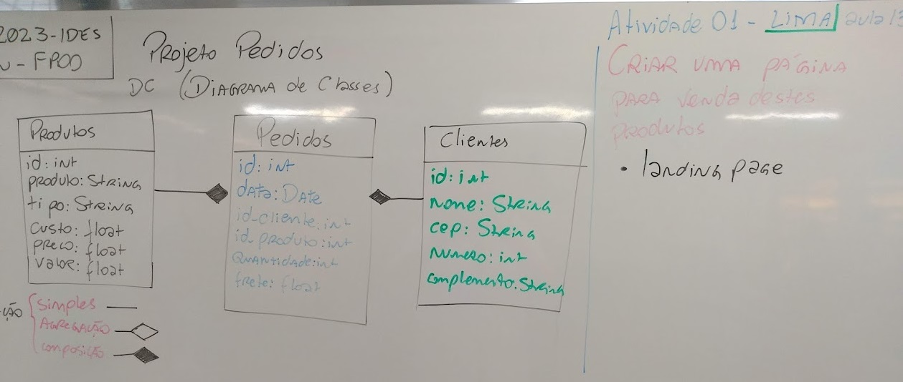
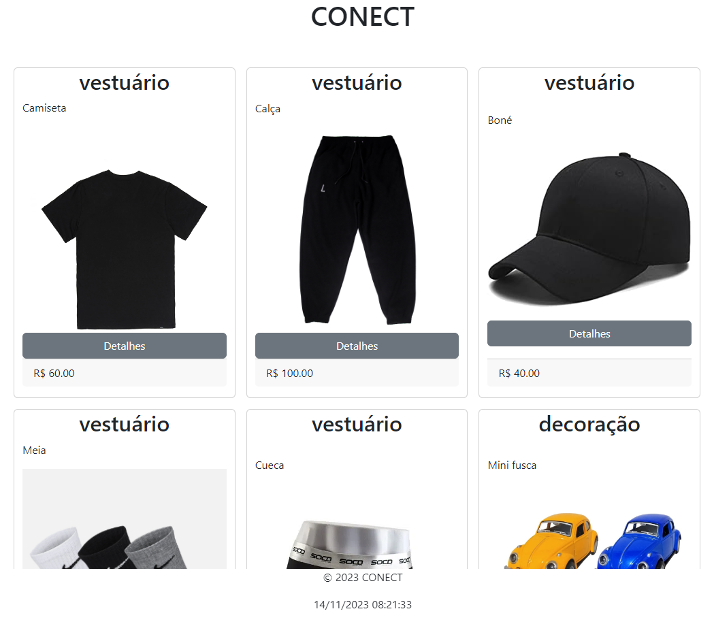

# Aula 13
## Landing Page
### Objetivo: Criar uma landing Page

### Situação Problema

|Contextualização|
|-|
|Você foi contratado para desenvolver uma landing page para uma pequena empresa chamada **COLECT** cuja principal atividade é a venda de roupas, miniaturas e colecionáveis pela internet, atualmente utiliza apenas o site do **mercado livre** para suas vendas, e precisa de uma página própria|

|Desafio|
|-|
|Criar uma landing page para a empresa **COLECT**, com os dados dos produtos estão no reposítório (../04-sop/aula08/analisepedidos)|
|Desafio de aprendizagem autônoma|
|Para este desafio você pode utilizar o Framework Bootstrap, segue alguns links sobre este framework que você poderá utilizar para estilizar sua landing page|

|WireFrame|
|-|
||

### Bootstrap
- Framework para desenvolvimento de sites responsivos
- [Bootstrap](https://getbootstrap.com/)
- [Documentação](https://getbootstrap.com/docs/4.5/getting-started/introduction/)

## Tutorial
- [Tutorial Landing Page com Bootstrap](./tutorial_bootstrap.md)