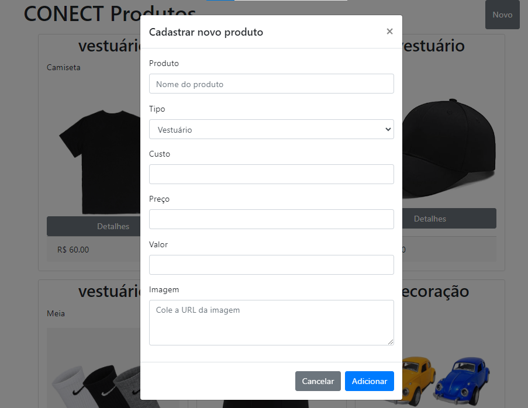
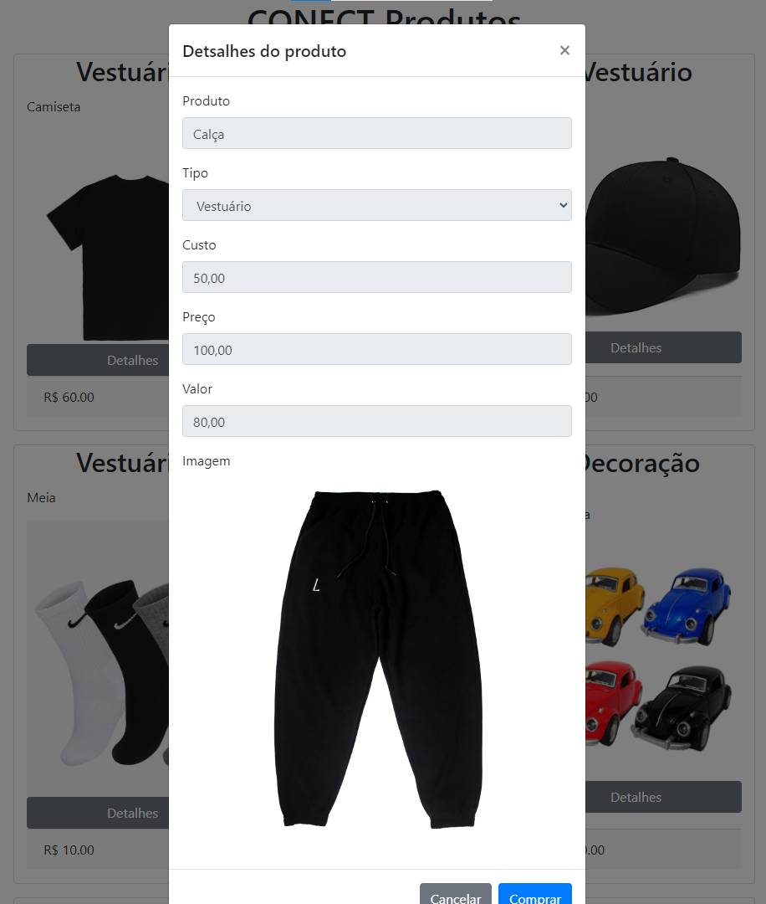
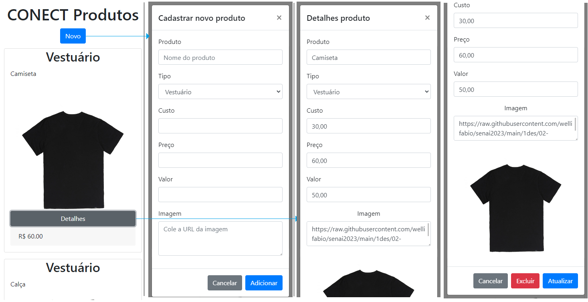

### Bootstrap
- Framework para desenvolvimento de sites responsivos
- [Bootstrap](https://getbootstrap.com/)
- [Documentação](https://getbootstrap.com/docs/4.5/getting-started/introduction/)

### Tutorial Bootstrap
#### 1. Criar uma pasta chamada **landingpage** e dentro dela criar um arquivo chamado **index.html** e outro **script.js**.

#### 2. Adicionar o código abaixo no arquivo **index.html**
```html
<!DOCTYPE html>
<html lang="en">

<head>
    <meta charset="UTF-8">
    <meta name="viewport" content="width=device-width, initial-scale=1.0">
    <title>CONECT</title>
</head>

<body>
    <header>
        <div>
            <h1>CONECT</h1>
        </div>
    </header>
    <main>
    </main>
    <footer>
        <p>© 2023 CONECT</p>
        <label id="rodape"></label>
        <script>
            rodape = document.getElementById("rodape");
            rodape.innerHTML = new Date().toLocaleDateString();
            rodape.innerHTML += " ";
            rodape.innerHTML += new Date().toLocaleTimeString();
        </script>
    </footer>
</body>
<script src="./script.js"></script>

</html>
```

#### 3. Adicionar o código abaixo no arquivo **script.js**
```html
alert('oi');
```
Pronto, a estrutura da página está preparada para ser estilizada com Bootstrap
#### 4. Adicionar os códigos a seguir **index.html** para criar links com o css e javascript do Bootstrap
```html
<!DOCTYPE html>
<html lang="en">

<head>
    <meta charset="UTF-8">
    <meta name="viewport" content="width=device-width, initial-scale=1.0">
    <!-- Links para os CSSs do Bootstrap -->
    <link rel="stylesheet" href="https://cdn.jsdelivr.net/npm/bootstrap@4.5.3/dist/css/bootstrap.min.css"
        integrity="sha384-TX8t27EcRE3e/ihU7zmQxVncDAy5uIKz4rEkgIXeMed4M0jlfIDPvg6uqKI2xXr2" crossorigin="anonymous">
    <title>CONECT</title>
</head>

<body>
    <header class="col justify-content-center">
        <div class="row justify-content-around">
            <h1>CONECT Produtos</h1>
        </div>
    </header>
    <main class="container">
        <!-- Card de Modelo para os outros -->
        <div id="container" class="row justify-content-md-center">
            <div id="model0" class="card col-lg-3 m-2 justify-content-between">
                <h2 class="card-title text-center">Tipo</h2>
                <p class="card-text">Produto</p>
                
                <button class="btn btn-secondary">Detalhes</button>
                <p class="card-footer">Preço</p>
            </div>
        </div>
    </main>
    <footer class="text-center">
        <p>© 2023 CONECT</p>
        <label id="rodape"></label>
        <script>
            rodape = document.getElementById("rodape");
            rodape.innerHTML = new Date().toLocaleDateString();
            rodape.innerHTML += " ";
            rodape.innerHTML += new Date().toLocaleTimeString();
        </script>
    </footer>
    <!-- Links para os JavaScripts do Bootstrap -->
    <script src="https://code.jquery.com/jquery-3.5.1.slim.min.js"
        integrity="sha384-DfXdz2htPH0lsSSs5nCTpuj/zy4C+OGpamoFVy38MVBnE+IbbVYUew+OrCXaRkfj"
        crossorigin="anonymous"></script>
    <script src="https://cdn.jsdelivr.net/npm/bootstrap@4.5.3/dist/js/bootstrap.bundle.min.js"
        integrity="sha384-ho+j7jyWK8fNQe+A12Hb8AhRq26LrZ/JpcUGGOn+Y7RsweNrtN/tE3MoK7ZeZDyx"
        crossorigin="anonymous"></script>
</body>
<script src="./script.js"></script>

</html>
```

#### 5. JavaScript, criar uma lista de objetos JSON a partir do arquivo produtos.csv
Podemos usar uma extenção do VSCode "CSV to JSON" para converter os dados, depois copiar para um vetor no arquivo **script.js**
```js
var objs = [
	{
		"id": "1",
		"produto": "Camiseta",
		"tipo": "vestuário",
		"custo": "30.00",
		"preco": "60.00",
		"valor": "50.00",
		"img": "https://raw.githubusercontent.com/wellifabio/senai2023/main/1des/02-lima/aula13/assets/camiseta.webp"
	},
	{
		"id": "2",
		"produto": "Calça",
		"tipo": "vestuário",
		"custo": "50.00",
		"preco": "100.00",
		"valor": "80.00",
		"img": "https://raw.githubusercontent.com/wellifabio/senai2023/main/1des/02-lima/aula13/assets/calsa.jpg"
	},
	{
		"id": "3",
		"produto": "Boné",
		"tipo": "vestuário",
		"custo": "15.00",
		"preco": "40.00",
		"valor": "25.00",
		"img": "https://raw.githubusercontent.com/wellifabio/senai2023/main/1des/02-lima/aula13/assets/bone.jpg"
	},
	{
		"id": "4",
		"produto": "Meia",
		"tipo": "vestuário",
		"custo": "5.00",
		"preco": "10.00",
		"valor": "8.00",
		"img": "https://raw.githubusercontent.com/wellifabio/senai2023/main/1des/02-lima/aula13/assets/meia.png"
	},
	{
		"id": "5",
		"produto": "Cueca",
		"tipo": "vestuário",
		"custo": "5.00",
		"preco": "10.00",
		"valor": "8.00",
		"img": "https://raw.githubusercontent.com/wellifabio/senai2023/main/1des/02-lima/aula13/assets/cueca.webp"
	},
	{
		"id": "6",
		"produto": "Mini fusca",
		"tipo": "decoração",
		"custo": "100.00",
		"preco": "200.00",
		"valor": "150.00",
		"img": "https://raw.githubusercontent.com/wellifabio/senai2023/main/1des/02-lima/aula13/assets/fusca.jpg"
	},
	{
		"id": "7",
		"produto": "Mini moto",
		"tipo": "decoração",
		"custo": "120.00",
		"preco": "240.00",
		"valor": "200.00",
		"img": "https://raw.githubusercontent.com/wellifabio/senai2023/main/1des/02-lima/aula13/assets/moto.webp"
	},
	{
		"id": "8",
		"produto": "Mini caminhão",
		"tipo": "decoração",
		"custo": "150.00",
		"preco": "300.00",
		"valor": "250.00",
		"img": "https://raw.githubusercontent.com/wellifabio/senai2023/main/1des/02-lima/aula13/assets/caminhao.webp"
	},
	{
		"id": "9",
		"produto": "Mini bicicleta",
		"tipo": "decoração",
		"custo": "80.00",
		"preco": "160.00",
		"valor": "120.00",
		"img": "https://raw.githubusercontent.com/wellifabio/senai2023/main/1des/02-lima/aula13/assets/bicicleta.webp"
	},
	{
		"id": "10",
		"produto": "Miniatura Thor",
		"tipo": "colecionáveis",
		"custo": "200.00",
		"preco": "400.00",
		"valor": "350.00",
		"img": "https://raw.githubusercontent.com/wellifabio/senai2023/main/1des/02-lima/aula13/assets/thor.webp"
	},
	{
		"id": "11",
		"produto": "Miniatura Hulk",
		"tipo": "colecionáveis",
		"custo": "200.00",
		"preco": "400.00",
		"valor": "350.00",
		"img": "https://raw.githubusercontent.com/wellifabio/senai2023/main/1des/02-lima/aula13/assets/hulk.webp"
	},
	{
		"id": "12",
		"produto": "Miniatura Homem de Ferro",
		"tipo": "colecionáveis",
		"custo": "200.00",
		"preco": "400.00",
		"valor": "350.00",
		"img": "https://raw.githubusercontent.com/wellifabio/senai2023/main/1des/02-lima/aula13/assets/homemferro.JPEG"
	}
];
console.table(objs);
const container = document.getElementById('container');
objs.forEach(p =>{
    const model = document.getElementById('model0').cloneNode(true);
    model.setAttribute('id', 'model'+p.id);
    model.querySelector('.card-title').innerHTML = p.tipo;
    model.querySelector('.card-text').innerHTML = p.produto;
    model.querySelector('.img').src = p.img;
    model.querySelector('.card-footer').innerHTML = `R$ ${parseFloat(p.preco).toFixed(2)}`;
    container.appendChild(model);
});
document.getElementById('model0').remove();
```
#### 6. Execute o arquivo index.html com live server e o resultado será semelhante ao wireframe a seguir


# Desafio 1 - Novo Produto
Pesquise na [Documentação](https://getbootstrap.com/docs/4.5/getting-started/introduction/) do **Bootstrap** sobre **Modais** e **Formulários**, crie um com um formulário para cadastrar um novo produto que se abra quando for clicado no botão **Novo** conforme o wireframe a seguir:


# Desafio 2 - Detalhes
Crie um modal que se abra quando for clicado no botão **Detalhes** de cada produto conforme o wireframe a seguir, e um botão comprar que ao ser clicado "adicione o produto ao carrinho.", como não temos um carrinho, basta apenas excluir o produto da lista.:


# Desafio 3 - CRUD (Cadasctro, Consulta, Alteração e Exclusão)
Crie uma versão da Landing Page que permita cadastrar, consultar, alterar e excluir produtos, manipulando a lista em JavaScript, o wireframe a seguir está na visualização responsiva:
