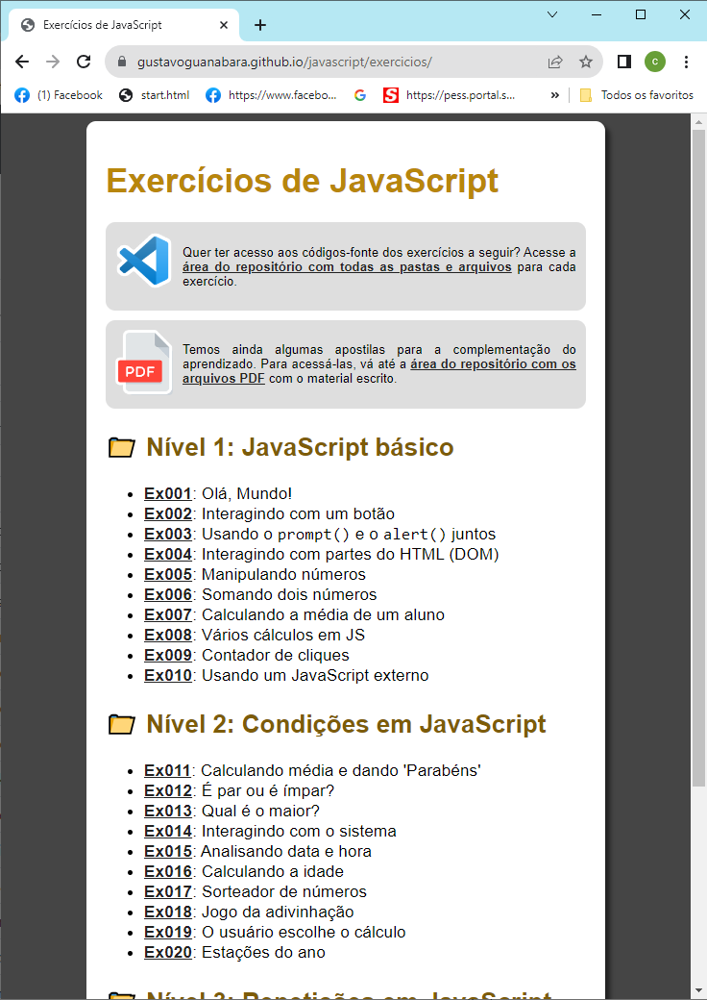
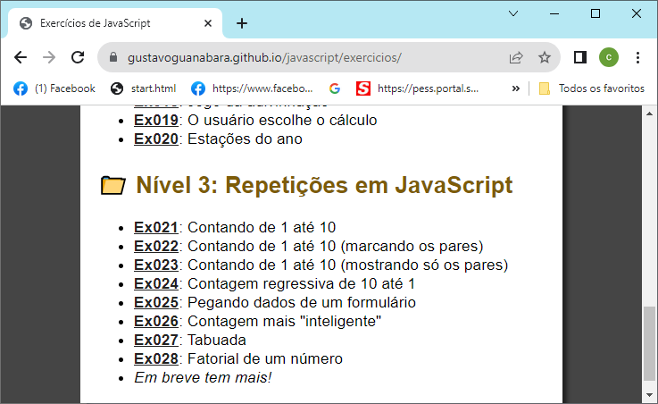

# Aula 14 - JavaScript
## Lista de exercícios - Gustavo Guanabara
- https://gustavoguanabara.github.io/javascript/exercicios/

# Missões
- 1 Replicar a home page (index.html) do site do Gustavo Guanabara

- 2 Criar uma página HTML para cada exercício do nível 3: do 21 ao 28
