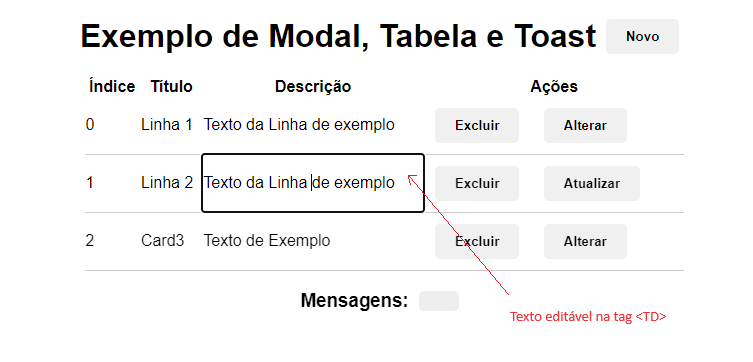
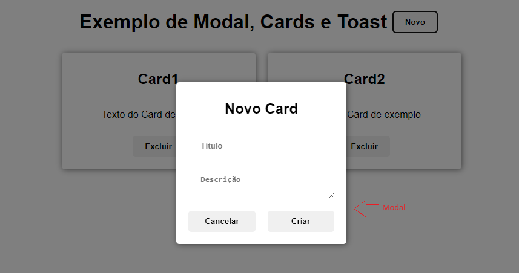
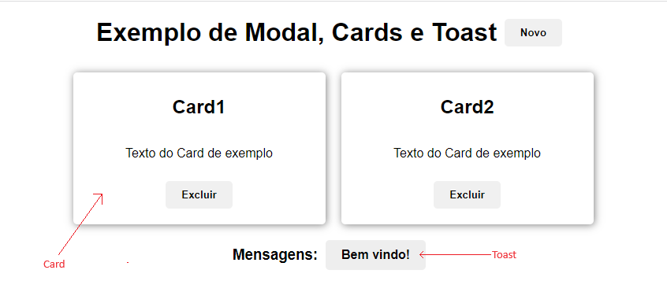

# Aula16 - Técnicas UI x CRUD
## Técnicas UI (User Interface) e CRUD (Create, Read, Update, Delete)

- Card
- <TR> Table
- Modal
- Toast

## Card
- Card é um componente que exibe um conteúdo de forma organizada, geralmente com uma imagem, um título e uma descrição.

## <TR> Table
- Table é um componente que exibe um conteúdo em forma de tabela, geralmente com linhas e colunas.

## Modal
- Modal é uma janela que aparece sobre o conteúdo da tela, geralmente para exibir mensagens importantes.

## Toast
- Toast é uma mensagem que aparece na tela, geralmente na parte inferior, para exibir mensagens importantes.

## Exemplos
Neste repositório/aula ha uma pasta com 6 exemplos destas técnicas de UI
