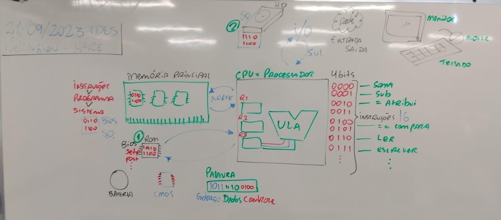
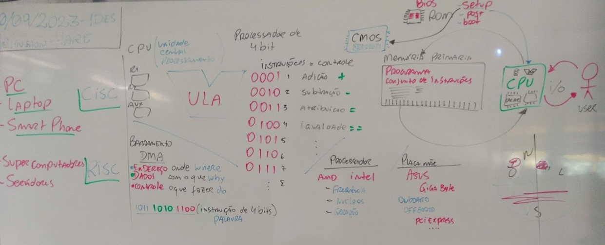
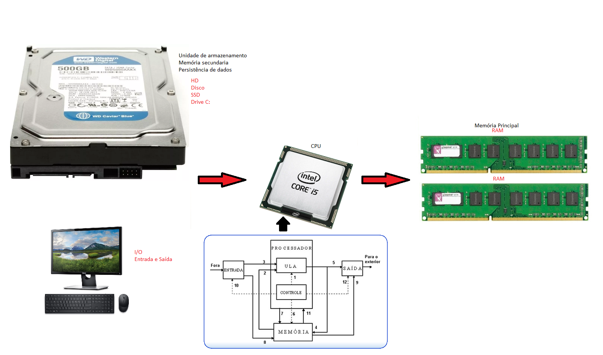
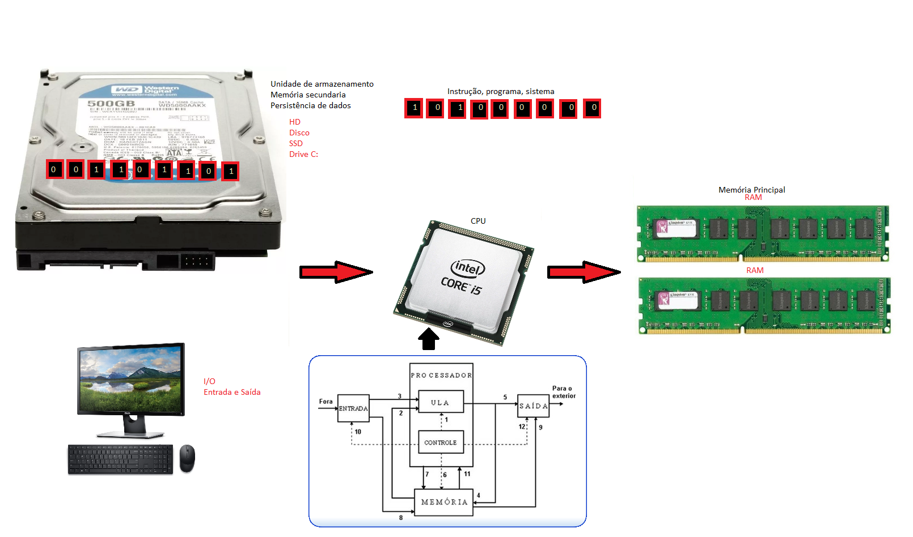
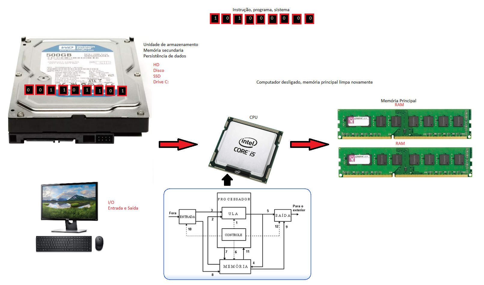
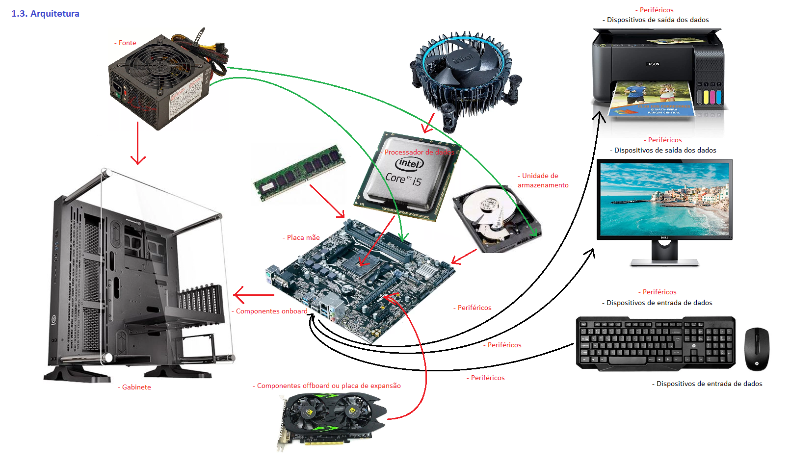
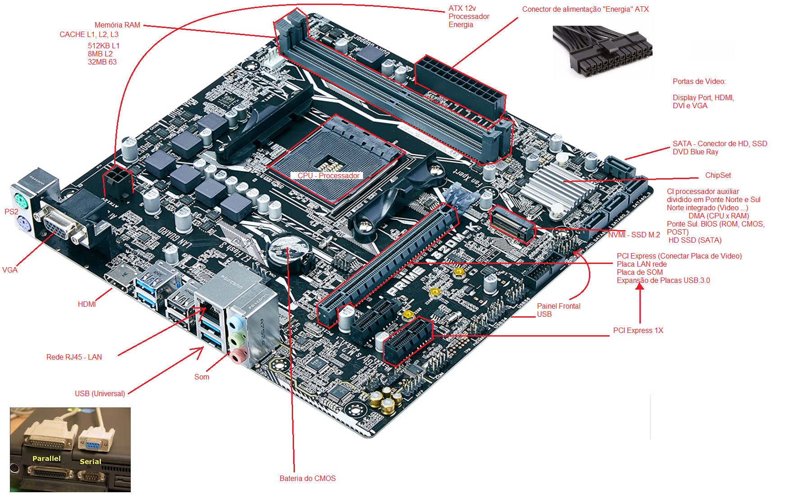
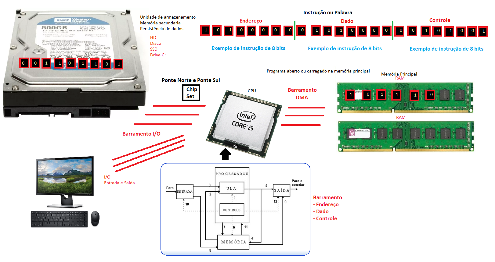

# Aula03

### Fundamentos Técnicos e Científicos
- 1 Identificar as terminologias de grandezas utilizadas em sistemas computacionais
- 2 Realizar a conversão entre sistemas numéricos nas bases binária, decimal e hexadecimal
- **3 Identificar as arquiteturas de hardware e suas funcionalidades**

### Conhecimentos
	- 1.3.1. Dispositivos de entrada de dados
	- 1.3.2. Processador de dados
	- 1.3.3. Dispositivos de saída dos dados
	- 1.3.4. Placa mãe
	- 1.3.5. Componentes onboard e offboard
	- 1.3.6. Unidade de armazenamento
	- 1.3.7. Placas de expansão
	- 1.3.8. Periféricos
	- 1.3.9. Fonte
	- 1.3.10. Barramento
	- 1.3.11. Gabinetes

## Ciclo de carregamento de um programa/sistema
|Imagens|
|-|
||
||
||
||

## Componentes

## Placa mãe

## Barramentos
