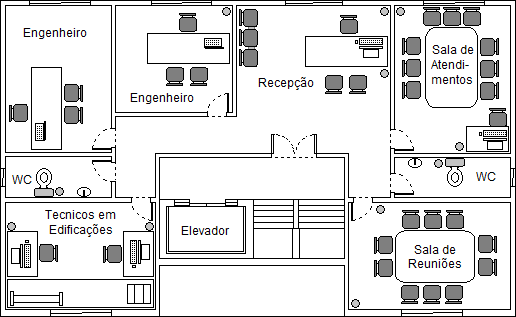

# Aula04 - Projeto
## Atividade Prática em Dupla.

|Situação de Aprendizagem Somativa|
|-|
|Em duplas - **Data de entrega:** 29/09/2023|
|**Contextualização:** A empresa WFOM Engenharia pretende abrir uma nova filial em Jaguariúna e já alugou o segundo andar de um prédio, onde montará seu escritório. Contará com cinco funcionários, além da equipe de limpeza e outros serviços terceirizados. Os funcionários são: um atendente de relacionamento com clientes que ficará na recepção, dois engenheiros civis e dois técnicos em edificações. A planta do escritório conta com uma recepção, uma sala para cada engenheiro e uma sala onde os dois técnicos trabalharão juntos, uma sala de reuniões e uma sala para demonstrações e atendimentos aos clientes, com um Datashow, onde os projetos serão apresentados e discutidos.|
|**Desafio:** Como técnico em desenvolvimento de sistemas, você também é empreendedor e possui uma consultoria que fornece, além de sistemas, também hardware, softwares e manutenção de equipamentos de TI para escritórios em geral. Foi procurado por um representante da WFOM solicitando uma análise técnica dos equipamentos necessários, um orçamento para aquisição destes e uma proposta de contrato de manutenção por um ano. O atendente e os dois técnicos em edificações, vão trabalhar a maior parte do tempo dentro da filial e utilizarão softwares com alto poder de processamento de imagens vetoriais 2D e 3D, como AutoCad e Inventor. Já os dois engenheiros ficarão parte do tempo no escritório e outra parte acompanhando as obras e necessitarão dos mesmos softwares, porém em computadores portáteis. O orçamento para cumprir todos os requisitos (hardware + licenças dos softwares + projeto de manutenção anual) é de R$100.000,00.|
||
|**Entregas:** Anexe os arquivos no formato PDF através do **Google Classroom**  - Elabore um **orçamento** utilizando o **Excel** contendo as especificações dos hardwares e softwares necessários para atender as necessidades de cada perfil de usuário da nova filial – PC (Gabinetes, Placa mãe, HD, Memória RAM, Placa de Vídeo, Monitor), Notebooks (Placa mãe, HD, Memória RAM, Placa de Vídeo), Impressoras, Projetor, etc. Exporte no formato PDF e anexe nesta atividade.  - Elabore também um **contrato** de manutenção dos equipamentos e softwares utilize o **Word** por um período de um ano (Especifique os tipos de serviços prestados, formatação, backup, etc.).|

## Critérios de avaliação
|Tipo|Competência/Capacidade|Critério|
|-|-|:-:|
||Identificar as terminologias de grandezas utilizadas em sistemas computacionais.|**Demonstrou no orçamento as medidas de Capacidade em bytes, GB, TB velocidade e outras necessárias**|
||Realizar a conversão entre sistemas numéricos nas bases binária, decimal e hexadecimal.|**Se necessário demonstrou esta capacidade para analizar os ítens do orçamento**|
||Identificar as arquiteturas de hardware e suas funcionalidades.|**Demonstrou os motivos técnicos para a escolha de cada ítem do orçamento**|
||Instalar sistemas operacionais em hardware |**Demonstrar o motivo da escolha do sistema operacional para cada perfil de usuário**|
||Configurar os dispositivos de hardware de acordo com as necessidades de desenvolvimento do sistema.|**Relacionou as soluções computacionais (Softwares) com os requisitos mínimos de processamento e armazenamento (Hardware)**|
||Demonstrar atenção a detalhes|**Aplicou os conceitos vistos nas demonstrações e palestras em aulas tanto no contrato quanto no orçamento**|
||Demonstrar capacidade de análise|**Pesquisou na internet e relacionou a solução proposta a descrição do problema**|
||Demonstrar capacidade de organização|**Entregou dentro do prazo**|