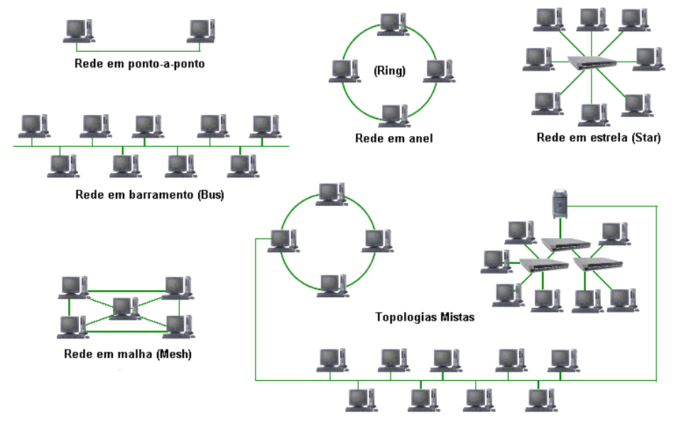
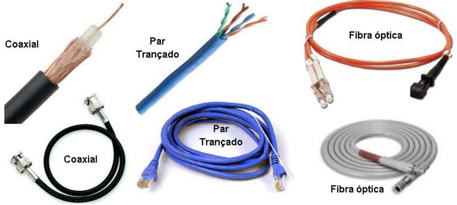
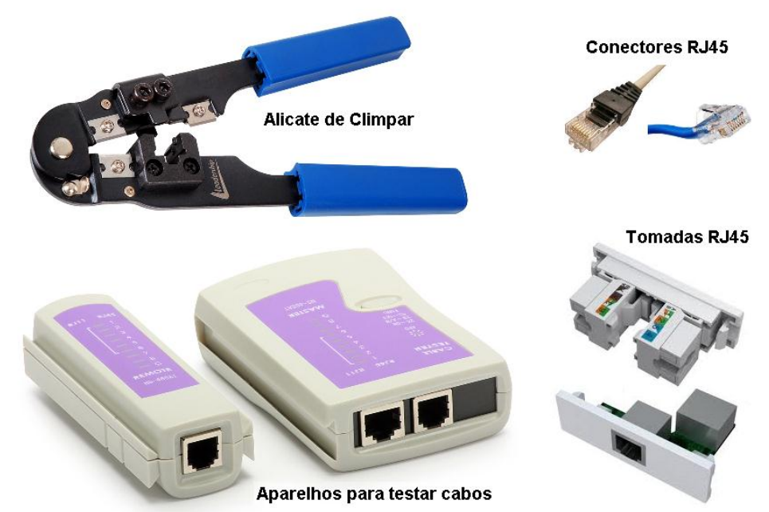

# Aula06
## Redes de computadores
- 2.1. Definição
- 2.2. Aplicabilidade
- 2.3. Tipos
- 2.4. Topologia
- 2.6. Equipamentos ativos e passivos de redes
- 2.7. Meios físicos de transmissão de dados
- 2.8. Meios sem fio de transmissão de dados

## Definição
Rede de computadores é um conjunto de equipamentos interligados entre si, com a finalidade de trocar informações e compartilhar recursos.
## Aplicabilidade
Em todos os ambientes onde há computadores, smartphones, ou qualquer equipamento conectado.

## Tipos
O conceito de rede abrange não somente computadores, mas qualquer conexão entre dois ou mais pontos onde se compartilhe algum recurso. Por exemplo: rede de água, de esgoto, de energia, telefônica, rede social, rede de televisão entre outras. Chamamos de rede de computadores uma conexão entre dois ou mais pontos de rede, não necessariamente entre computadores como conhecemos, mas, por exemplo, celulares, iphones, ou qualquer aparelho eletrônico que possua hardware e software e possa se interconectar.  Segundo a extensão geográfica as redes de computadores apresentam as seguintes nomenclaturas:
• SAN (Storage Area Network)
• LAN (Local Area Network)
• PAN (Personal Area Network)
• MAN (Metropolitan Area Network)
• WMAN Wireless Metropolitan Area Network é uma rede sem fio de maior alcance em relação à WLAN
• WAN (Wide Area Network)
• WWAN Wireless Wide Area Network é uma rede sem fio de maior alcance em relação à WAN
• RAN (Regional Area Network)
• CAN (Campus Area Network)

### Resumidamente as três classificações mais utilizadas são:
• LAN (Local Area Network) – Redes locais.
• MAN (Metropolitan Area Network) – Redes de Médio alcance.
• WAN (Wide Area Network) – Redes de Longo alcance – Internet.

## Topologia
As topologias de redes são as seguintes, conforme a ilustração abaixo:

### Meios físicos de transmissão de dados
- Rede Cabeada (Guiada)

### Meios sem fio de transmissão de dados
- Infravermlho
- NFC
- Bluetooth
- Wi-Fi (Microondas)
- Radio (Torre / Satélite)
### Sistemas de Comunicação e meios de transmissão
Sistema de comunicação se refere à maneira com que os pontos se comunicam, não importa se com a utilização de cabos ou não, quando há a utilização de cabos chamamos de comunicação Guiada, e a não utilização de cabos de Não guiada.  Características dos sistemas de comunicação:

#### Tipo de ligação
Define a topologia de ligação dos intervenientes no processo de comunicação:
• Ponto a ponto
• Ponto a multiponto
• Multiponto a multiponto
#### Direção da transmissão
• **Simplex** – transmissão num só sentido; o receptor não responde pelo mesmo canal.
• **Duplex** – transmissão nos dois sentidos no mesmo canal; os dois equipamentos possuem emissor e receptor.
• **Half-Duplex** – a largura de banda é totalmente ocupada por um sentido de cada vez; é usada uma direção de cada vez.
• **Full-Duplex** – a largura de banda é repartida de forma a que a comunicação é possível em simultâneo nos dois sentidos
#### Tipo de sinal transmitido
• Analógico – Envio de sinal analógico, o qual deve ser reproduzido no receptor.
• Exemplo: sinal áudio produzido por um microfone, rádio AM, rádio FM, sinal de vídeo (analógico!) produzido por uma câmara,...
• Digital – Transferência de bits entre equipamentos Exemplo: Ligação entre computadores, redes locais de computadores, interface USB,...

### Banda de frequência
#### Banda de Base:
• Uso de códigos de linha (ondas “quadradas”) colocados diretamente no meio de transmissão, sem translação na frequência.
• O meio de transmissão admite componentes de frequência em torno de 0 Hertz
• Os meios de transmissão são cabos (ou fibra); não é possível transmitir em banda
base através de meio wireless (propagação no ar).
• Ex: Intercomunicador de áudio, Sistemas CCTV – Closed Circuit Television System, Ligação entre computadores e dispositivos, Redes Locais.
#### Banda de Canal:
• Uso de sinusóides (portadoras) para posicionar o espectro em determinadas frequências (passa-banda); este processo é designado por modulação.
• Aproveitamento eficiente da largura de banda do meio de transmissão
• Escolha da frequência e das bandas de frequências a utilizar; os meios de transmissão são cabos, fibra ou ar.
• Ex: Transmissão wireless (Wi-Fi, Wi-Max,...), Sistema GSM.

## Cabeamento estruturado:
Montar uma rede doméstica é bem diferente de montar uma rede local de 100 pontos em uma empresa de médio porte. Não apenas porque o trabalho é mais complexo, mas também porque existem normas mais estritas a cumprir. O padrão para instalação de redes locais em prédios é o ANSI/TIA/EIA-568-B, que especifica normas para a  instalação do cabeamento, topologia da rede e outros quesitos, que chamamos  genericamente de cabeamento estruturado. No Brasil, temos a norma NBR 14565, publicada pela ABNT em 2001. A norma da ABNT é ligeiramente diferente da norma internacional, a começar pelos nomes, que são modificados e traduzidos para o português, por isso vou procurar abordar os pontos centrais para que você entenda como o sistema funciona, sem entrar em detalhes sobre a norma propriamente dita.  A ideia central do cabeamento estruturado é cabear todo o prédio de forma a colocar pontos de rede em todos os pontos onde eles possam ser necessários. Todos os cabos vão para um ponto central, onde ficam os switches e outros equipamentos de rede. Os pontos não precisam ficar necessariamente ativados, mas a instalação fica pronta para quando precisar ser usada. A ideia é que em longo prazo é mais barato instalar todo o cabeamento de uma vez, de preferência antes do local ser ocupado, do que ficar fazendo modificações cada vez que for preciso adicionar um novo ponto de rede.
- Fonte: http://www.gdhpress.com.br/redes/leia/index.php?p=cap1-20 
A figura abaixo mostra os equipamentos mais simples para iniciar a montagem de um cabeamento de rede, muitos outros equipamentos são utilizados dependendo do alcance da estrutura.

### Cabos pares trançados possuem seguintes características:
- As taxas usadas nas redes com o cabo par trançado são:
    - 10 Mbps (Ethernet);
    -  100 Mbps (Fast Ethernet)
    - 1000 Mbps (Gigabit Ethernet).
- Os cabos par trançado são muito comuns em equipamentos para internet banda larga como ADSL E CATV para ligar a placa de rede nos Hubs, Switch ou Roteador. Estes equipamentos geralmente são instalados em redes domésticas através do cabo UTP Categoria 5. Com alcance médio de 100 metros de comprimento. Climpagem de cabos de rede Ao climpar um cabo de rede UTP com terminal RJ-45 podemos usar dois padrões: 568A ou 568B. Segue a sequencia como devem ser conectados os fios no terminal RJ-45.
#### 568A
- 1 Branco pigmentado de verde
- 2 Verde
- 3 Branco pigmentado de laranja
- 4 Azul
- 5 Branco Pigmentado de azul
- 6 Laranja
- 7 Branco pigmentado de marrom
- 8 Marrom
#### 568B
- 1 Branco pigmentado de laranja
- 2 Laranja
- 3 Branco pigmentado de verde
- 4 Azul
- 5 Branco Pigmentado de azul
- 6 Verde
- 7 Branco pigmentado de marrom
- 8 Marrom

 Se o cabo for usado para interligar dois computadores, uma das pontas do cabo deve ser climpada com padrão 568A e a outra com 568B. Chamamos esse cabo de Cross-over ou cabo cruzado. Se o cabo for usado para interligar um computador a um equipamento diferente (hub, roteador, switch), suas duas pontas devem ser climpadas com o mesmo padrão (ou 568A ou então 568B). Esse cabo e chamado cabo direto ou patch-cable.

## Componentes de redes
- **Placas de redes** – Conectadas aos pontos de rede, com ou sem fio.
- **Hubs** – Concentradores de cabos repetem o sinal recebido a todas as estações.
- **Pontes** – Fazem a ligação entre duas ou mais redes.
- **Switches** – O mesmo que os Hubs, mas tratam individualmente os pontos de rede.
- **Roteadores** – Interligam redes e roteiam o tráfego de informações.
- **Gateways** – O computador ou equipamento da rede que tem a conexão é ele que os outros consultarão quando precisarem acessar qualquer coisa.
- **Servidores** – Computadores que fornecem algum serviço na rede.

