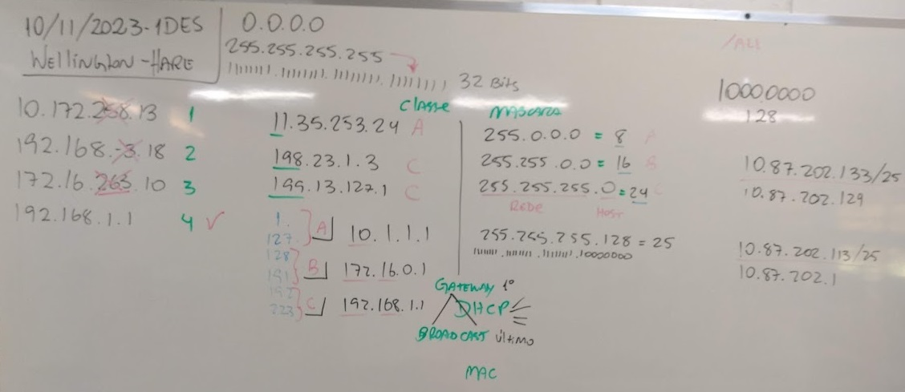
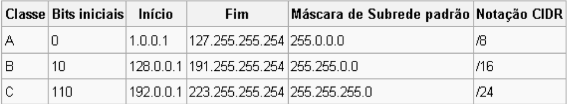
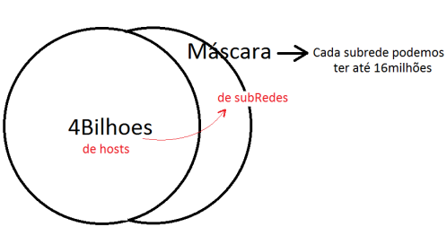
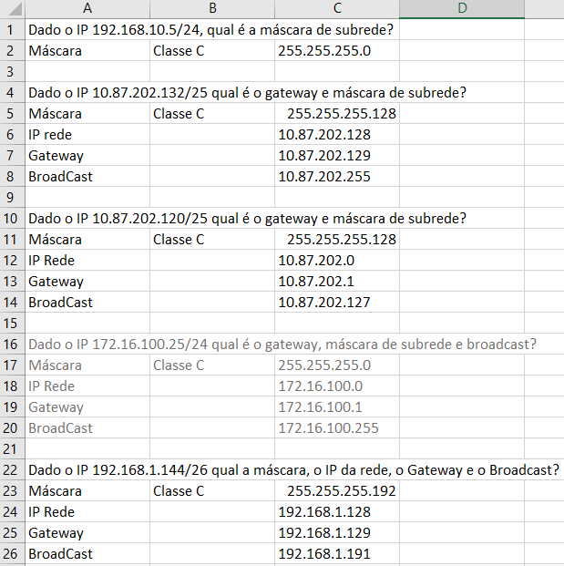
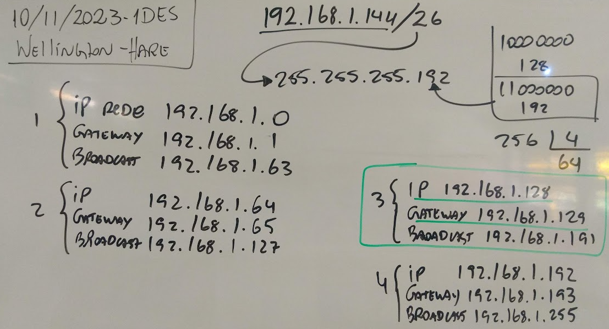

# Aula09 - Redes
## Nuvens
### Google Cloud
#### Trilha 01 - Criar e gerenciar recuros de nuvem (VM, Load Balance, Container, Kubernet, Firewall)
#### Trilha 02 - Infraestrutura (Buckets, IAM, Funções, Tópicos PUB/SUB, Monitoramento)
#### Trilha 03 - Redes (VPC, Várias redes, IPs internos e externos, Firewall, Roteamento)

#### Recursos de núvem - Trilha 01
- **VM** (Virtual Machine) Instância de máquina virtual
  - Utilidade: Hospedar sites, Armazenar arquivos, Testes ...
- **VPC** (Virtual Private Cloud) Rede virtual em nuvem
  - Utilidade: Hospedar sites, Bancos de dados, Front-End e Back-End.
- **Load Balance** (Balanceador de Cargas)
  - Utilidade: Distribuir as requisições HTTP entre as máquinas virtuais ou entre os nós de clusters do kubernets
- **Container**: Máquinas virtuais reduzidas para hospedagem de sites ou aplicativos, podendo ser duplicados e excluídos com facilidade
- **Kubernet**: Orquestrador de containers
- **Firewall**: Filtro de segurança de Rede, VM, clusters, VPC...
#### Recursos de núvem - Trilha 02
- **Buckets**: Pastas de rede para armazenamento e compartilhamento de arquivos.
- **IAM** (Identity and Access Management): Gerenciamento de acesso e identidade
- **Funções**: Recursos de nuvem onde podemos programar funções utilizando JavaScript e outras linguagens
- **Tópicos PUB/SUB**: Recurso de nuvem para comunicação entre aplicações
- **Monitoramento**: Recurso de nuvem para monitorar recursos de nuvem
#### Recursos de núvem - Trilha 03
- **VPC** (Virtual Private Cloud) Rede virtual em nuvem
  - Utilidade: Hospedar sites, Bancos de dados, Front-End e Back-End.
- **Várias redes**: Recurso de nuvem para criar várias redes virtuais
- **IPs internos e externos**: Recurso de nuvem para criar IPs internos e externos
- **Roteamento**: Recurso de nuvem para criar rotas de rede

## Endereçamento IP

### Protocolo TCP IP: Camada de Rede, segunda camada.
### IP v4
- 32 Bits
- 4 octetos:
- Decimal min 0 max 255;
- Em binário min 00000000 max 11111111
- Número total de endereços é $255^4$ = $4.228.250.625$;
- Pouco mais de 4 bilhões de endereços

### 32 Bits
- $192.168.258.32$ Teste: este endereço É ou não É um endereço **IPv4**.
- $192.168.253.134$ Este é um endereço IP, por que o de cima não é?
  - Porque um dos octetos é maior do que 255
- $11000000. 10101000. 100000010.00100000$ não é endereço IPv4
- $11000000. 10101000. 11111101. 10000110$ é um endereço IPv4
- $10.1.1.3.2$ Teste: este endereço É ou não É um endereço IPv4.
  - Não é um endereço IP porque tem mais de 4 octetos.
- $10.0.1.2$ É um endereço IP.

#### Os IPs são divididos em Classes.
- Em um “range (Escopo)” de 4 Bilhões de endereços a chance de virar um bagunça é extrema.
- Classes A, B, C, D, E

#### IPs Reservados Localmente
- 127.0.0.1: Este IP é reservado para LoopBack. Local da sua Placa de Rede, também conhecido pela DNS localhost.
- 169.254.x.x: Este IP o SO Windows, quando não encontra um servidor DHCP, executa um processo de auto-configuração de rede, com o nome de Automatic Private Internet Protocol Addressing (APIPA).
- OBS: Outro assunto Consumo de Banda: O SO “Windows” reserva 20% por padrão, para o próprio SO. Para alterar isso: gpedit.msc >>Modelos Administrativos >> Rede >> Agendador de Pacotes QoS >> Limitar Largura de Banda Reservável.

#### Ips Reservados para SubRedes
- Classe A: 10.0.0.1 até 10.255.255.255
- Classe B: 172.16.0.1 até 172.16.255.255
- Classe C: 192.168.0.1 até 192.168.0.255
- Tem sido usado comumente roteadores - Classe C: 192.168.1.1 até 192.168.1.255

### Máscaras
- As máscaras seguem as mesmas regras dos endereços IPv4
- Porém servem para identificar as SubRedes.
- IP identifica cada “host” ponto de rede e máscara identifica um conjunto (subrede).

|Máscaras comuns mais utilizadas|
|-|
|255.255.255.0 = /24 = **Classe C** 11111111.11111111.11111111.00000000|
|255.255.0.0 = /16 = **Classe B** 11111111.11111111.00000000.00000000|
|255.0.0.0 = /8 = **Classe A** 11111111.00000000.00000000.0000000|

- 255 identifica a rede
-  0 identifica os hosts

|Exemplos|
|-|
|Ex1: Máscara 255.255.0.0, o IP inicial 172.16.0.1 O maior IP desta rede seria 172.16.255.255 O máximo de hosts desta rede é 2552 = 65025|
|Ex2: Máscara 255.255.0.0, o IP inicial 10.0.0.1 O maior IP desta rede seria 10.0.255.255 O máximo de hosts desta rede é 2552 = 65025|

#### Máscara de subrede “simples”

- 255 identifica a rede 0 identifica os hosts

|Exemplos|
|-|
|Ex3: Máscara 255.0.0.0, o IP inicial 10.0.0.1 O maior IP desta rede seria 10.255.255.255 O máximo de hosts desta rede é 2553 = 16.581.375|
|Ex4: Máscara 255.255.255.0, o IP inicial 10.0.0.1 O maior IP desta rede seria 10.0.0.255 O máximo de hosts desta rede é 255 |

#### Diferença entre IP e Máscara
- A Máscara foi uma solução de roteamento, que ampliou a capacidade das redes
- E também melhor ao desempenho

#### Como escrever as máscaras
- Classe A: 255.0.0.0
- Classe B: 255.255.0.0
- Classe C: 255.255.255.0
- O número “255” representa a rede e os zeros “0” representam os Hosts.
- Classe A: /8
- Classe B: /16
- Classe C: /24
- Classe A /8 = 11111111.00000000.00000000.00000000 = 255.0.0.0
- Classe B /16 = 11111111.11111111.00000000.00000000 = 255.255.0.0
- Classe C /24 = 11111111.11111111.11111111.00000000 = 255.255.255.0

# Atividades

- 1 Dado o IP 192.168.10.5/24, qual é a máscara de subrede?
- 2 Dado o IP 10.87.202.132/25 qual é o gateway e máscara de subrede?
- 3 Dado o IP 172.16.100.25/24 qual é o gateway, máscara de subrede e broadcast?
- 4 Dado o IP 172.16.100.25/24 qual é o gateway, máscara de subrede e broadcast?
- 5 Dado o IP 192.168.1.144/26 qual a máscara, o IP da rede, o Gateway e o Broadcast?

# Correção

