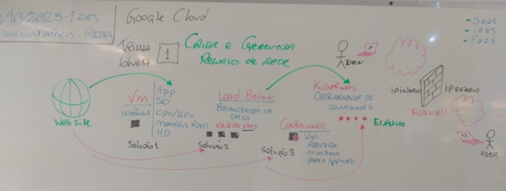

# Aula09 - Redes
## Nuvens
### Google Cloud
#### Trilha 01 - Criar e gerenciar recuros de nuvem

#### Recursos de núvem
- **VM** (Virtual Machine) Instância de máquina virtual
  - Utilidade: Hospedar sites, Armazenar arquivos, Testes ...
- **VPC** (Virtual Private Cloud) Rede virtual em nuvem
  - Utilidade: Hospedar sites, Bancos de dados, Front-End e Back-End.
- **Load Balance** (Balanceador de Cargas)
  - Utilidade: Distribuir as requisições HTTP entre as máquinas virtuais ou entre os nós de clusters do kubernets
- **Container**: Máquinas virtuais reduzidas para hospedagem de sites ou aplicativos, podendo ser duplicados e excluídos com facilidade
- **Kubernet**: Orquestrador de containers
- **Firewall**: Filtro de segurança de Rede, VM, clusters, VPC...

## Endereçamento IP