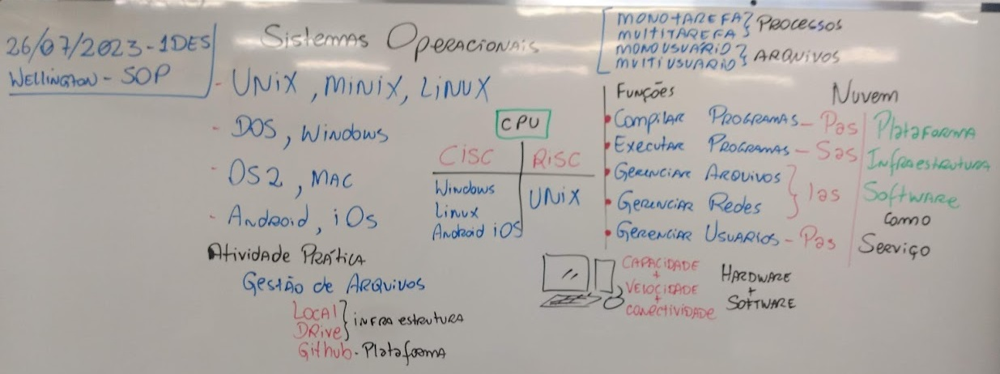
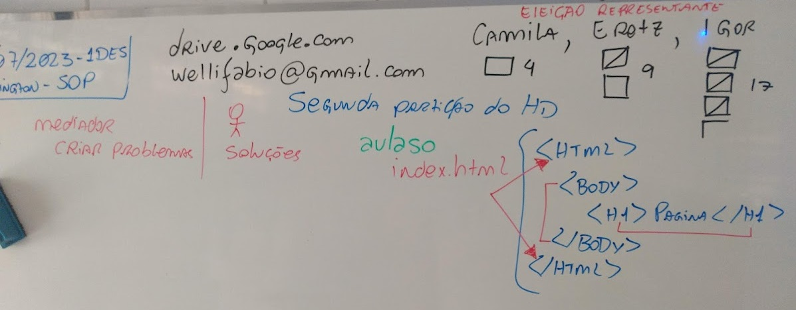
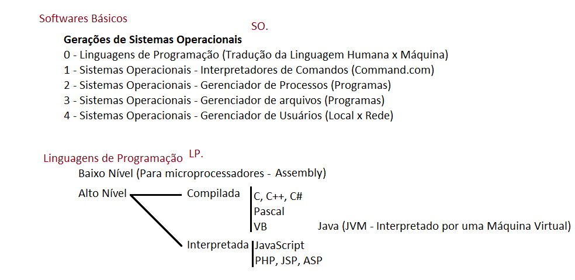

# Aula01 - Arquitetura dos sistemas operacionais
### Lousa

## Conhecimentos:
- 1. Arquitetura dos sistemas operacionais
- 1.1. Definição
- 1.2. Histórico
- 1.3. Classificação
- 1.3.1. Monotarefa
- 1.3.2. Multitarefa
- 1.4. Gerenciador de processos
- 1.5. Sistemas de arquivos
### ULA (Unidade Lógica e Aritmética)
- Instruções binária 1011.1100.11010 (Exemplo de uma instrução de quatro bits)
- Endereço, Dado e Controle
- Exemplo de insrução em linguagem humana A = 10 (A <= Endereço, 10 <= Dado, = <= Controle tipo Atribuição)

## Links
- Vídeo youtube (Manual do Mundo) https://www.youtube.com/watch?v=xajcV4lwY3Q
- Apresentação com a história da Computação https://github.com/wellifabio/senai2020/blob/master/1DES/sop/aula01/Historia_Comp_Hard_SO.pdf
