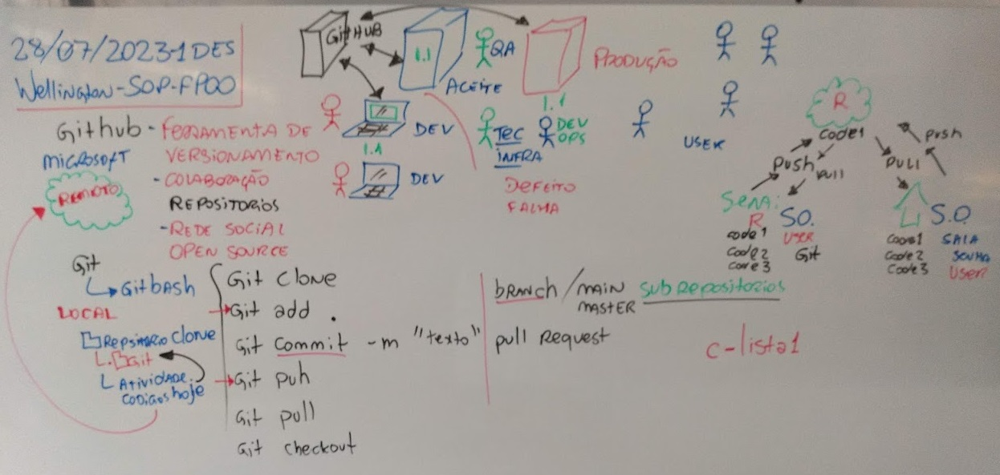
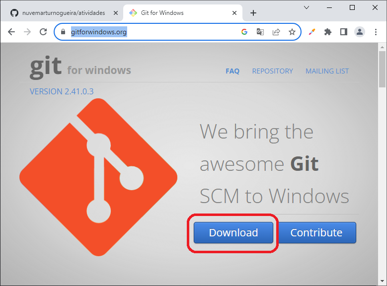
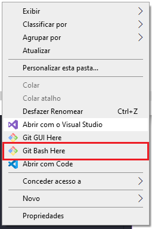
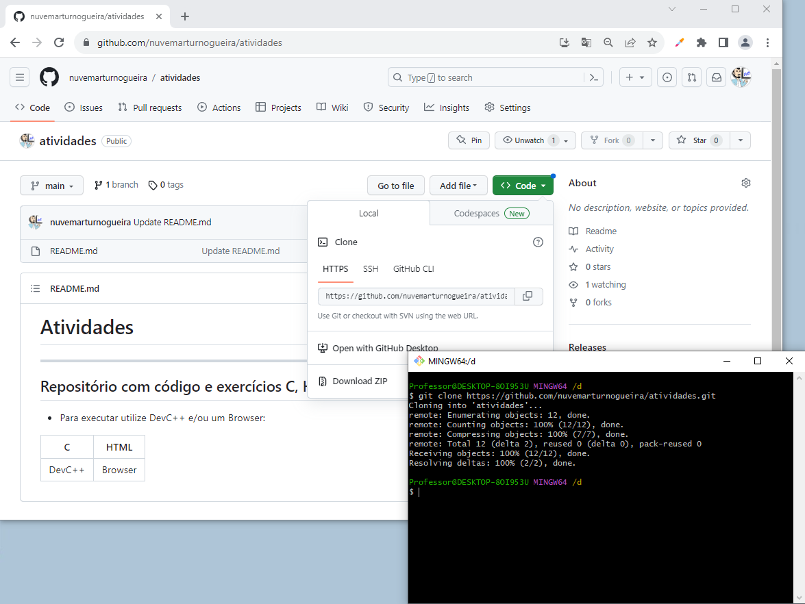
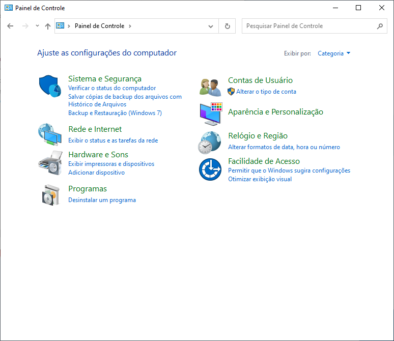
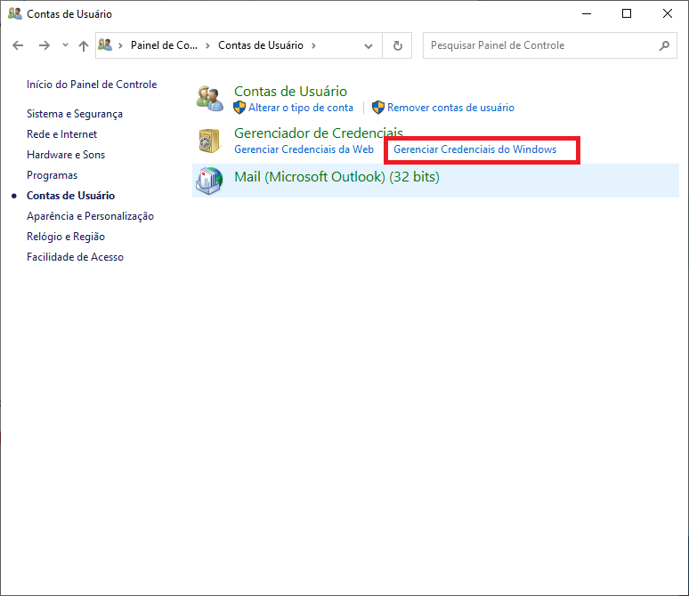
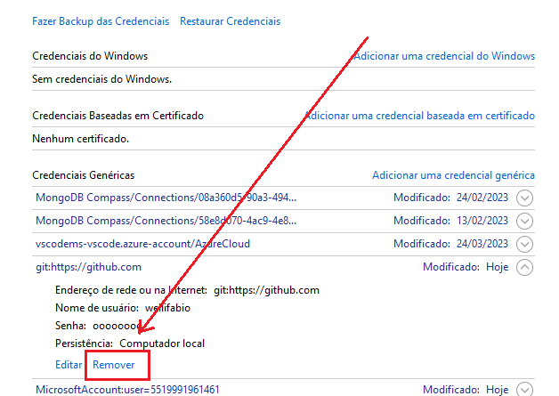

# Aula02 - Manipulação de Arquivos e Pastas
## Shell, CMD
- Interpretadores de linha de comando

## Git
- Git (Ferramenta)
    - git bash (Linha de comando)
    - git gui (Ferramenta gráfica)
- GitHub (Repositórios remotos)

## Tutorial Git (Clone, Push, Pull)
### Recursos necessários
- 1º Prepare o Ambiente
    - Tenha uma conta no **github**
    - Tenha instalado o git localmente
        - Caso não tenha instalado basta fazer download no link abaixo
        - https://gitforwindows.org/
        - 
- 2º Crie um repositório no github
- 3º Copie o endereço do repositório para clonar
- 4º Em um local a sua escolha no computador abra o git bash
    - Botão direito **Git Bash Here**
    - 
- 5º Clone seu repositório
```bash
    git clone https://github.com/nuvemarturnogueira/atividades.git
``` 
- 
- 6º Caso esteja em um computador público que já tenha o Git instalado, configure sua conta se acabou de instalar no seu computador não é necessário, pule ao 8º passo.
```bash
    git config --global user.name "nuvemarturnogueira"
    git config --global user.email "nuvemarturnogueira@gmail.com"
``` 
 7º Abra o painel de controle > **Contas de usuário > Gerenciar Credenciais do Windows** e remova a conta **github.com** que estiver lá.
- 
- 
- 
- 8º Desenvolva seus códigos, exercícios, projetos, etc, não esqueça do arquivo **.gitignore** com os executáveis, bibliotecas e acessos.
- 9º Volte ao git bash, acesse a pasta/repositorio local e execute os comandos para enviar os novos códigos:
```bash
cd atividades
git add .
git commit -m "Novas atividades"
git push

```
Se for a primeira vez que faz **push** neste computador vai solicitar que continue com seu navegador e autentique, senão pronto, seus arquivos estão na **nuvem**.