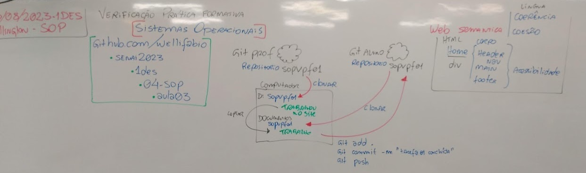
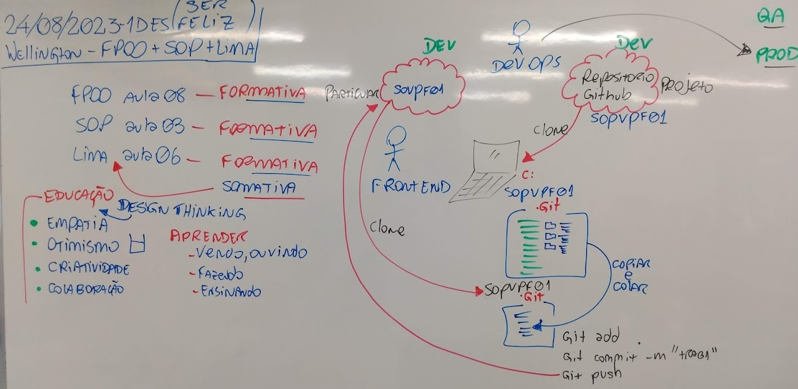

# Aula03 - VPF01
## Verificação Prática Formativa
- link: https://forms.gle/EaVHPdX68XvbUdRt5
- 
- 

## Critérios de avaliação
### Fundamentos Técnicos e Científicos
-  Identificar as características técnicas dos sistemas de arquivo, tendo em vista a utilização de sistemas operacionais (Diferenciar arquivos de pastas, tipos de arquivos)
-  Operar sistemas operacionais por meio de linha de comando e interface gráfica (Clonou o repositorio e enviu os dados para repositório próprio através do **git bash**)
-  Configurar sistemas operacionais considerando variáveis de ambiente, memória, disco, serviço, usuários e permissões (Compriu as tarefas utiliaznso computador público configurando credenciais do **Windows** e configurações globais do **Git**)
-  Instalar gerenciador de pacotes de acordo com o sistema operacional (Apenas instalou o Git se necessário para versionamento)
### Capacidades Sociais, Organizativas e Metodológicas
-  Demonstrar atenção a detalhes (Realizou todas as tarefas conforme descrito na situação de aprendizagem)
-  Seguir método de trabalho (Conforme descrito na imagem da lousa realizou as tarefas solicitadas, facilitando tarefas de outros menbros da equipe)
-  Demonstrar capacidade de organização (Executou as tarefas seguindo os passos descritos)
# Conhecimentos
- 1. Arquitetura dos sistemas operacionais
- 1.1. Definição
- 1.2. Histórico
- 1.3. Classificação
- 1.3.1. Monotarefa
- 1.3.2. Multitarefa
- 1.4. Gerenciador de processos
- 1.5. Sistemas de arquivos
- 2. Sistema operacional código fechado
- 2.1. Definição
- 2.2. Modo texto (linha de comando)
- 2.2.1. Navegação entre diretórios
- 2.2.2. Criação de diretórios e arquivos
- 2.2.3. Exclusão de diretórios e arquivos
- 2.2.4. Renomeação de diretórios e arquivos
- 2.2.5. Movimentação de diretórios e arquivos
- 2.2.6. Cópia de diretórios e arquivos
- 2.2.7. Edição de arquivos
- 2.3. Modo gráfico (Interface gráfica)
- 2.3.1. Área de trabalho
- 2.3.2. Trabalho com janelas
- 2.3.3. Configuração do sistema
- 2.3.4. Ferramentas do sistema
- 2.3.5. Acessórios
- 2.3.6. Menu de ajuda
- 2.3.7. Gerenciamento de arquivos
- 2.3.8. Gerenciamento de usuários e permissões
- 2.4. Níveis de inicialização e finalização