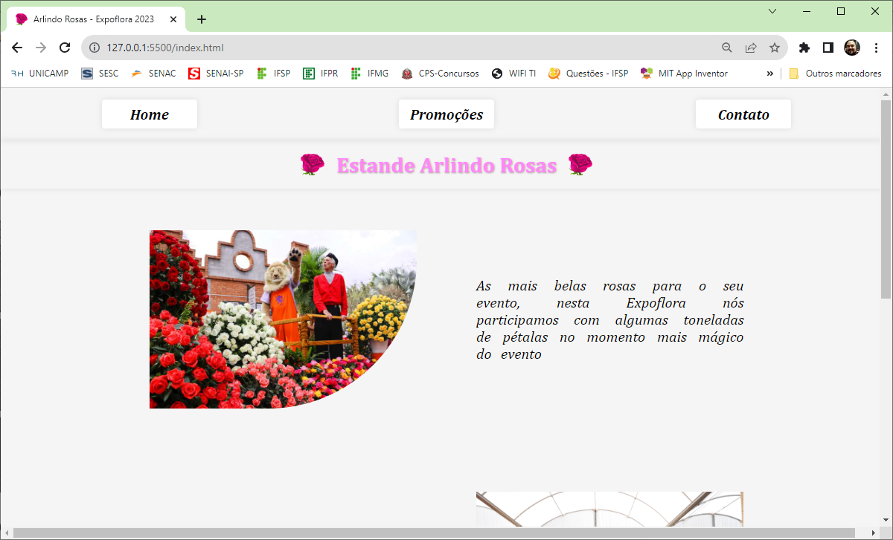
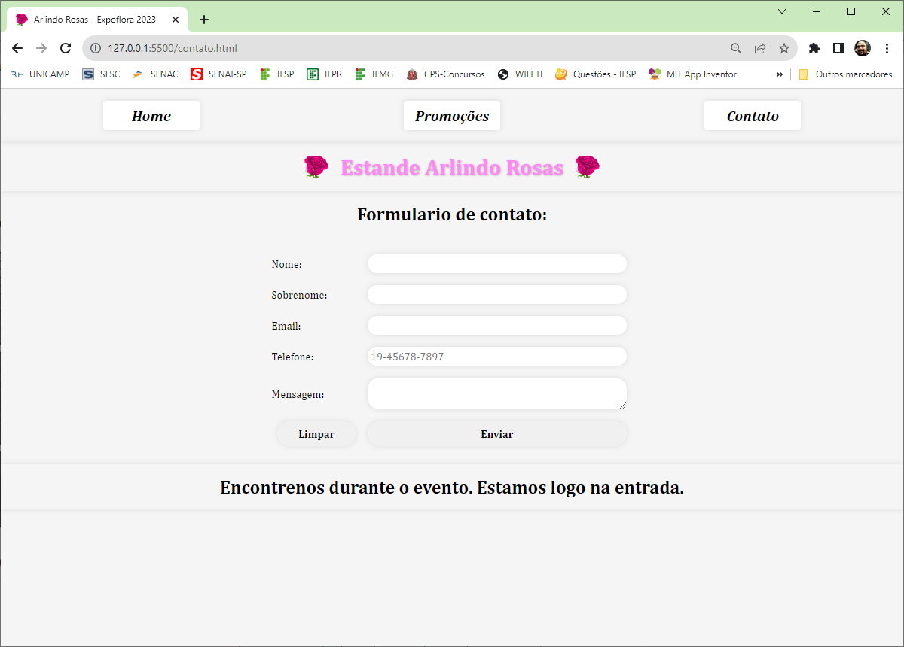
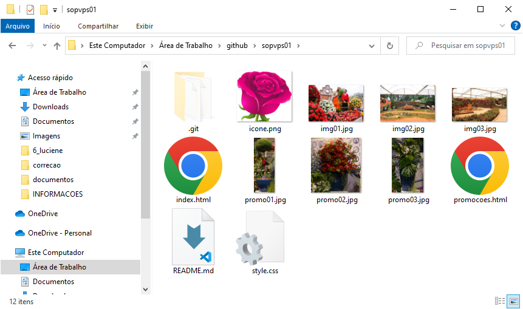

# Aula04 - VPS01
## Verificação Prática Somativa
- link: https://forms.gle/rptpSJycz5Z6PiWf8

## Critérios de avaliação
### Fundamentos Técnicos e Científicos
-  Identificar as características técnicas dos sistemas de arquivo, tendo em vista a utilização de sistemas operacionais (Diferenciar arquivos de pastas, tipos de arquivos)
-  Operar sistemas operacionais por meio de linha de comando e interface gráfica (Clonou o repositorio e enviu os dados para repositório próprio através do **git bash**)
-  Configurar sistemas operacionais considerando variáveis de ambiente, memória, disco, serviço, usuários e permissões (Compriu as tarefas utiliaznso computador público configurando credenciais do **Windows** e configurações globais do **Git**)
-  Instalar gerenciador de pacotes de acordo com o sistema operacional (Apenas instalou o Git se necessário para versionamento)
### Capacidades Sociais, Organizativas e Metodológicas
-  Demonstrar atenção a detalhes (Realizou todas as tarefas conforme descrito na situação de aprendizagem)
-  Seguir método de trabalho (Conforme descrito na imagem da lousa realizou as tarefas solicitadas, facilitando tarefas de outros menbros da equipe)
-  Demonstrar capacidade de organização (Executou as tarefas seguindo os passos descritos)

## Wireframes
- 
- 
- 
- 