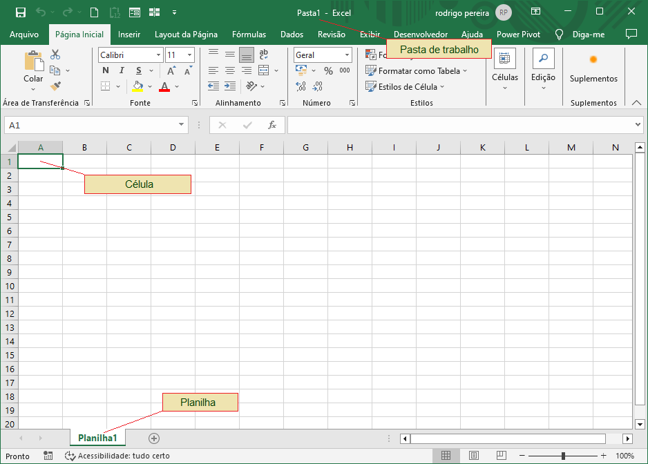
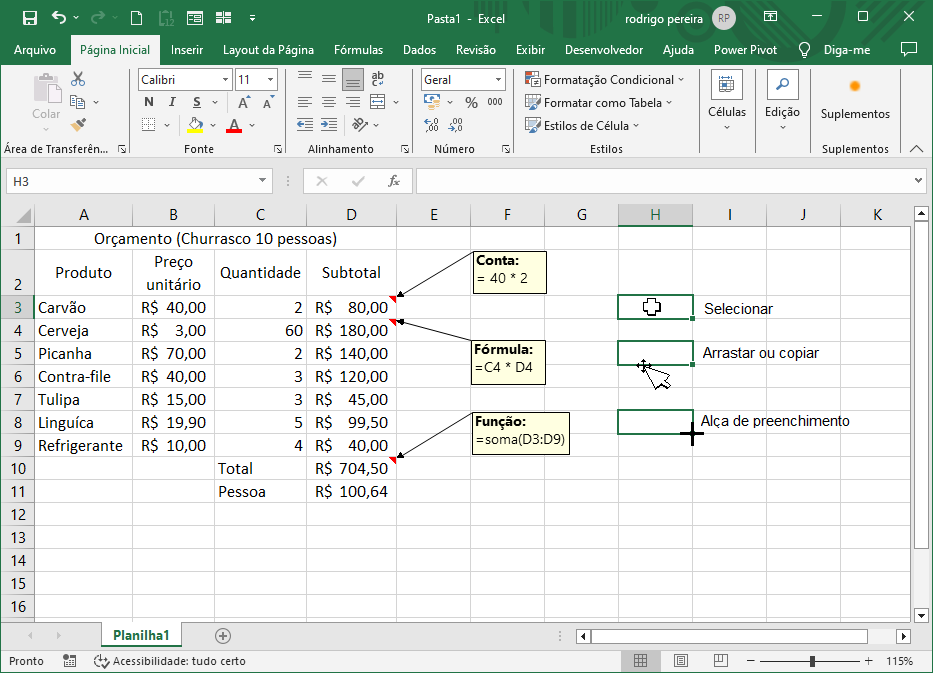

# Aula05 - Aplicativos do Office
## Planilha Eletrônica
### Excel

### Missão 01
Elabore uma pequena planilha com um orçamento de ítens para um churrasco tradicional de fim de semana para 10 pessoas, queremos saber qual será o total investido e o valor por pessoa.

## Missão 02
Crie uma planilha que sorteie um aluno dos listados abaixo:
```
Alefe de Magalhães Vigatto
Halina Yelena Volkov
Ana Clara Ortiz Ochner
Bruno Otávio da Silva Ramos
Bryan Beckham de Alencar de Souza
Camilla Piva da Silva
Carla Carota Mozena
Carlos Augusto Rodrigues
Carlos Henrique de Oliveira Siqueira
Carlos Henrique Jesus de Almeida Filho
Cicero Ruan Soares Baborsa
Erick da Silva de Jesus
Gabriella Godoi Avila
Guilherme Carvalho de Oliveira
Igor Henrique Gonçalves
Isac Catarino Natividade
Jaqueline de Faria Rodrigues
João Victor Colosso
João Vitor Castro Viana Marques
Karina Corrêa Shifferli Santos
Leticia Aparecido Hofman de Souza
Maria Cecília Evangelista Oliveira
Maria Fernanda Mattoso Oliveira Rello
Mirella França de Almeida
Otávio Bassi de Freitas
Otavio Lima Bueno
Pedro Henrique Pereira Sanches
Rafael David Paes Landim Rodrigues da Silva
Richard Matheus Pinesi
Vinicius Manzano dos Santos
Walyson Lima Pompeu
```
## Missão 03
Precisamos criar emails corporativos para todos os alunos, o formato de email é nome.ultimosobrenome@senaisp.edu.br crie uma coluna que monte os emails neste padrão com base na lista da Missão 02.

### Soluções dos desafios
[./Missoes.xlsm](./Missoes.xlsm)