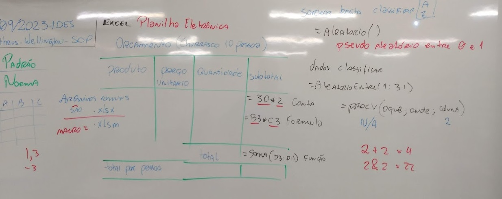
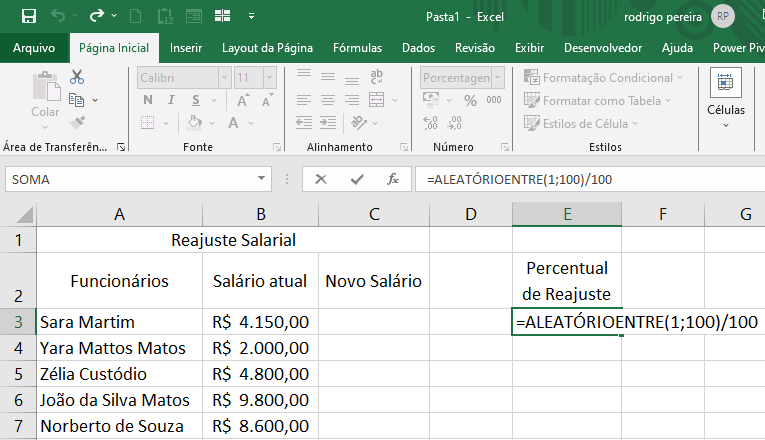
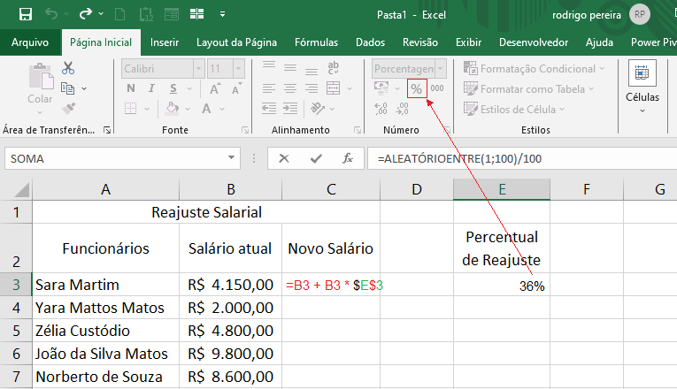
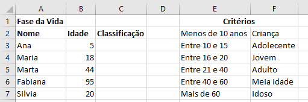
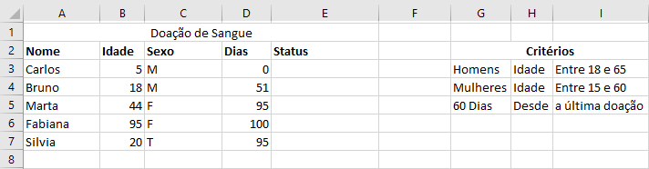
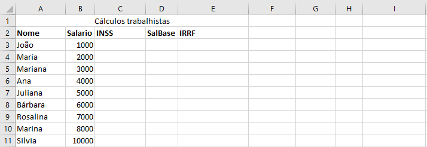

# Aula06 - Planilha eletrônica
## Excel

## Conhecimentos
- 5. Planilha eletrônica
- 5.1. Criação de planilhas
- 5.2. Formatação de células
- 5.3. Entrada de dados
- 5.3.1. Números
- 5.3.2. Textos
- 5.3.3. Fórmulas
- 5.4. Funções
- 5.4.1. Aritméticas
- 5.4.2. Condicionais

## Atividades desafiadoras
### Objetivo
Criar planilhas no Excel que resolvam os exercícios propostos nas aulas de C em FPOO.

### Exercícios:
- 1 Desenvolva um programa que leia o nome e o salário de 5 pessoas, depois leia um valor de índice percentual (%) de reajuste do salário. Calcule e apresente na tela, o valor do novo salário e o nome das 5 pessoas.
 
 
- 2 Desenvolva uma planilha que classifique pessoas por **idade**
 
- 3 Desenvolva uma planilha que classifique candidatos a doar sangue com status como **Apto** ou **Inapto**
 
- 4 Crie uma planilha que calcule os impostos trabalhistas INSS e IRRF de 9 pessoas, busque na internet as tabelas atualizadas conforme salários e valores a deduzir.
 

#### Dicas
Para solucionar os desafios propostos utilize as funções SE() e/ou função PROCV()
