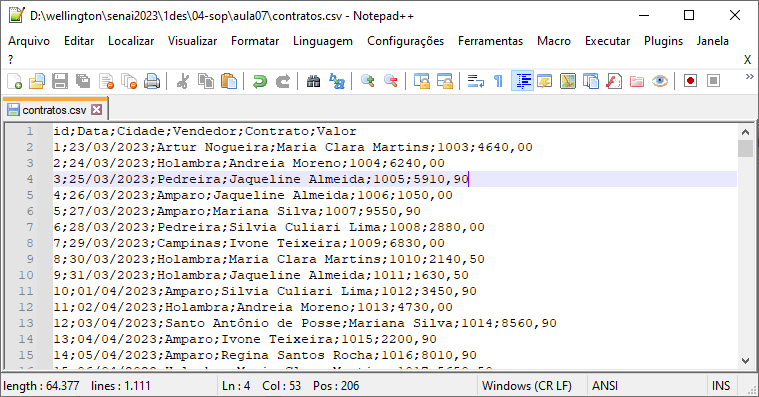
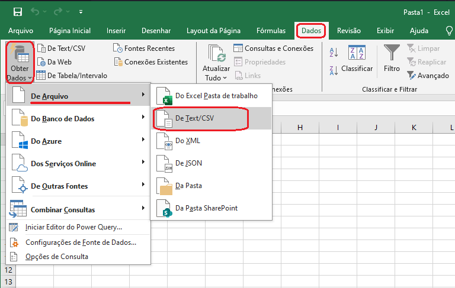
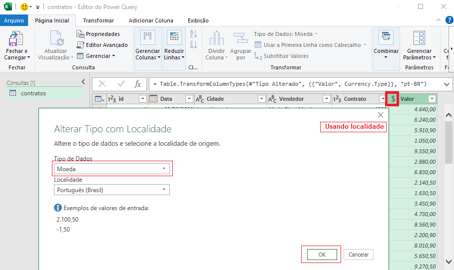
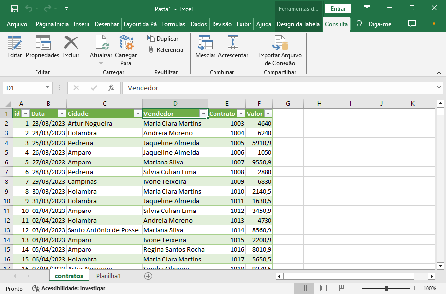
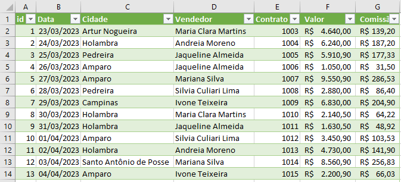
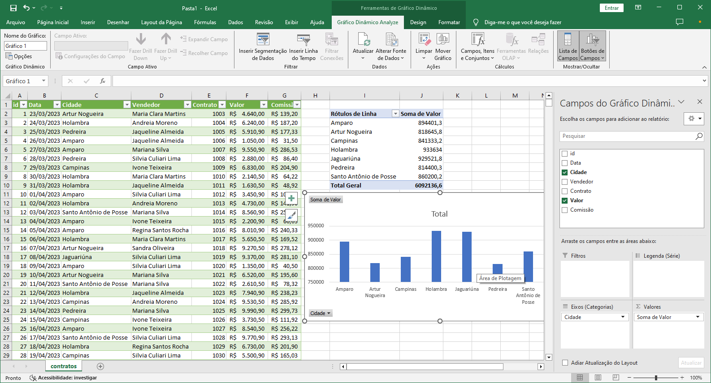
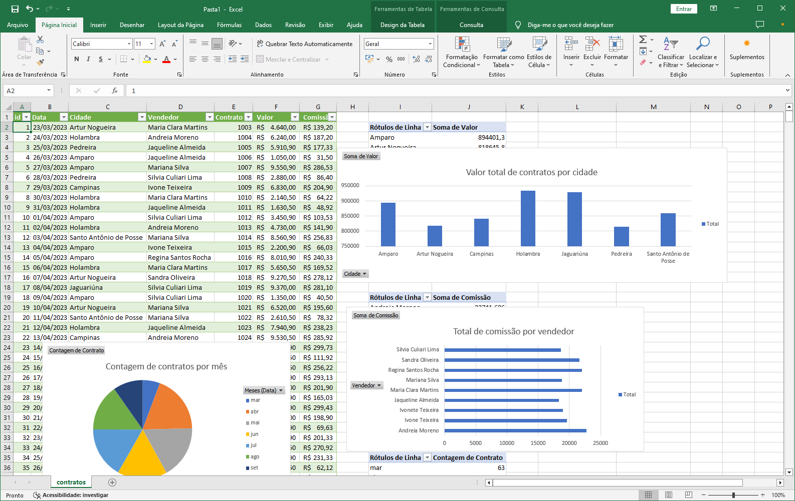
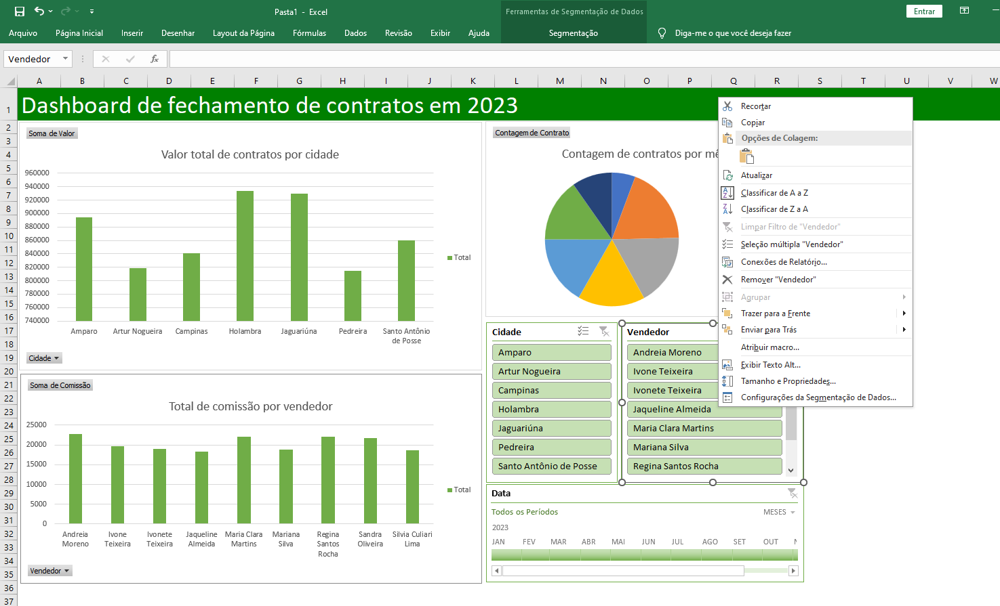
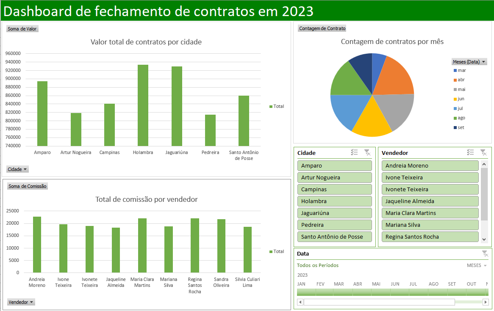

# Aula07

## Dashboards - Visualização de dados graficamente com Excel.
- Gráficos e Tabelas dinâmicas
- Seguimentação de Dados
- Linha do tempo
- Conexões de relatório

## Tutorial - Dashboard
- Para criar uma visualização de dados seguimos três passos:
  - 1 Extração
  - 2 Transformação
  - 3 Visualização
- O Excel é capaz de processar os três passos
## 1 Extração
- Caso os dados venha de outro sistema, devem ser extraídos, exportados do sistema e importados no Excel.
- Formatos universais estruturados **CSV, XML, JSON**
- Para isso devem estar em um dos formatos universais
- 
- Abra o **Excel** e importe os dados do arquivo **./contratos.csv**
- 
## 2 Transformação
- Clique em **Transformar Dados** para editar com o **Power Query**
- Formate o Valor, usando **Localidade** para tipo Moeda, Português Brasil.
- 
- Feche e Carreque os dados na planilha
- 
- Acrescente uma coluna aplicando uma **comissão de 3%** em cada contrato.
- 
- ## 3 Visualização (Dashboard)
- Clique em alguma célula no meio da planilha, depois inserir >> Gráfico Dinâmico, escolha a própria planilha para inserir o gráfico e marque as colunas **Cidade** e **Valor**.
- Insira outro gráfico na mesma planilha, repetindo o procedimento, agora marque **Vendedor** e **Comissão**
- Altere os títulos e tipos de gráfico
- Crie mais um marcando **Data** (específicamente o mês) e **Contrato** alterando de Soma para Contagem. 
- Crie uma nova planilha, oculte as linhas, acrescente uma faixa de título, copie e cole os três gráficos.
- Clique em um dos gráficos e através do menú **Gráfico Dinâmico Analyse** e adicione **Segmentação de dados** marcando Cidade e Vendedor e **linha do tempo**.
- Marque todos os gráficos como **conexão de relatório**.
- E conclua seu dashboard/visualização 
