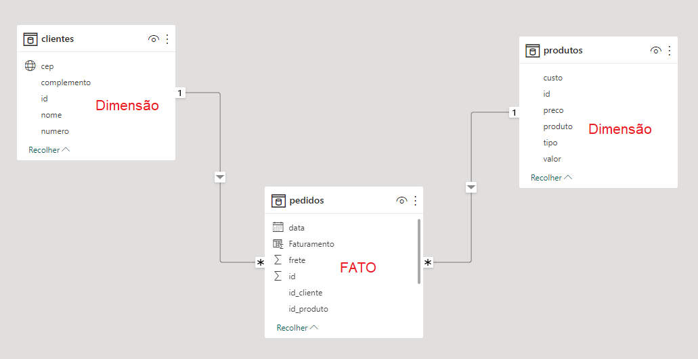
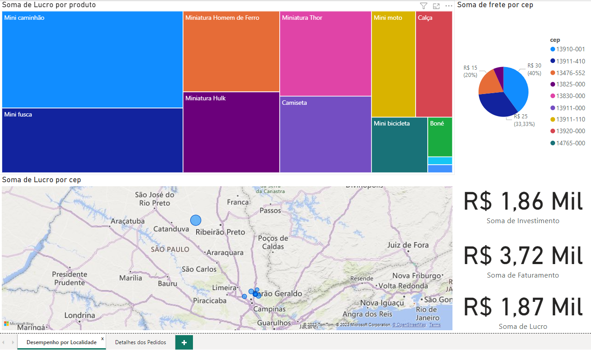
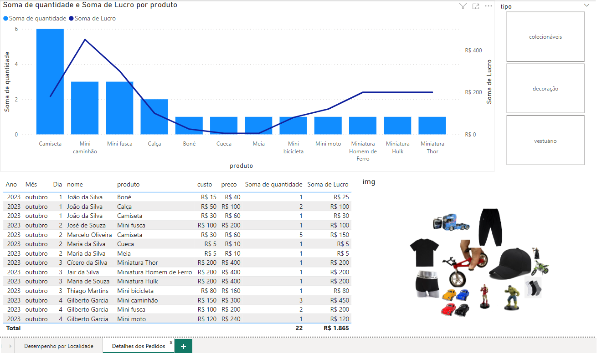

# Aula 08
## DashBoard com Power BI
### Análise de dados tipo Estrela (Fato e dimenções)
- Origem dos dados (Bancos de Dados Relacionais)
- Dados Normalizados

- Power Pivot
### Objetivo: Fazer uma análise de dados com as seguintes informações:
- Investimento
- Faturamento
- Lucro
- Pedidos por Cidade
- Pedidos por Produto
### Funções DAX
- LOOKUPVALUE(Coluna de retorno, Coluna de pesquisa, Valor de pesquisa)
- LOOKUPVALUE(Coluna de retorno, **Chave primária**, **Chave estrangeira**)

## Tutorial
### 1. Abrir a pasta ./analisepedidos e vizualizar com RAW as três tabelas:
- clientes.csv
- pedidos.csv
- produtos.csv
### 2. Abrir o Power BI e importar os arquivos
- Obter dados > Web > Copiar e colar o link do RAW
### 3. Transformar os dados
- Subistituir valores em branco por **null**
- Classificar os dados numéricos decimais usando a localidade **pt-BR**
### 4. Criar as relações entre as tabelas
- Removes as relações de **1 para 1**
- Ligar as chaves primárias com as chaves estrangeiras
    - Clientes[id] com Pedidos[id_cliente]
    - Produtos[id] com Pedidos[id_produto]
### 5. Criar colunas com as seguintes fórmulas:
- Investimento = Pedidos[quantidade] * LOOKUPVALUE(Produtos[custo], Produtos[id], Pedidos[id_produto])
- Faturamento = Pedidos[quantidade] * LOOKUPVALUE(Produtos[preco], Produtos[id], Pedidos[id_produto])
- Lucro = Pedidos[Faturamento] - Pedidos[Investimento]
### 6. Criar medidas, neste caso não será necessário
### 7. Criar dois Dashboards

| Dashboards |
|-|
|Desempenho por localidade (Mapa de Árvore, Pizza, Mapa e Cartões)|
||
|Detalhes dos pedidos (Colunas e Linhas, Segmentação de dados, Tabela e Grade de Imagens)|
||
|Obs: O visual de grade de imagens **(Image Grig)** não está disponível no Power BI Desktop, deve ser importado, para isso precisa fazer login com um e-mail corporativo, utilize seu email do SENAI|
