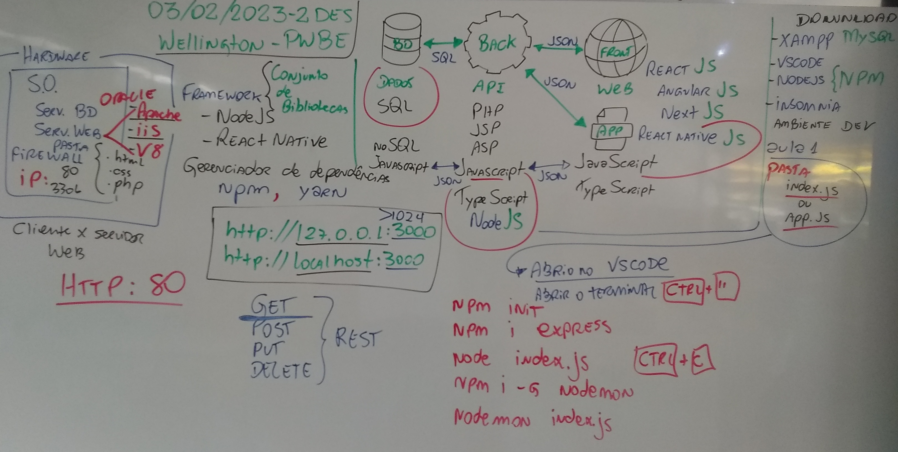

# Back-End

- Tipos de Programação
	- Desktop
	- Cliente x Servidor
	- Programação Web
	- Programação Web (Back-End)
	- Programação Web (Front-End)
	- Programação para dispositivos Móveis
	- Programação iOT

- Tipos de programadores e profissionais de Desenvolvimento / Programação
	- Engenheiro de Software
	- Analista de Sistemas
	- DBA (Administrador de Bancos de Dados)
	- Analista de suporte InfraEstrutura (Servidores, Rede, Nuvem)
	- Programador DevOps
	- Programador FullStack
	- Programador (Back-End)
	- Programador (Front-End)
	- Programador (Mobile)
	- Programador Ágil Scrum Master
- Lousa
	- 
- O que é Back-End
	- Uma API (Application Programming Interface)
	- O intermediário entre as bases de dados e a interface com o usuário.
	- Utiliza um servidor de aplicação

- Servidores de Aplicação mais comuns
	- IIS (ASP)
	- Apache (PHP)
	- Aparche Tom Cat (JSP)
	- v8 (Node JS)
- 
- Principais Verbos HTTP - REST
	- GET
	- POST
	- PUT
	- DELETE

- API que responde corretamente aos verbos do protocolo HTTP é chamada de API REST FULL

# Iniciar um Back-End com PHP
	- 1. Iniciar o serviço Apache no XAMPP Controll Panel
	- 2. Navegar até a pasta htdocs em c:\xampp\htdocs
	- 3. Criar uma pasta com o nome do seu projeto
	- 4. Criar um arquivo chamado index.php
	- 5. Editar o arquivo com os códigos necessários para responder a uma requisição GET
	- 6. Abrir um navegador web e digitar o caminho: http://localhost/projeto

# Iniciar um Back-End com Node JS
	- 1. Criar uma pasta com o nome do seu projeto
	- 2. Abrir a pasta com o vsCode
	- 3. Abrir um terminal do vsCode "CTRL" + """
	- 4. Preferencialmente configure o terminal para "cmd"
	- 5. Inicie o projeto com o comando -> npm init 
		- Pressione Enter para responder com o padrão para os dados do projeto
	- 6. Instale a primeira dependência para responder as requisições HTTP -> npm install express
	- 7. Crie um arquivo chamado "index.js"
	- 8. Editar o arquivo com os códigos necessários para responder a uma requisição GET
	- 9. Verificar se foi criado o arquivo package.json e a pasta node_modules
	- 10. Executar o Servidor com o comando -> node index.js
	- 11. Abrir um navegador web e digitar o caminho: http://localhost:PORTA/projeto
	- 12. Caso for postar no git criar o arquivo .gitignore e colocar a pasta node_modules
	