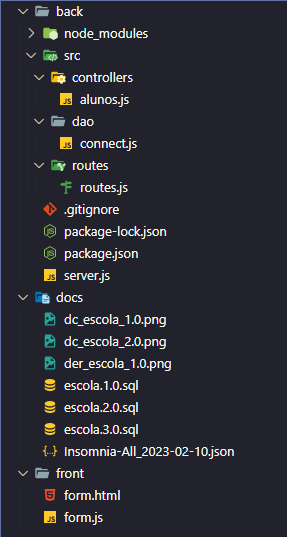
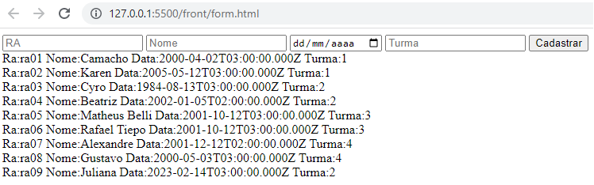

# 1ª Integração (Banco de dados + BackEnd + FrontEnd)
* Abrir o projeto da aula04 com VsCode.


## Banco de dados
* Executar o XAMPP Controll Panel
    - Start em Apache
    - Start MyQL
    - Abrir o PHPMyAdmin, clicando em "Admin" a frente de MySQL
    - Clicar na ABA SQL, copiar e colar o script de criação e população do banco de dados:
---
```SQL
-- Script SQL de criação e população do banco de dados Escola
drop database if exists escola;
create database escola charset=UTF8 collate utf8_general_ci;
use escola;

-- Script DDL de Criação das tabelas e relacionamentos
create table professor(
    id integer not null primary key auto_increment,
    nome varchar(50) not null,
    especialidade varchar(50)
);

create table aluno(
    ra varchar(10) not null primary key,
    nome varchar(50) not null,
    nascto Date not null,
    id_turma integer not null
);

create table turma(
    id integer not null primary key auto_increment,
    nome varchar(30) not null,
    abreviacao varchar(5) not null
);

alter table aluno add foreign key (id_turma) references turma(id);

create table leciona(
    id_prof integer not null,
    id_turma integer not null,
    foreign key (id_prof) references professor(id)
    on delete cascade on update cascade,
    foreign key (id_turma) references turma(id)
    on delete cascade on update cascade
);

-- Script DML Popular o Banco de dados com dados para Testes
insert into professor values
(default, "Reenye", "Mobile"),
(default, "Wellington", "Banco de Dados"),
(default, "Ivo", "Matemática");

insert into turma values
(null,"Desenvolvimento de Sistemas","2DES"),
(null,"Desenvolvimento de Sistemas","3DES"),
(null,"Eletrônica","1EA"),
(null,"Eletrônica","3EA");

insert into aluno values
('ra01','Camacho','2000-04-02',1),
('ra02','Karen','2005-05-12',1),
('ra03','Cyro','1984-08-13',2),
('ra04','Beatriz','2002-01-05',2),
('ra05','Matheus Belli','2001-10-12',3),
('ra06','Rafael Tiepo','2001-10-12',3),
('ra07','Alexandre','2001-12-12',4),
('ra08','Gustavo','2000-05-03',4);

insert into leciona values
(1,1),
(1,2),
(2,1),
(2,2),
(3,3),
(3,4);

select * from professor;
select * from turma;
select * from aluno;
select * from leciona;
```
---

## Back-End
* Abrir o terminal do VsCode
* Acessar a pasta back "cd back"
* Executar os comandos:
    - npm i <-Para instalar todas as dependências do projeto
    - nodemon <-Para executar
* Conferir os arquivos da estrutura MVC do backEnd

server.js
```JavaScript
const express = require('express')
const cors = require('cors')

const router = require('./src/routes/routes')

const app = express()
app.use(express.json())
app.use(cors())
app.use('/',router)

app.listen(3000,()=>{
    console.log("Respondendo na porta 3000")
})
```

./routes/routes.js
```JavaScript
const express = require("express");
const router = express.Router();

const Alunos = require('../controllers/alunos');

router.get('/', Alunos.teste);
router.get('/aluno/listar', Alunos.listar);
router.get('/aluno/criar', Alunos.cadastrar);

module.exports = router
```
./controllers/aluno.js
```JavaScript
const con = require('../dao/connect')

const teste = (req, res) => {
    res.json("Escola Respondendo").end()
}
const listar = (req, res) => {
    con.query('SELECT * FROM aluno', (result, err) => {
        if (err == null) {
            res.json(result).end()
        } else {
            res.json(err).end()
        }
    })
}

const cadastrar = (req, res) => {
    let ra = req.query.ra
    let nome = req.query.nome
    let nascto = req.query.nascto
    let turma = req.query.turma
    let string = `INSERT INTO aluno VALUE('${ra}','${nome}','${nascto}',${turma})`
    con.query(string, (err, result) => {
        if (err == null)
            res.redirect('http://127.0.0.1:5500/front/form.html')
        else
            res.json(err).end()
    })
}

module.exports = {
    teste,
    cadastrar,
    listar
}
```
./dao/connect.js
```JavaScript
const mysql = require('mysql')

const con = mysql.createConnection({
    user: 'root',
    host: 'localhost',
    database: 'escola'
});

module.exports = con;
```

## Front-End
* No VsCode: Acesse a pasta "front"
crie os seguintes arquivos

form.html
```html
<!DOCTYPE html>
<html lang="en">

<head>
    <meta charset="UTF-8">
    <meta http-equiv="X-UA-Compatible" content="IE=edge">
    <meta name="viewport" content="width=device-width, initial-scale=1.0">
    <title>Cadastro de Alunos</title>
</head>

<body>
    <header>
        <form action="http://localhost:3000/aluno/criar">
            <input type="text" name="ra" id="ra" placeholder="RA">
            <input type="text" name="nome" id="nome" placeholder="Nome">
            <input type="Date" name="nascto" id="nascto" placeholder="Data de nascimento">
            <input type="number" name="turma" id="turma" placeholder="Turma">
            <input type="submit" value="Cadastrar">
        </form>
    </header>
    <main id="dados">
    </main>
</body>
<script src="form.js"></script>

</html>
```

form.js
```JavaScript
const dados = document.querySelector('#dados')

const options = { method: 'GET' };

fetch('http://localhost:3000/aluno/listar', options)
  .then(response => response.json())
  .then(response => {
    response.forEach(element => {
      let linha = document.createElement('div')
      linha.innerHTML = `Ra:${element.ra} Nome:${element.nome} Data:${element.nascto} Turma:${element.id_turma}`
      dados.appendChild(linha)

    });
  })
  .catch(err => console.error(err));
```
* Execute o form.html através do Live Server
    - Este será o resultado:
