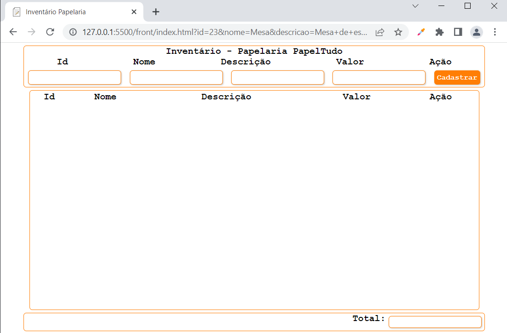
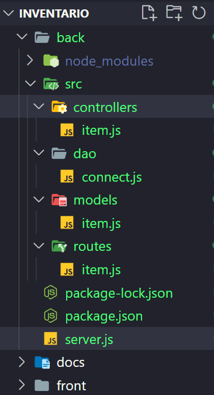

# CRUD com apenas uma tabela.
## Inventário (Iniciando pelo Front-End)
- Crie uma pasta para o projeto (inventario[todas em minúsculas ou snake_case])
- Crie uma subpasta "front" e os arquivos index.html e style.css

index.html
```html
<!DOCTYPE html>
<html lang="en">

<head>
    <meta charset="UTF-8">
    <meta http-equiv="X-UA-Compatible" content="IE=edge">
    <meta name="viewport" content="width=device-width, initial-scale=1.0">
    <link rel="stylesheet" href="style.css">
    <link rel="shortcut icon" href="./assets/favicon.png" type="image/x-icon">
    <title>Inventário Papelaria</title>
</head>

<body>
    <header>
        <h1>Inventário - Papelaria PapelTudo</h1>
        <div class="rotulos">
            <label for="id">Id</label>
            <label for="nome">Nome</label>
            <label for="descricao">Descrição</label>
            <label for="valor">Valor</label>
            <label for="acao">Ação</label>
        </div>
        <form id="cadastro">
            <input type="text" name="id" id="id" required />
            <input type="text" name="nome" id="nome" required />
            <input type="text" name="descricao" id="descricao" />
            <input type="number" step="any" name="valor" id="valor" required />
            <input type="submit" value="Cadastrar" />
        </form>
    </header>
    <main>
        <table>
            <thead>
                <tr>
                    <th>Id</th>
                    <th>Nome</th>
                    <th>Descrição</th>
                    <th>Valor</th>
                    <th>Ação</th>
                </tr>
            </thead>
            <tbody id="corpo"></tbody>
        </table>
    </main>
    <footer>
        <label for="total">Total:</label>
        <input type="text" name="total" id="total" readonly/>
    </footer>
</body>
<script src="index.js"></script>

</html>
```
style.css
```css
* {
    margin: 0;
    padding: 0;
    font-family: 'Courier New', Courier, monospace;
    font-size: medium;
}

body {
    display: flex;
    flex-direction: column;
    align-items: center;
    height: 100%;
}

header {
    height: 10vh;
    width: 50vw;
    display: flex;
    flex-direction: column;
    align-items: center;
    border: 1px solid #ff7e05;
    border-radius: 5px;
    max-width: 800px;
    margin: 5px;
    padding: 5px;
}

.rotulos {
    width: 100%;
    display: flex;
    flex-direction: row;
    justify-content: space-around;
}

label {
    font-weight: bold;
}

form {
    display: flex;
    flex-direction: row;
    justify-content: space-around;
}

input {
    max-width: 160px;
    margin: 5px;
    border: 1px solid #ff7e05;
    border-radius: 5px;
    font-size: small;
    font-weight: bold;
    color: #a35002;
    box-shadow: 1px 1px 3px #ccc;
}

main {
    height: 50vh;
    max-width: 50vw;
    border: 1px solid #ff7e05;
    border-radius: 5px;
    overflow-y: auto;
    overflow-x: hidden;
    padding: 5px;
}

main::-webkit-scrollbar {
    width: 10px;
}

main::-webkit-scrollbar-track {
    background: rgb(255, 225, 192);
}

main::-webkit-scrollbar-thumb {
    background-color: #ff9a3b;
    border-radius: 10px;
    border: 1px solid #ff7e05;
}

main table {
    width: 50vw;
}

main table tr:nth-child(even) {
    background: rgb(255, 225, 192);
}

main table tr td {
    text-align: center;
}

button {
    border: none;
    background-color: #ff7e05;
    border-radius: 5px;
    font-size: small;
    font-weight: bold;
    padding: 5px;
    color: #fff;
    box-shadow: 1px 1px 3px #ccc;
    cursor: pointer;
}

input[type=submit] {
    border: none;
    background-color: #ff7e05;
    border-radius: 5px;
    font-size: small;
    font-weight: bold;
    padding: 5px;
    color: #fff;
    box-shadow: 1px 1px 3px #ccc;
    cursor: pointer;
}

footer {
    height: 5vh;
    width: 50vw;
    border: 1px solid #ff7e05;
    border-radius: 5px;
    display: flex;
    flex-direction: row;
    justify-content: end;
    margin: 5px;
    padding: 5px;
}
```
- Em JavaScript criar o código que pega os dados do formulário e adiciona a tabela
index.js
```javascript
const cadastro = document.querySelector('#cadastro')
const corpo = document.querySelector('#corpo')
const total = document.querySelector('#total')
var valTotal = 0;

cadastro.addEventListener('submit', e => {
    e.preventDefault();
    let linha = document.createElement('tr')
    let col1 = document.createElement('td')
    let col2 = document.createElement('td')
    let col3 = document.createElement('td')
    let col4 = document.createElement('td')
    let col5 = document.createElement('td')
    let del = document.createElement('button')
    del.innerHTML = '[-]'
    del.setAttribute('onclick','excluirItem(this)')
    col1.innerHTML = cadastro.id.value
    col2.innerHTML = cadastro.nome.value
    col3.innerHTML = cadastro.descricao.value
    col4.innerHTML = cadastro.valor.value
    col5.appendChild(del)
    linha.appendChild(col1)
    linha.appendChild(col2)
    linha.appendChild(col3)
    linha.appendChild(col4)
    linha.appendChild(col5)
    corpo.appendChild(linha)
    valTotal += parseFloat(cadastro.valor.value)
    total.value = valTotal 
})

function excluirItem(i){
    i.parentNode.parentNode.remove()
}

```
# O HTML e CSS cria a seguinte interface


# Criando o Banco de dados
- Criar uma subpasta chamada "docs"
- Criar um arquivo chamado "inventario.sql" e criar o script de criação e população do banco de dados SQL(DDL, DML)

inventario.sql
```sql
-- SQL do banco de dados de Inventários com apenas uma tabela
DROP DATABASE IF EXISTS inventario;
CREATE DATABASE inventario CHARSET=UTF8 COLLATE utf8_general_ci;
USE inventario;
-- DDL Criação da estrutura da tabela
CREATE TABLE item(
    id varchar(5) not null primary key,
    nome varchar(50) not null,
    descricao text,
    valor decimal(10,2) not null
);
-- DML Popular a tabela com dados de teste
INSERT INTO item VALUES
('i001','Mesa','Mesa de escritório',100.00),
('i002','Computador','Desktop DEL i5, 8GB RAM, SSD 500GB',2200.00),
('i003','Cadeira','Cadeira giratória de escritório',500.00),
('i004','Longarina','Longarina de três cadeiras',450.00),
('i005','Prateleira','Prateleira de vidro',2500.00),
('i006','Prateleira','Prateleira de Madeira',1600.00);
```

# Desenvolver o BackEnd (Em NodeJS)
- Criar uma subpasta chamada "back"
- Abrir o Terminal do VsCode "CTRL + Aspas"
- Acessar a pasta "back" -> cd back
- Iniciar o projeto e instalar as dependências
    - npm init
    - npm i express cors mysql
- Será criada a pasta node_modules e o arquivo package.json
- Altere a primeira linha do package.json, campo "name":"back" para "name":"inventario"
- Altere a linha "main": "index.js", para "main": "server.js",
- Criar o arquivo "server.js"
```javascript
const express = require('express')
const cors = require('cors')

const router = require('./src/routes/item')

const app = express()
app.use(express.json())
app.use(cors())
app.use('/',router)

app.listen(3000,()=>{
    console.log("Respondendo na porta 3000")
})
```
- Crie a estrutura MVC



- E os arquivos conforme a seguir

src/dao/connect.js
```javascript
const mysql = require('mysql')

const con = mysql.createConnection({
    user: 'root',
    host: 'localhost',
    database: 'inventario'
});

module.exports = con;
```
src/routes/item.js
```javascript
const express = require("express");
const router = express.Router();

const Item = require('../controllers/item');

router.get('/', Item.teste);
router.get('/item/listar', Item.listar);
router.post('/item/criar', Item.criar);
router.delete('/item/excluir', Item.excluir);

module.exports = router
```

src/controllers/item.js
```javascript
const con = require('../dao/connect')

const teste = (req, res) => {
    res.json("Inventário Respondendo").end()
}

const criar = (req, res)=>{
    let string = `INSERT INTO item VALUE('${req.body.id}','${req.body.nome}','${req.body.descricao}',${req.body.valor})`
    con.query(string,(err, result)=>{
        if(err == null)
            res.status(201).end()
        else
            res.status(500).json(err).end()
    })
}

const listar = (req, res)=>{
    let string = "SELECT * FROM item"
    con.query(string, (err, result)=>{
        if(err == null)
            res.json(result).end()
    })
}

const excluir = (req, res)=>{
    let string = `DELETE FROM item WHERE id = '${req.params.id}'`
    con.query(string, (err, result)=>{
        if(result.affectedRows > 0)
            res.status(204).end()
        else
            res.status(404).end()
    })
}

module.exports = {
    teste,
    criar,
    listar,
    excluir
}
```

# Conclusão do MVC e Integração (Proxima aula07)
- Concluir a estrutura do Back-End criando a classe Model
- Alterar o Front-End para consumir os dados do BackEnd e integrar a aplicação