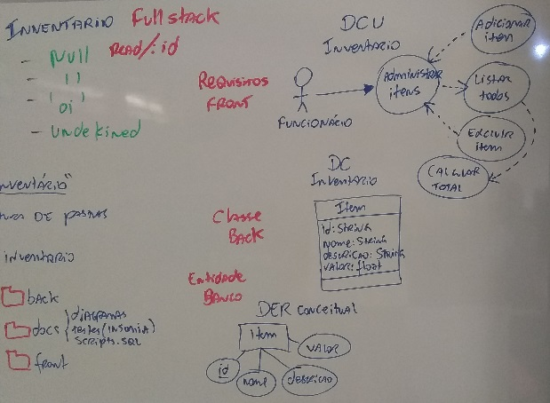
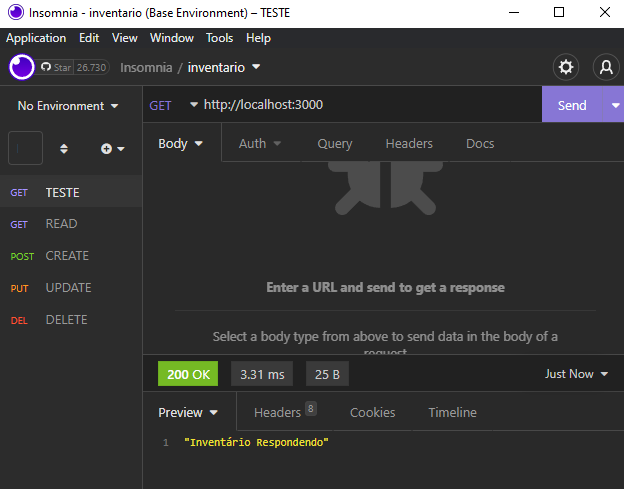
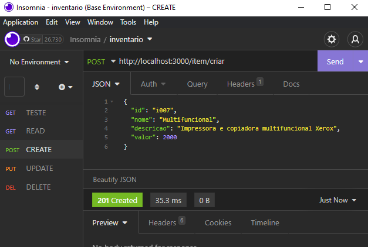
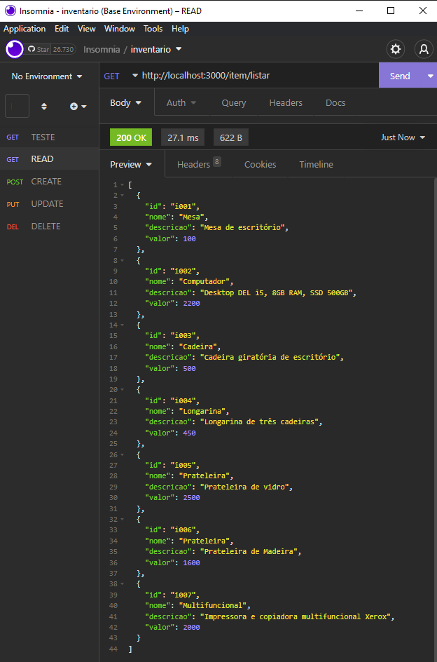
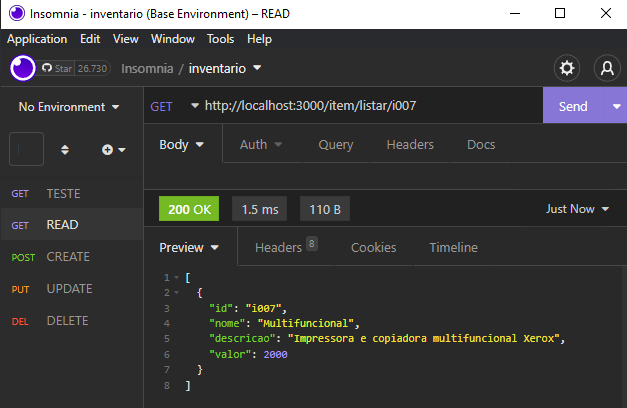
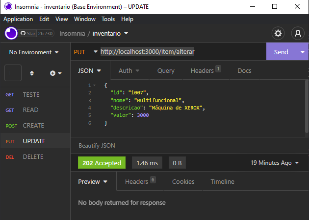
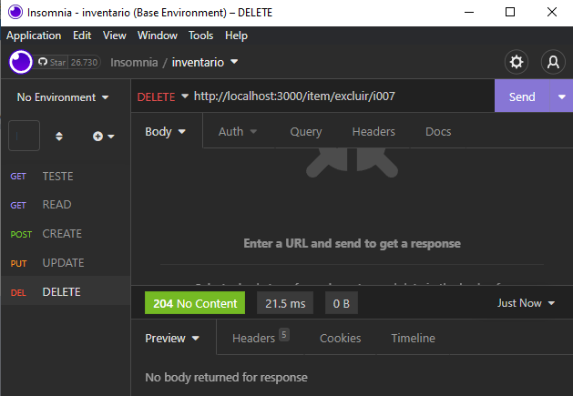
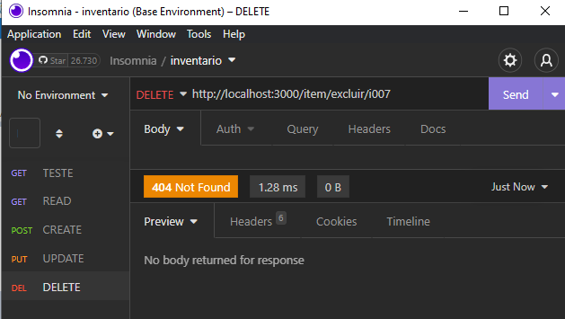

# Aula07 - Projeto Fullstak 
# CRUD com apenas uma tabela (Continuação - Inventário)
## Conhecimentos
* 2.3. Design patterns
* 3. Frameworks
* 3.1. Definição
* 3.2. Modelos e tipos
* 3.3. Instalação e configuração
* 3.4. Criação de projetos utilizando framework
* 4. Persistência de dados
* 4.1. Conexão com base de dados
* 4.2. CRUD

# Ainda com o mesmo front da aula anterior


- Mesmo banco de dados
<br/>docs/inventario.sql
```sql
-- SQL do banco de dados de Inventários com apenas uma tabela
DROP DATABASE IF EXISTS inventario;
CREATE DATABASE inventario CHARSET=UTF8 COLLATE utf8_general_ci;
USE inventario;
-- DDL Criação da estrutura da tabela
CREATE TABLE item(
    id varchar(5) not null primary key,
    nome varchar(50) not null,
    descricao text,
    valor decimal(10,2) not null
);
-- DML Popular a tabela com dados de teste
INSERT INTO item VALUES
('i001','Mesa','Mesa de escritório',100.00),
('i002','Computador','Desktop DEL i5, 8GB RAM, SSD 500GB',2200.00),
('i003','Cadeira','Cadeira giratória de escritório',500.00),
('i004','Longarina','Longarina de três cadeiras',450.00),
('i005','Prateleira','Prateleira de vidro',2500.00),
('i006','Prateleira','Prateleira de Madeira',1600.00);
```

## Alterar o BackEnd (NodeJS) Acrescentando a Classe Model
### E alterando os arquivos conforme a seguir
- src/models/item.js
```javascript
class Item {

    constructor(i) {
        this.id = i.id
        this.nome = i.nome
        this.descricao = i.descricao
        this.valor = i.valor
    }

    create() {
        return `INSERT INTO item VALUE('${this.id}','${this.nome}','${this.descricao}',${this.valor})`
    }

    read() {
        if (this.id == undefined)
            return `SELECT * FROM item`
        else
            return `SELECT * FROM item WHERE id = '${this.id}'`
    }

    update() {
        return `UPDATE item SET nome = '${this.nome}', descricao = '${this.descricao}', valor = ${this.valor} WHERE id = '${this.id}'`
    }

    delete() {
        return `DELETE FROM item WHERE id = '${this.id}'`
    }
}

module.exports = Item 
```
src/controllers/item.js
```javascript
const con = require('../dao/connect')
const Item = require('../models/item')

const teste = (req, res) => {
    res.json("Inventário Respondendo").end()
}

const criar = (req, res) => {
    let item = new Item(req.body)
    con.query(item.create(), (err, result) => {
        if (err == null)
            res.status(201).end()
        else
            res.status(500).json(err).end()
    })
}

const listar = (req, res) => {
    let item = new Item(req.params)
    con.query(item.read(), (err, result) => {
        if (err == null)
            res.json(result).end()
    })
}

const alterar = (req, res) => {
    let item = new Item(req.body)
    con.query(item.update(), (err, result) => {
        if (result.affectedRows > 0)
            res.status(202).end()
        else
            res.status(404).end()
    })
}

const excluir = (req, res) => {
    let item = new Item(req.params)
    con.query(item.delete(), (err, result) => {
        if (result.affectedRows > 0)
            res.status(204).end()
        else
            res.status(404).end()
    })
}

module.exports = {
    teste,
    criar,
    listar,
    alterar,
    excluir
}
```

src/routes/item.js
```javascript
const express = require("express");
const router = express.Router();

const Item = require('../controllers/item');

router.get('/', Item.teste);
router.post('/item/criar', Item.criar);
router.get('/item/listar', Item.listar);
router.get('/item/listar/:id', Item.listar);
router.put('/item/alterar', Item.alterar);
router.delete('/item/excluir/:id', Item.excluir);

module.exports = router
```
src/dao/connect.js
```javascript
const mysql = require('mysql')

const con = mysql.createConnection({
    user: 'root',
    host: 'localhost',
    database: 'inventario'
});

module.exports = con;
```

server.js
```javascript
const express = require('express')
const cors = require('cors')

const router = require('./src/routes/item')

const app = express()
app.use(express.json())
app.use(cors())
app.use('/', router)

app.listen(3000, () => {
    console.log("Respondendo na porta 3000")
})
```

package.json
```json
{
    "name": "inventario",
    "version": "1.0.0",
    "description": "",
    "main": "server.js",
    "scripts": {
      "test": "echo \"Error: no test specified\" && exit 1"
    },
    "author": "",
    "license": "ISC",
    "dependencies": {
      "cors": "^2.8.5",
      "express": "^4.18.2",
      "mysql": "^2.18.1"
    }
  }
```
- Ao concluir rode novamente os comandos:
	- mpm i
	- nodemon

# Realize os testes unitários com o aplicativo insomnia
- Rota de teste: http://localhost:3000
<br>
- Rota POST Criar: http://localhost:3000/item/criar
<br>
- Rota GET Listar todos: http://localhost:3000/item/listar
<br>
- Rota GET Listar 1 item específico: http://localhost:3000/item/listar/i007
<br>
- Rota PUT Alterar: http://localhost:3000/item/alterar
<br>
- Rota DELETE Excluir 1 item específico: http://localhost:3000/item/excluir/i007
<br>
- Excluir o mesmo item novamete e ver se responde com código 404 não encontrado
<br>

# Altere o arquivo index.js no Front-End para fazer a integração:

front/index.js
```javascript
const uri = 'http://localhost:3000/item'
const cadastro = document.querySelector('#cadastro')
const corpo = document.querySelector('#corpo')
const total = document.querySelector('#total')
var valTotal = 0;

fetch(uri + '/listar', { method: 'GET' })
    .then(resp => resp.json())
    .then(resp => montarTabela(resp))
    .catch(err => console.error(err));

cadastro.addEventListener('submit', e => {
    e.preventDefault();

    const body = {
        "id": cadastro.id.value,
        "nome": cadastro.nome.value,
        "descricao": cadastro.descricao.value,
        "valor": cadastro.valor.value,
    }

    const options = {
        method: 'POST',
        headers: { 'Content-Type': 'application/json' },
    };

    options.body = JSON.stringify(body)

    fetch(uri + '/criar', options)
        .then(resp => resp.status)
        .then(resp => {
            if (resp == 201) window.location.reload()
            else alert('Erro ao enviar dados')
        })
})

function montarTabela(vetor) {
    vetor.forEach(e => {
        let linha = document.createElement('tr')
        let col1 = document.createElement('td')
        let col2 = document.createElement('td')
        let col3 = document.createElement('td')
        let col4 = document.createElement('td')
        let col5 = document.createElement('td')
        let del = document.createElement('button')
        del.innerHTML = '[-]'
        del.setAttribute('onclick', `excluirItem('${e.id}')`)
        col1.innerHTML = e.id
        col2.innerHTML = e.nome
        col3.innerHTML = e.descricao
        col4.innerHTML = e.valor
        col5.appendChild(del)
        linha.appendChild(col1)
        linha.appendChild(col2)
        linha.appendChild(col3)
        linha.appendChild(col4)
        linha.appendChild(col5)
        corpo.appendChild(linha)
        valTotal += e.valor
        total.value = new Intl.NumberFormat('pt-BR', { style: 'currency', currency: 'BRL' }).format(valTotal)
    });
}

function excluirItem(i) {
    if (confirm('Valida Exclusao'))
        fetch(uri + '/excluir/' + i, { method: 'DELETE' })
            .then(resp => resp.status)
            .then(resp => {
                if (resp == 204) window.location.reload()
                else alert('Erro ao enviar dados')
            })
}
```

style.css
```css
* {
    margin: 0;
    padding: 0;
    font-family: 'Courier New', Courier, monospace;
    font-size: medium;
}

body {
    display: flex;
    flex-direction: column;
    align-items: center;
    height: 100%;
}

header {
    height: 10vh;
    width: 50vw;
    display: flex;
    flex-direction: column;
    align-items: center;
    border: 1px solid #ff7e05;
    border-radius: 5px;
    margin: 5px;
    padding: 5px;
}

.rotulos {
    width: 100%;
    display: flex;
    flex-direction: row;
    justify-content: space-around;
}

label {
    font-weight: bold;
}

form {
    display: flex;
    flex-direction: row;
    justify-content: space-around;
}

input {
    max-width: 160px;
    margin: 5px;
    border: 1px solid #ff7e05;
    border-radius: 5px;
    font-size: small;
    font-weight: bold;
    color: #a35002;
    box-shadow: 1px 1px 3px #ccc;
}

main {
    height: 50vh;
    width: 50vw;
    display: flex;
    flex-direction: column;
    justify-content: space-between;
    border: 1px solid #ff7e05;
    border-radius: 5px;
    overflow-y: auto;
    overflow-x: hidden;
    padding: 5px;
}

main::-webkit-scrollbar {
    width: 10px;
}

main::-webkit-scrollbar-track {
    background: rgb(255, 225, 192);
}

main::-webkit-scrollbar-thumb {
    background-color: #ff9a3b;
    border-radius: 10px;
    border: 1px solid #ff7e05;
}

main table {
    width: 100%;
}

main table tr:nth-child(even) {
    background: rgb(255, 225, 192);
}

main table tr td {
    text-align: center;
}

button {
    border: none;
    background-color: #ff7e05;
    border-radius: 5px;
    font-size: small;
    font-weight: bold;
    padding: 5px;
    color: #fff;
    box-shadow: 1px 1px 3px #ccc;
    cursor: pointer;
}

input[type=submit] {
    border: none;
    background-color: #ff7e05;
    border-radius: 5px;
    font-size: small;
    font-weight: bold;
    padding: 5px;
    color: #fff;
    box-shadow: 1px 1px 3px #ccc;
    cursor: pointer;
}

footer {
    height: 5vh;
    width: 50vw;
    border: 1px solid #ff7e05;
    border-radius: 5px;
    display: flex;
    flex-direction: row;
    justify-content: end;
    margin: 5px;
    padding: 5px;
}

@media screen and (max-width: 1500px) {

    header,
    main,
    footer {
        width: 55vw;
    }
}

@media screen and (max-width: 1300px) {

    header,
    main,
    footer {
        width: 80vw;
    }
}

@media screen and (max-width: 1100px) {

    header,
    main,
    footer {
        width: 90vw;
    }
}

@media screen and (max-width: 800px) {

    header,
    main,
    footer {
        width: 100vw;
    }

    header {
        height: 22vh;
    }

    form {
        display: flex;
        flex-direction: column;
    }

    input {
        height: 25px;
        width: 350px;
        max-width: 100%;
    }

    label {
        display: none;
    }

}

@media screen and (max-width: 400px) {

    header,
    main,
    footer {
        width: 100vw;
    }

    header {
        height: 27vh;
    }

    form {
        display: flex;
        flex-direction: column;
    }

    input {
        height: 25px;
        width: 350px;
        max-width: 100%;
    }

    label {
        display: none;
    }
}
```
index.html
```html
<!DOCTYPE html>
<html lang="en">

<head>
    <meta charset="UTF-8">
    <meta http-equiv="X-UA-Compatible" content="IE=edge">
    <meta name="viewport" content="width=device-width, initial-scale=1.0">
    <link rel="stylesheet" href="style.css">
    <link rel="shortcut icon" href="./assets/favicon.png" type="image/x-icon">
    <title>Inventário Papelaria</title>
</head>

<body>
    <header>
        <h1>Inventário - Papelaria PapelTudo</h1>
        <div class="rotulos">
            <label for="id">Id</label>
            <label for="nome">Nome</label>
            <label for="descricao">Descrição</label>
            <label for="valor">Valor</label>
            <label for="acao">Ação</label>
        </div>
        <form id="cadastro">
            <input type="text" name="id" id="id" required />
            <input type="text" name="nome" id="nome" required />
            <input type="text" name="descricao" id="descricao" />
            <input type="number" step="any" name="valor" id="valor" required />
            <input type="submit" value="Cadastrar" />
        </form>
    </header>
    <main>
        <table>
            <thead>
                <tr>
                    <th>Id</th>
                    <th>Nome</th>
                    <th>Descrição</th>
                    <th>Valor</th>
                    <th>Ação</th>
                </tr>
            </thead>
            <tbody id="corpo"></tbody>
        </table>
    </main>
    <footer>
        <label for="total">Patrimônio Total:</label>
        <input type="text" name="total" id="total" style="text-align: right;" readonly />
    </footer>
</body>
<script src="index.js"></script>

</html>
```