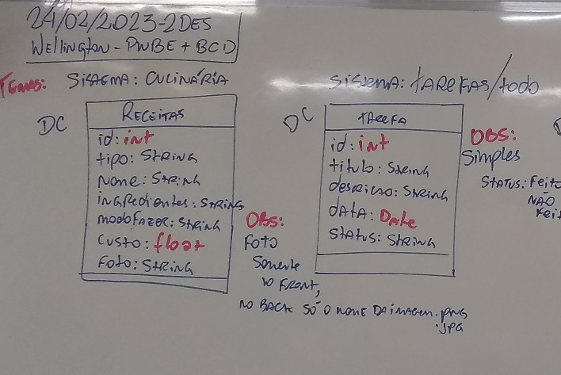
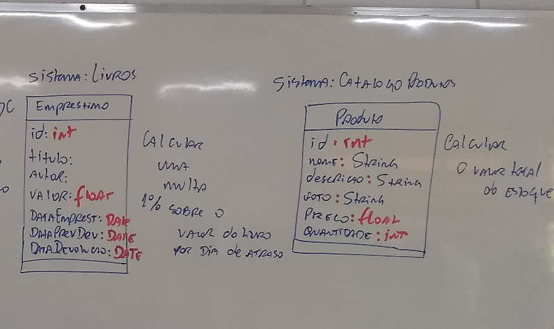

# Aula08 (Atividades)
- Seguindo o modelo do projeto full-stack **inventário**.
- Escolha um dos temas a seguir e desenvolva um projeto fullstack completo com:
    - docs
        - MER DER
        - UML DCU
        - Script SQL
    - front
        - CRUD
    - back
        - CRUD
        - MVC
        - DAO
Temas:





## Previsão de entrega para 03/03/2023
## Entrega oficial 10/03/2023
- Crie um repositório público no GitHub
    - Clone seu projeto
    ```git
        git clone endereco_do_seu_repositorio
    ```
    - Copie as pastas do seu projeto para o repositório local
        - back
        - docs
        - front
    - Crie um arquivo README.md e coloco os dados de como executar seu projeto
        - Ex: https://github.com/wellifabio/inventario_crud_node_mysql
    - Na pasta **back** crie um arquivo **.gitignore**
        ```
            node_modules
            package-lock.json
        ```
    - Se estiver utilizando computador público (na sala de aula)
        - Vá em Painel de controle, Contas de usuário, Gerenciar Credenciais do Windows e remova a credencial do git
    - Abra o gitback
        ```git
            git add .
            git commit -m "primeiro commit"
            git push
        ```
    E envie somente o endereço do seu projeto
- Através do formulário: https://forms.gle/5xmz3gGsCJUH6ekp8