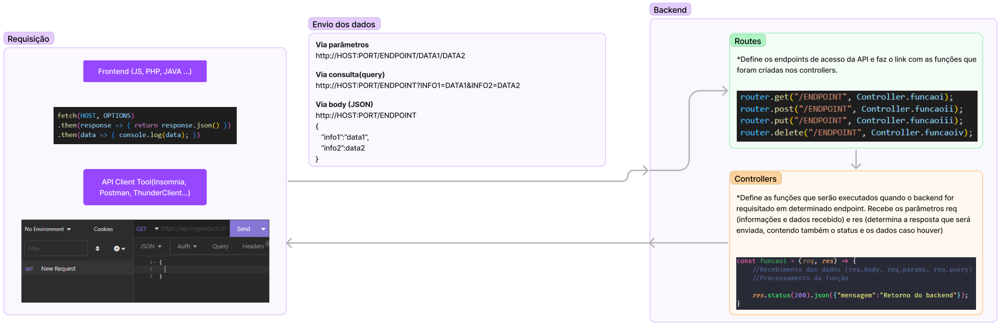
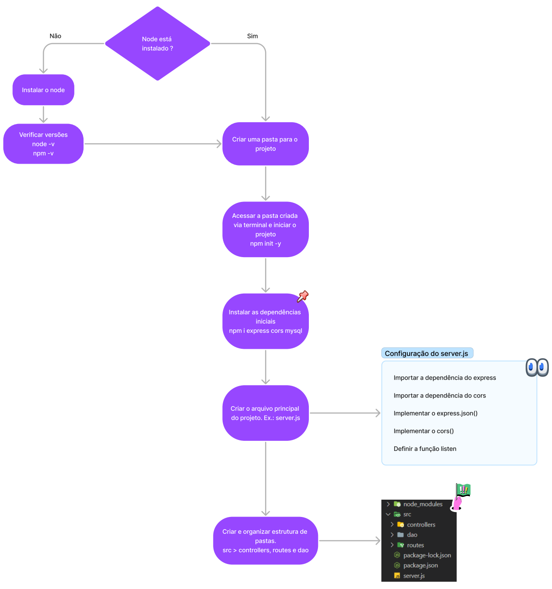

# Aula10
- Conluído projeto Imobiliária
- Esquema de comunicação entre as stacks (Integração)

- Fluxograma de como iniciar um projeto Back-End NodeJS

## Atividades
- Atividade 1:
    - Criar um projeto backend que irá conter um endpoint GET chamado **"/calcular/:operacao"**. A função do **controller** irá receber duas informações (vali e valii) através de query. Baseado no parâmetro enviado (somar, dividir, multiplicar ou subtrair) a função irá retornar um JSON com o resultado do cálculo.
    - Ex. JSON:
    ```json
        { 
            "resultado": 5
        }
    ```
- Atividade 2:
    - Criar um projeto backend que contém o endpoint POST "/concatenar". A função do controller irá receber um JSON via body com a seguinte estrutura:
    ```json
        {
            "nome":"Nome",
            "sobrenome":"Sobrenome"
        }
    ```
    e irá retornar a seguinte informação:
    ```json
        {
            "nome_completo":"Nome Sobrenome"
        }
    ```
- Atividade 3:
    - Criar um projeto backend que possua um endpoint GET chamado "/random". A função do controller irá receber uma informação (limite) via query e deverá retornar um JSON com um número inteiro aleatório entre 0 e o valor de limite, ex.:
    ```json
        {
            "random":5
        }
    ```
- Atividade 4:
    - Criar um projeto backend que possua um endpoint GET chamado "/nome". A função do controller irá retornar um JSON com um nome completo aleatório, ex.:
    ```json
        {
            "nome":"Nome Exemplo"
        }
    ```
- Atividade 5:
    - Criar um projeto backend que possua os seguintes endpoints:
        - GET "/tarefas"
        - POST "/nova"
    - A função do controller vinculada ao endpoint "tarefas" irá retornar um JSON Array com todas as tarefas cadastradas no banco.
    - A função do controller vinculada ao endpoint "nova" irá receber um JSON  via body com a estrutura:
    ```json
        {
            "tarefa":"Informações da tarefa"
        }
    ```
    - Armazenar essa informação no banco de dados e retornar um JSON confirmando o cadastro.
    ```SQL
        CREATE TABLE tarefas (
            id INT NOT NULL AUTO_INCREMENT PRIMARY KEY,
            tarefa VARCHAR(100)
        );
    ```