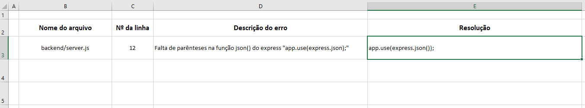
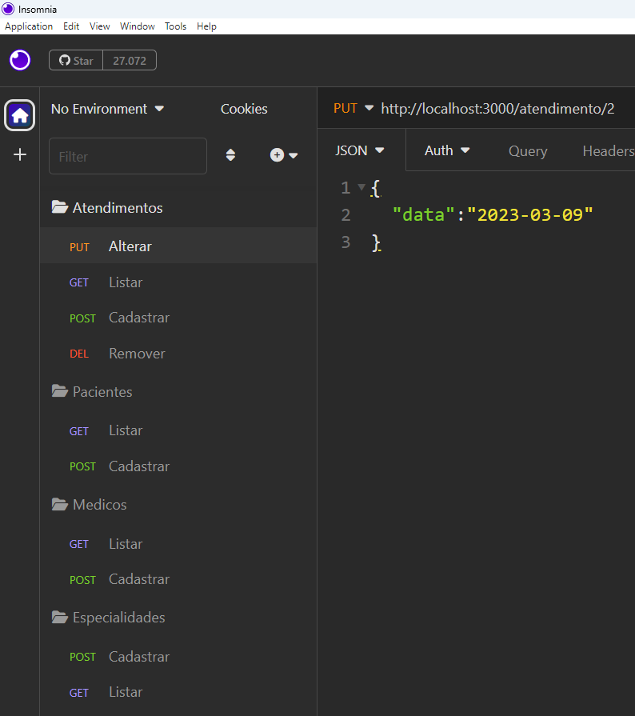

# Situação Problema:

## Refatoração de código:
- OBS: Este desafio pode ser utilizado como teste em um processo seletivo para contratação de programador Back-End ou FullStack

|Contextualização|
|-|
|Você é um programador backend júnior e faz parte de uma equipe dev, um colega de trabalho que estava desenvolvendo um código para um cliente importante "Cínica Médica" teve que se ausentar por motivos de saúde mental|

|Desafio|
|-|
|O banco de dados e o arquivo de testes estão concluídos, porém o código backend não está funcionando, pois apresenta diversos erros.<br>Conclua o trabalho encontrando e corrigindo os erros encontrados|

|entregas:|
|-|
|A pasta /backend/docs possui o **script.sql**, o arquivo de testes insomnia **Clinica.json** e uma planilha chamada **"Lista de Erros.xlsx"**<br>- Faça download do projeto "Exercíco Clinica", <br>- Instale o banco de dados,<br>- Importe o arquivo de testes no Insomnia<br>- Instale o BackEnd (NodeJS) **npm i**<br>- Tente executar o projeto e encontre os erros<br>- Preencha a **planilha** com os erros encontrados e a **solução** aplicada|
## Planilha de erros

## Arquivo de testes (Insomnia)

## Stript SQL
```sql
DROP DATABASE IF EXISTS clinica;
CREATE DATABASE clinica;

USE clinica;

CREATE TABLE especialidades (
    id INT NOT NULL AUTO_INCREMENT PRIMARY KEY,
    nome VARCHAR(100) NOT NULL
);

CREATE TABLE medicos (
    id INT NOT NULL AUTO_INCREMENT PRIMARY KEY,
    nome VARCHAR(100) NOT NULL,
    especialidade_id INT NOT NULL,
    FOREIGN KEY (especialidade_id) REFERENCES especialidades(id)
);

CREATE TABLE pacientes (
    id INT NOT NULL AUTO_INCREMENT PRIMARY KEY,
    nome VARCHAR(153) NOT NULL,
    data_nascimento DATE NOT NULL
);

CREATE TABLE atendimentos (
    id INT NOT NULL AUTO_INCREMENT PRIMARY KEY,
    data DATE NOT NULL,
    medico_id INT NOT NULL,
    paciente_id INT NOT NULL,
    FOREIGN KEY (paciente_id) REFERENCES pacientes(id),
    FOREIGN KEY (medico_id) REFERENCES medicos(id)
);

INSERT INTO especialidades 
VALUES (DEFAULT, "Oftalmologia"),
       (DEFAULT, "Pediatria"),
       (DEFAULT, "Pneumologia"),
       (DEFAULT, "Neurologia");

INSERT INTO medicos
VALUES (DEFAULT, "Isabela Elza Fogaça", 1),
       (DEFAULT, "Marcos Vinicius Enzo Farias", 2),
       (DEFAULT, "Pedro Vinicius da Rosa", 3),
       (DEFAULT, "Agatha Catarina Carolina Baptista", 4);

INSERT INTO pacientes
VALUES (DEFAULT, "Diogo Diego Gustavo Gomes", "1967-01-07"),
       (DEFAULT, "Bianca Kamilly Lopes", "1948-03-03"),
       (DEFAULT, "Andreia Manuela Santos", "1987-01-23"),
       (DEFAULT, "Oliver Felipe Nunes", "1988-02-10");

INSERT INTO atendimentos
VALUES (DEFAULT, "2020-01-15", 1, 4),
       (DEFAULT, "2020-01-18", 2, 3),
       (DEFAULT, "2020-02-23", 3, 2),
       (DEFAULT, "2020-03-08", 4, 1);
```