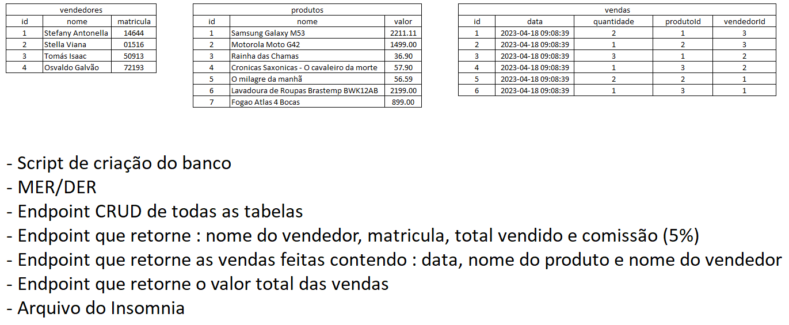

## VPS01 (Verificação Prática Somativa)

|Contextualização:|
|-|
|A loja XPTO de aparelhos eletrônicos necessita de um sistema que faça a gestão de suas vendas, possui os seguintes dados de modelo já normalizados nas tabelas abaixo:|

|Desafio|
|-|
|Você foi encarregado do desenvolvimento da API Back-End com todos os Endpoints descritos na imagem.|

| Entregas|
|-|
|Crie um repositório publico do github e envie o endereço no formulário:  https://forms.gle/t7e7ttjaMuDmXmnN8|

|Correção|
|-|
|[Aula11 de PWFE](../../02-pwfe/aula11)|