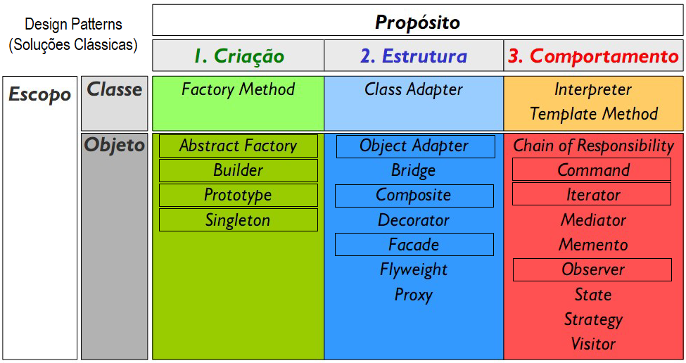
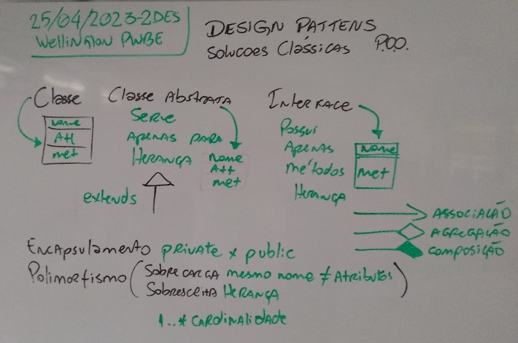
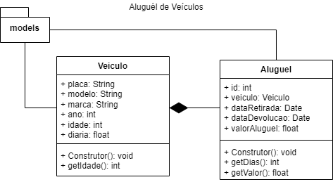
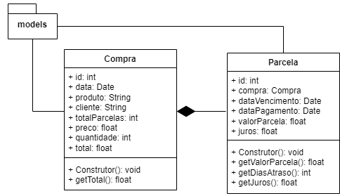
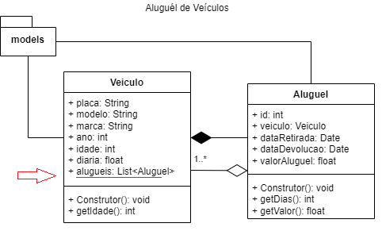
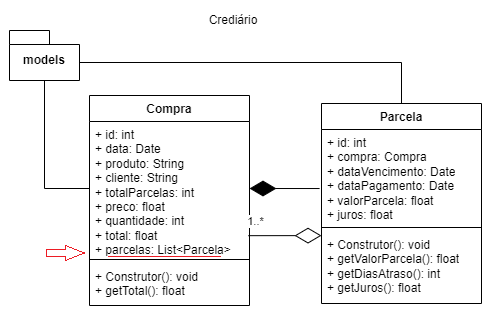

# 2. Padrão de desenvolvimento MVC
Alguns programadores consideram o MVC (Model, View, Controller) um Design Pattern (Solução Clássica) outros não, pois não faz parte das soluções dlivro GOF  (Gang Of Four)
- 2.1. Definição (Padrão de projetos e frameworks dividido em pelo menos três camadas)
- 2.2. Aplicabilidade (NodeJS, React, Angular, Spring e outros Frameworks)
- 2.3. Design patterns (Gang Of Four - 24 Soluções)
# Design Patterns - GOF
- Criação
- Estrutura
- Comportamento
 
### Pattens GOF
 Estes 24 pattens estão no livro GOF (Gang Of Four) escrito por quatro programadores documentando soluções clássicas com P.O.O. (Programação Orientadas a Objeto, por isso vamos estudar um pouco dos conceitos de P.O.O.
 

## Links importantes
- (patterns x standard) https://www.youtube.com/watch?v=GUanHEGlje4&t=1440s
- Slides: https://github.com/wellifabio/senai2021/blob/master/3des/projetos/aula22/design_patterns.pdf
- Exemplos com Java: https://github.com/wellifabio/senai2022/tree/master/3des/projetos/aula09/exemplo-java
- POO Classes em JavaScript https://developer.mozilla.org/pt-BR/docs/Web/JavaScript/Reference/Classes

## Atividades
### Atividade 1
|Modele com JavaScript as classes conforme o Diagrama de Classes, utilize o Pattern Builder e os dados a seguir para testar|
|-|
||

#### Dados para testar:

#### Veículos
|placa|modelo|marca|ano|idade|diaria|
|-|-|-|-|:-:|-|
|JHK-2518|Uno|Fiat|2015|**calcular**|75.9|
|PBC-5A58|Gol|VW|2018|**calcular**|99.9|
|CCB-2F19|Celta|Chevrolet|2007|**calcular**|49.9|

#### Aluguéis
|id|veículo|dataRetirada|dataDevolucao|valorAluguel|
|-|-|-|-|:-:|
|1|JHK-2518|2023-04-01|2023-04-06|**calcular**|
|2|PBC-5A58|2023-04-01|2023-04-08|**calcular**|
|3|PBC-5A58|2023-04-02|2023-04-07|**calcular**|
|4|CCB-2F19|2023-04-07|2023-04-16|**calcular**|
|5|JHK-2518|2023-04-08|2023-04-16|**calcular**|

### Atividade 2
|Modele com JavaScript as classes conforme o Diagrama de Classes, utilize o Pattern Builder e os dados a seguir para testar, calcule juros de 1% do valor da parcela por dia de atraso|
|-|
||

#### Dados para testar:

#### Compras

|id|data|produto|cliente|totalParcelas|preco|quantidade|total|
|-|-|-|-|-|-|-|:-:|
|1|25/03/2022|TV LCD 4K 50" LG|Jair Santana|4|2800.00|2|**calcular**|
|2|12/05/2022|TV LCD 4K 50" Sansung|Jurema Santana|2|3100.00|1|**calcular**|
|3|08/06/2022|TV LCD 4K 50" LG|Mariana Silva|3|2850.00|2|**calcular**|
|4|17/02/2023|TV LCD 4K 50" Sansung|Marta Oliveira|5|2899.90|1|**calcular**|
#### Parcelas
|id|compra|dataVencimento|dataPagamento|valorParcela|Juros|
|-|-|-|-|-|:-:|
|1|1|25/04/2022|23/04/2022|**calcular**|**calcular**|
|2|1|25/05/2022|24/05/2022|**calcular**|**calcular**|
|3|1|25/06/2022|27/06/2022|**calcular**|**calcular**|
|4|1|25/07/2022|30/07/2022|**calcular**|**calcular**|
|5|2|12/06/2022|12/06/2022|**calcular**|**calcular**|
|6|2|12/07/2022|15/07/2022|**calcular**|**calcular**|
|7|3|08/07/2022|18/07/2022|**calcular**|**calcular**|
|8|3|08/08/2022|08/08/2022|**calcular**|**calcular**|
|9|3|08/09/2022|06/09/2022|**calcular**|**calcular**|
|10|4|17/03/2023|20/03/2023|**calcular**|**calcular**|
|11|4|17/04/2023|22/04/2023|**calcular**|**calcular**|
|12|4|17/05/2023|null|**calcular**|**calcular**|
|13|4|17/06/2023|null|**calcular**|**calcular**|
|14|4|17/07/2023|null|**calcular**|**calcular**|

### Atividade 3
|A partir dos dados da atividade 1 Locação de Veículos, agora aplique o Pattern Composite conforme Diagrama de Classes a seguir|
|-|
||
### Atividade 4
|A partir dos dados da da atividade 2 Parcelas de Compras, agora aplique o Pattern Composite conforme Diagrama de Classes a seguir|
|-|
||