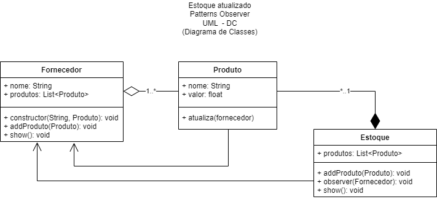

# Comportamento - Observer

O padrão de projeto **Observer** é usado para estabelecer uma relação de dependência um-para-muitos entre objetos, de modo que quando um objeto muda de estado, todos os seus dependentes são notificados e atualizados automaticamente. Aqui está um exemplo de como usar o padrão Observer em **JavaScript**:

|Problema|
|-|
|Quando um objeto muda de estado, todos os seus dependentes são notificados e atualizados automaticamente|
|Semelhante a um Gatilho de banco de dados relacional, como a instrução **ON UPDATE CASCADE**|

```javascript
// Subject (Assunto)
class NewsPublisher {
  constructor() {
    this.subscribers = [];
  }

  subscribe(observer) {
    this.subscribers.push(observer);
  }

  unsubscribe(observer) {
    this.subscribers = this.subscribers.filter(subscriber => subscriber !== observer);
  }

  notify(news) {
    this.subscribers.forEach(subscriber => subscriber.update(news));
  }
}

// Observer (Observador)
class NewsSubscriber {
  constructor(name) {
    this.name = name;
  }

  update(news) {
    console.log(`${this.name} recebeu uma notificação: ${news}`);
  }
}

// Exemplo de uso:

const publisher = new NewsPublisher();

const subscriber1 = new NewsSubscriber('Assinante 1');
const subscriber2 = new NewsSubscriber('Assinante 2');
const subscriber3 = new NewsSubscriber('Assinante 3');

publisher.subscribe(subscriber1);
publisher.subscribe(subscriber2);
publisher.subscribe(subscriber3);

publisher.notify('Nova notícia publicada'); // Saída: Assinante 1 recebeu uma notificação: Nova notícia publicada
                                           //        Assinante 2 recebeu uma notificação: Nova notícia publicada
                                           //        Assinante 3 recebeu uma notificação: Nova notícia publicada

publisher.unsubscribe(subscriber2);

publisher.notify('Outra notícia publicada'); // Saída: Assinante 1 recebeu uma notificação: Outra notícia publicada
                                             //        Assinante 3 recebeu uma notificação: Outra notícia publicada
```
Neste exemplo, temos a classe NewsPublisher, que atua como o sujeito ou assunto. Ela mantém uma lista de observadores (subscribers) e possui métodos para adicionar (subscribe), remover (unsubscribe) e notificar (notify) os observadores quando ocorre uma mudança.

A classe NewsSubscriber representa os observadores. Cada observador possui um nome e um método update que é chamado pelo NewsPublisher quando uma notificação é enviada. No método update, cada observador recebe a notícia e pode realizar ações com base nessa notificação.

No exemplo de uso, criamos uma instância de NewsPublisher e várias instâncias de NewsSubscriber. Em seguida, registramos os observadores usando o método subscribe. Quando chamamos o método notify no NewsPublisher, todos os observadores registrados são notificados por meio do método update.

Após a notificação, os observadores são livres para realizar ações com base na notícia recebida. No exemplo, a saída no console mostra que todos os observadores recebem a notificação, exceto o subscriber2, que foi removido da lista de observadores usando o método unsubscribe antes da segunda notificação.

O padrão Observer permite uma comunicação eficiente e desacoplada entre objetos, onde os observadores podem reagir a mudanças no estado do sujeito de forma flexível. É útil em situações onde você deseja que diferentes partes do sistema sejam notificadas e atualizadas automaticamente quando ocorrerem mudanças.

|Outro exemplo: [Código](./estoque/index.js)<br/>Youtube: https://www.youtube.com/watch?v=wiQdrH2YpT4|
|-|
|Outro exemplo, um programa que compara preços de um determinado produto em fornecedores diferentes e atualiza o valor no estoque|
||
