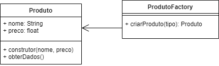

## Criação - Factory

O padrão de projeto **Factory** é usado para encapsular a lógica de criação de objetos em uma fábrica, permitindo a criação de diferentes tipos de objetos sem expor a lógica de criação diretamente. Aqui está um exemplo de como usar o padrão Factory em **JavaScript**:
|Problema|
|-|
|Criar produtos de tipos diferentes e padronizados|
||
```javascript
class Produto {
  constructor(nome, preco) {
    this.nome = nome;
    this.preco = preco;
  }

  obterDados() {
    console.log(`Produto: ${this.nome}, Preço: ${this.preco}`);
  }
}

class ProdutoFactory {
  criarProduto(tipo) {
    let produto;

    if (tipo === 'A') {
      produto = new Produto('Produto A', 100);
    } else if (tipo === 'B') {
      produto = new Produto('Produto B', 200);
    } else if (tipo === 'C') {
      produto = new Produto('Produto C', 300);
    }

    return produto;
  }
}

// Exemplo de uso:
const factory = new ProdutoFactory();

const productA = factory.criarProduto('A');
productA.obterDados();

const productB = factory.criarProduto('B');
productB.obterDados();

const productC = factory.criarProduto('C');
productC.obterDados();
```
Neste exemplo, **Produto** é a classe dos objetos que serão criados pela fábrica, **ProdutoFactory** é a fábrica que encapsula a lógica de criação dos objetos. A fábrica possui um método **criarProduto(tipo)** que recebe um parâmetro **tipo** para determinar qual tipo de objeto deve ser criado. Dependendo do valor do parâmetro "tipo", a fábrica cria e retorna um objeto **Produto** correspondente.

Para usar o padrão Factory, primeiro uma instância da fábrica (ProdutoFactory) deve ser criada. Em seguida, a fábrica é usada para criar objetos chamando o método criarProduto(tipo) e passando o tipo desejado como argumento. A fábrica retorna um objeto Produto correspondente, que pode ser usado para realizar operações específicas do objeto criado.

Dessa forma, o padrão Factory permite criar diferentes tipos de objetos (**Produto** neste exemplo) sem expor a lógica de criação diretamente, centralizando a responsabilidade de criação na fábrica. Isso facilita a manutenção e a extensibilidade do código, pois novos tipos de objetos podem ser adicionados na fábrica sem afetar o código cliente que utiliza a fábrica.