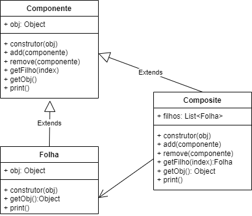

## Estrutura - Composite
O padrão de projeto **Composite** é usado para compor objetos em estruturas de árvore para representar hierarquias de partes-todo. O objetivo é tratar objetos individuais e composições de objetos de maneira uniforme. Aqui está um exemplo de como usar o padrão Composite em **JavaScript**:

|Problema|
| -|
|Compor um objeto com várias partes Ex:Relacionamentos 1 para N em Banco de Dados|
||

```javascript
// define a interface para todos os componentees da árvore
class Componente {
    constructor(obj) {
        this.obj = obj;
    }
    add(componente) { }
    remove(componente) { }
    getfilho(index) { }
    getObj() { }
    print() { }
}

// representa os objetos folha na árvore
class Folha extends Componente {
    constructor(obj) {
        super(obj);
    }
    getObj() {
        return this.obj;
    }
    print() {
        console.log(this.obj);
    }
}

// representa os objetos compostos na árvore
class Composite extends Componente {
    constructor(obj) {
        super(obj);
        this.filhos = [];
    }
    add(componente) {
        this.filhos.push(componente);
    }
    remove(componente) {
        const index = this.filhos.indexOf(componente);
        this.filhos.splice(index, 1);
    }
    getfilho(index) {
        return this.filhos[index];
    }
    getObj() {
        return this.obj;
    }
    print() {
        console.log(this.obj);
        this.filhos.forEach(filho => {
            filho.print();
        });
    }
}

// Exemplo de uso
const raiz = new Composite('Objeto raiz');
raiz.add(new Folha('folha raiz A'));
raiz.add(new Folha('folha raiz B'));

const comp = new Composite('SubObjeto');
comp.add(new Folha('folha Sub A'));
comp.add(new Folha('folha Sub B'));

raiz.add(comp);
raiz.add(new Folha('folha raiz C'));

const folha = new Folha('folha raiz D');
raiz.add(folha);
raiz.remove(folha);

raiz.print();
```

Neste exemplo, **Componente** define a interface para todos os componentes da árvore, **Folha** representa os objetos folha na árvore e **Composite** representa os objetos compostos na árvore. O Composite pode ter filhos, que podem ser Folha ou outro Composite. O método **print()** percorre a árvore inteira e imprime todos os componentes na hierarquia.