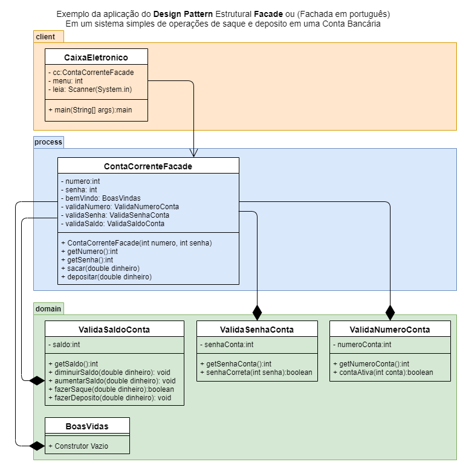

# Estrutura - Facade

O padrão de projeto **Facade** (Fachada em português) é usado para fornecer uma interface simplificada para interagir com um sistema complexo ou conjunto de classes, ocultando a complexidade subjacente e fornecendo um ponto de entrada único. Aqui está um exemplo de como usar o padrão Facade em **JavaScript**:

```javascript
// Classes complexas do sistema
class SubsystemA {
  operationA() {
    console.log('Operação A do Subsistema A');
  }
}

class SubsystemB {
  operationB() {
    console.log('Operação B do Subsistema B');
  }
}

class SubsystemC {
  operationC() {
    console.log('Operação C do Subsistema C');
  }
}

// Facade
class Facade {
  constructor() {
    this.subsystemA = new SubsystemA();
    this.subsystemB = new SubsystemB();
    this.subsystemC = new SubsystemC();
  }

  operation() {
    this.subsystemA.operationA();
    this.subsystemB.operationB();
    this.subsystemC.operationC();
  }
}

// Exemplo de uso:

const facade = new Facade();
facade.operation();
```

Neste exemplo, temos um sistema complexo composto por várias classes, representadas pelos subsistemas A, B e C. O subsistema A possui a operação A, o subsistema B possui a operação B e o subsistema C possui a operação C.

O Facade fornece uma interface simplificada para interagir com o sistema complexo. Ele possui instâncias dos subsistemas e encapsula as chamadas às operações dos subsistemas em um único método chamado **operation**.

Ao chamar **facade.operation()**, o Facade chama as operações dos subsistemas na ordem necessária. Isso oculta a complexidade do sistema subjacente e fornece um ponto de entrada simples para o cliente interagir com o sistema.

O padrão Facade é útil quando você precisa simplificar a interação com um sistema complexo, fornecendo uma interface unificada e ocultando a complexidade interna. Isso promove um código mais limpo, desacoplado e de fácil utilização para o cliente.

|Problema|
|-|
|Unir um conjunto de pequenas classes em uma fachada que resolve um problema maior|
|Segue o exemplo de um caixa eletrônico [Código](./caixa_eletronico/index.js)|
||