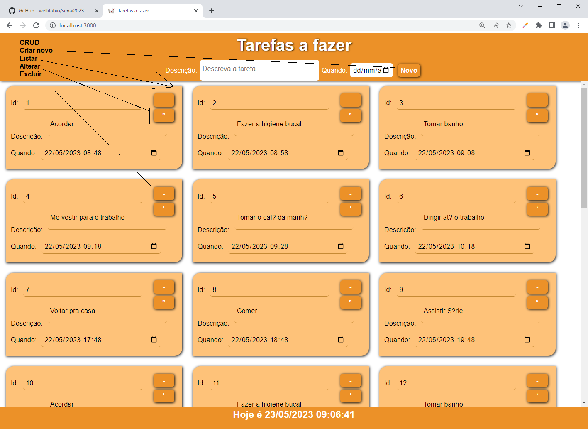
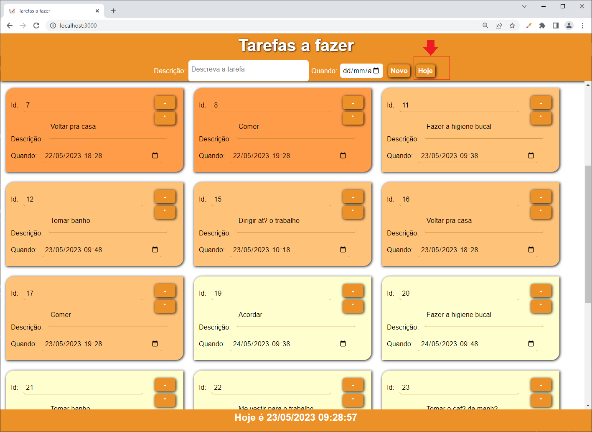
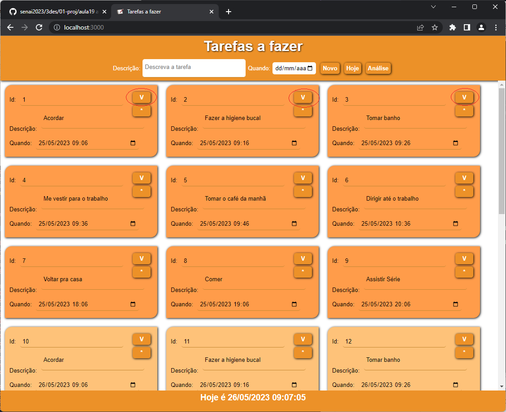
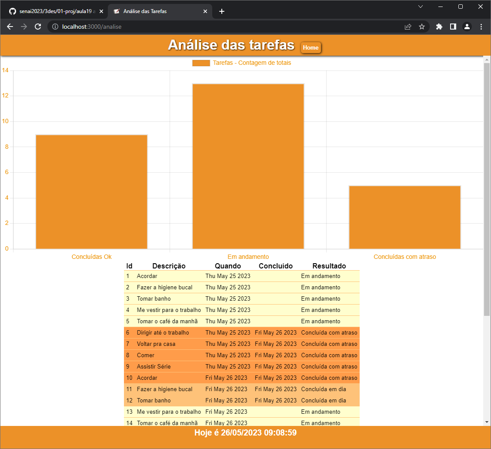

# Situação Problema

|Contextualização|
|-|
|Como programador da **XPTO indúsctria que produz de tudo** você precisa dar manutenção nos softwares que estão em andamento|

|Desafio|
|-|
|Sua missão no sprint desta semana é acrescentar algumas funcionalidades na agenda **(afazer)** de tarefas dos executivos da empresa, O código do projeto está neste repositório na pasta **./afazer**|
| Tela principal do programa **./afazer**|
|Sua missão é implementar as seguintes funcionalidades:|
|- Separar por cor as tarefas do passado, presente e futuro em outras palavras as de antes de hoje, as de hoje e as de depois de hoje.|
|- Adicionar um botão que ao ser clicado filtre as tarefas mostrando somente as de hoje e se clicado novamente volte a mostrar todas as tarefas, conforme o wireframe a seguir.|
| Wireframe com as funcionalidades adicionadas|

|Entregas|
|-|
|Apresente ao instrutor o software em execução com as funcionalidades adicionadas|

|Desafio Nivel 2|
|-|
|Para um melhor controle das tarefas e uma análise de desempenho dos executivos posteriormente, as terefas não devem mais ser excluídas ao serem concluídas mas sim um campo no banco de dados chamado status deve ser adicionado e deixado como nulo ao inserir uma nova tarefa, quando a tarefa for concluída a data e hora deve ser inserida e a tela deve ser alterada conforme imagem a seguir|
||
|Com estas alterações feitas será possível analizar as tarefas que estão em andamento, que foram concluídas com atraso e concluídas em dia ou OK|
|Crie então uma nova página com uma tabela e um gráfico que mostre todas as tarefas conforme wireframe a seguir|
||

|Entregas Nível2|
|-|
|Apresente ao instrutor o software em execução com as funcionalidades adicionadas|