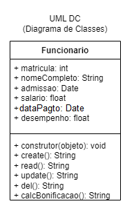
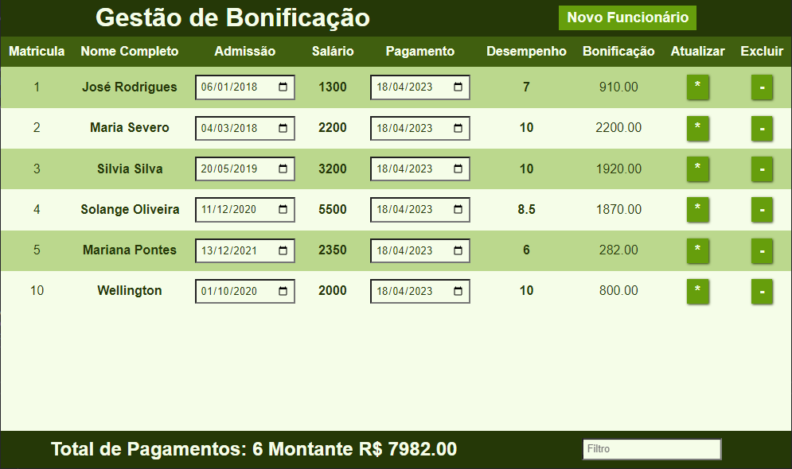
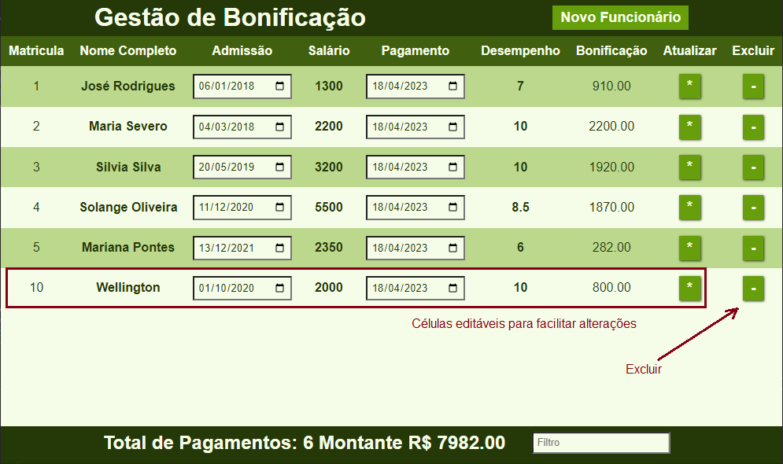

# Atividades FullStack

## Tema: Controle de bonificações

|Contextualização:|
|-|
|Algumas empresas costumam pagar participações nos lucros ou resultados de acordo com a legislação trabalhista ou acordo sindical a qual pertencem, outras tratam apenas como benefício aos funcionários como insntivo ou agradecimento pelo serviço prestado. A empresa ACME Parafusos precisa de um sistema para cadastrar/registrar e calcular as bonificações pagas a seus funcionários|

- O Analista de sistemas já realizou a **análise de requisitos** e documentou conforme diagramas a seguir:

|Documento|Diagrama|
|-|-|
|DER Modelo Conceitual||
|UML - DC||
|UML - DCU||

|Desafio:|
|-|
|Você foi contratado como Programador Full-Stack, por isso deve desenvolver um aplicativo Web responsivo com funcionalidades documentadas (CRUD). **A bonificação é 2% do salário multiplicado pelo total de anos de trabalho vezes a nota do desempenho (de 0 a 10)** Ex: um funcionário que recebe 1000.00 de salário, trabalhou 3 anos e obteve 10 de desempenho receberá 600.00 de **bonificação** Utilize os dados a seguir para testar sua aplicação:|

|Nome|Admissão|Salario|Data do Pagamento|Desempenho|Bonificacao|
|-|-|-|-|-|-|
|José Rodrigues|2018-01-06|1300.00|CURDATE()|7|NULL|
|Maria Severo|2018-03-04|2200.00|CURDATE()|10|NULL|
|Silvia Silva|2019-05-20|3200.00|CURDATE()|10|NULL|
|Solange Oliveira|2020-12-11|5500.00|CURDATE()|8.5|NULL|
|Mariana Pontes|2021-12-13|2350.00|CURDATE()|6|NULL|

### WireFrame

|Descrição|Tela|
|-|:-:|
|Tela CRUD||
|Modal de Cadastro||
|Responsividade da Tabela||
|Alteração com linhas editávejs da tabela||

|Observações:|
|-|
|Dados calculados nem sempre precisam ser armazenados em bancos de dados: - Porém, neste caso a empresa precisa registrar o histórico de pagamentos e em alguns casos pode haver diferença entre o valor calculado e o valor realmente recebido pelo funcionário/colaborador então **o resultado deve ser armazenado no banco de dados**|

## Como entregar as atividades
|Entregas:|
|-|
|Crie um repositório público no github separado em, backend e frontend|
|Apresente o projeto no ambeinte de desenvolvimento ao seu instrutor e/ou envie o link do repositório|

## Critérios de avaliação
|Descrição|Criticidade|
|-|-|
|O projeto deve ser desenvolvido conforme os diagramas apresentados|Desejável|
|Script SQL de criação do banco de dados|Crítico|
|Script SQL de inserção de dados|Crítico|
|O back-end de ve ao menos listar todos os dados da tabela|Crítico|
|Os testes realizados com o **Insonmia** devem ser apresentados ao instrutor|Crítico|
|O CRUD deve ser implementado no back-end|Desejável|
|O front-end deve ser implementado conforme os wireframes apresentados|Desejável|
|O front-end deve consumir os dados do back-end - ao menos Listar|Crítico|
|O front-end deve permitir a inserção de dados|Desejável|
|O front-end deve permitir a alteração de dados|Desejável|
|O front-end deve permitir a exclusão de dados|Desejável|
|Aplicação deve ser responsiva|Desejável|